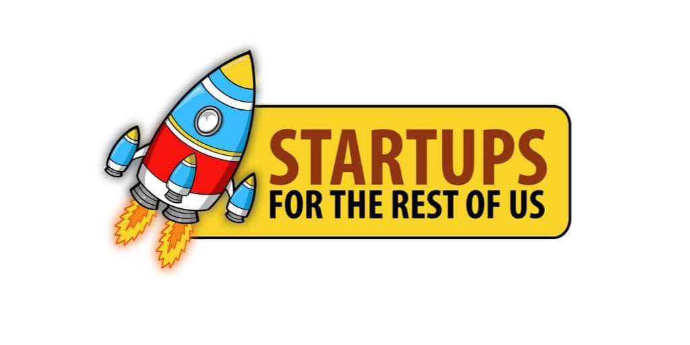

# Making cold email work with Rob from Startups for the Rest of Us

<iframe src="https://open.spotify.com/embed-podcast/episode/4qSHiu9dOhHi11AiSuoSUw" width="100%" height="232" frameborder="0" allowtransparency="true" allow="encrypted-media" style="position: absolute; top: 0px; left: 0px; width: 100%; height: 100%; border: none;"></iframe>

Damian on Startups for the rest of us with Rob.

On today’s episode, Rob chats with Damian Thompson, co-founder of LeadFuze. He’s also the founder of REVteam. They talk about if and when to hire a sales team, the kinds of cold email outreach campaigns that are working well today, the sales stack, and much more.

## The topics covered

* 5:43 Should a bootstrapper hire a Sales Development Rep (SDR)?
* 9:16 Assuming you understand your market, what kind of cold emails work today?
* 12:56 The formula to use for B2B cold email
* 14:37 Risks of bootstrappers hiring sales reps too quickly
* 17:19 Rule of thumb for hiring sales reps in 2020
* 21:29 Defining SDR (Sales Development Rep) and BDR (Business Development Rep)
* 24:47 What’s the bare minimum for a sales stack
* 36:42 The real challenge with outbound sales