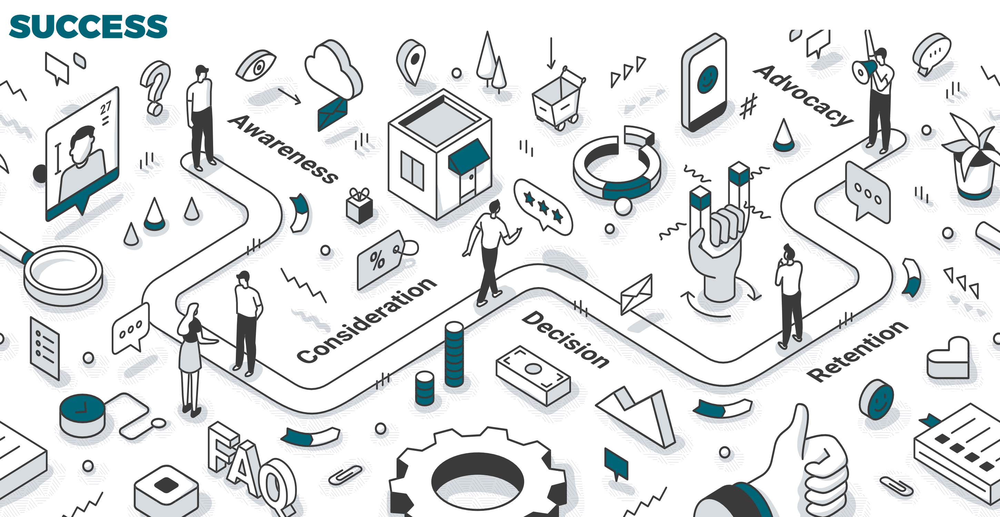

# Sales is Not a Numbers Game

Your customers are people, not numbers.

Many entrepreneurs think the answer to their growth is more leads and more calls.

I’m here to tell you it’s not a numbers problem, its a problem with your sales process.

Thinking sales is a numbers game is just an excuse for not learning the actual skills needed to truly sell.

And by having a “sales is about numbers” mindset, you dehumanize your customers and eliminate the chance to connect with them in a meaningful way.

Let’s look at the reasons why viewing sales as a numbers game will limit your progress and how you can shift your mindset to connect with your clients better.

### More Numbers Doesn’t Equal More Sales

It’s easy to make the mistake of throwing more volume at your sales problem.

From a statistical point of view, increasing the input of leads should increase sales.

But from a business point of view, it doesn’t work this way.

You don’t need more swings at bat, you need to get really good at fewer swings.

Focusing on numbers is a lazy and ineffective way to drive more sales.

It doesn’t force you to create the skills or procedures needed to win more business.

You need to work on your sales abilities to sustain and thrive in your business

### Play the Long Game

Are you in business for the short term or the long term?

If you’re in it for the long term, then the last thing you want to do is burn through a market.

By racing through large amounts of leads, you won’t be able to give those customers the attention needed to make a sale.

And when you give people a half-ass sales call, they aren’t going to give you a second chance to sell them something.

In their mind, why would they give you the time of day again?

Most people know you are not going to change their mind on a second call.

And people don’t like wasting their time.

If you do the numbers game thing to 500 people a day, you accelerate your race to the bottom.

You will be out of the game before you know it.

### Focusing on Numbers Decreases Your Performance

Wasting time with bad leads is no good.

In your attempt to get as many leads as possible, you probably threw the qualification process out the window.

Sure, you got some people to sign up for a call, but you’ll waste a lot of time talking to people that aren’t a good fit for your business.

Each sales process you go through with people is 30-90 minutes of your life. Do you want to spend that with someone who randomly signed up through an exit pop-up?

Furthermore, you’re creating new problems in your business trying to handle the volume you think you need.

By spending huge amounts of time on these calls, you’re pulling yourself away from the other parts of your business.

Let’s say you have 100 leads. Instead of talking with all of them, focus on 20 good ones. The other 80 aren’t wasted because you were able to spend that time on other important things, and if they turn out to be good leads, they’ll come back around.

You can find more leads, but you can’t find more time.

There is a law of diminishing returns.

Maybe you can handle the volume now, but as you grow you won’t be able to.

You need to put in the work and focus to form a sales process so when you do build a sales team, they can do the same thing.

### Humanize the Sales Process

Professionals realize that every time you have a sales conversation, you have to bring your best stuff. You have to focus on the customer and their emotions, that’s what sells.

Not facts and figures.

Not first steps and second steps.

You have to get the customer emotionally involved in solving their problem.

You can’t do that with a numbers mindset.

When you treat sales as a numbers game, you see people as conversion percentages and numbers.

When you treat them like they’re just a MQL, SQL, or an opportunity, you are not taking the human element into consideration.

When you try to over automate the sales process, you forget that the person you are talking to is a human being.

If we could create killer sales pages that could sell expensive services without talking to anybody, we would, but that’s not how people make four, five, or six figure decisions.

Remember, people buy from people.

You need to focus on the customers self-interest. What’s in it for them?

If you’ve found a problem worth solving, then generally that problem is tied to a lot of pain for that prospect.

They have goals that are unattained.

And you need to be able to empathize with them on these issues.

**Here's the thing: You can’t fake empathy at scale.**

If you’re in a service business of some sort, you’re going to have an ongoing relationship with your customers.

You need to have some humanity and level of care to get them to say yes to this relationship.

The more you can align your thinking around customer relationships and problem solving, the more yeses you will get.

You should see the sales transaction as a transition from a prospect relationship to a customer relationship.

It’s the real beginning of a mutually beneficial partnership.

### Your Sales Process and Messaging

Once you accept your sales problem is not a numbers problem, it’s time to figure out where your sales calls are falling short.

You should ask yourself:

What is off in my messaging?

What pain point am I missing?

What hook am I missing?

Throwing 100 more sales calls at the problem won’t solve that fundamental disconnect, even if it gets you a client or two.

More than likely, you haven’t dug for the pain points that are really motivating your market.

You haven’t led the customer to understand the true problem they’re trying to solve and the consequences of not making a change.

You haven’t shown how you’re going to solve their problem and help them see themselves in the solution.

You may have focused on topics not relevant to the issue at hand.

Figure out the hooks and triggers that matter to your various customer personas and what messaging works for each segment.

### Learning from Rejection

There’s always insight to be gained from a customer saying no to your offer.

It can be helpful to ask the prospect “what would have been a better solution to your problem?” or “how could we have been a better fit?”

You don’t ask as an effort to change their mind, but to learn where you can improve your sales process.

Once the customer knows they won’t have to negotiate on an offer, the stress of the conversation goes down.

You can then take off your sales hat and learn from the rest of the talk.

Ask about what their expectations were for the call.

A lot of the times there’s just a disconnect with what they were hoping to get on the call versus what your offer was.

### Sales is about Humans

It takes a mindset shift to stop thinking that sales is a numbers game or that volume solves everything.

It’s easy to say that it’s about numbers to cover up a poorly performing sales process.

It’s harder to accept the truth that it’s about people.

It means you’ll actually have to put in work to build the sales skills needed to connect with your customers and form a repeatable sales process.

It requires you to reshape your messaging to match your customers’ needs and expectations.

It requires you to empathize with your customers and be a good citizen in your industry.

When you stop focusing on the numbers, your energy can be spent refining your sales process with the right prospects.

Quit wasting time on bad prospects and start learning the skills needed to truly sell to your customers.