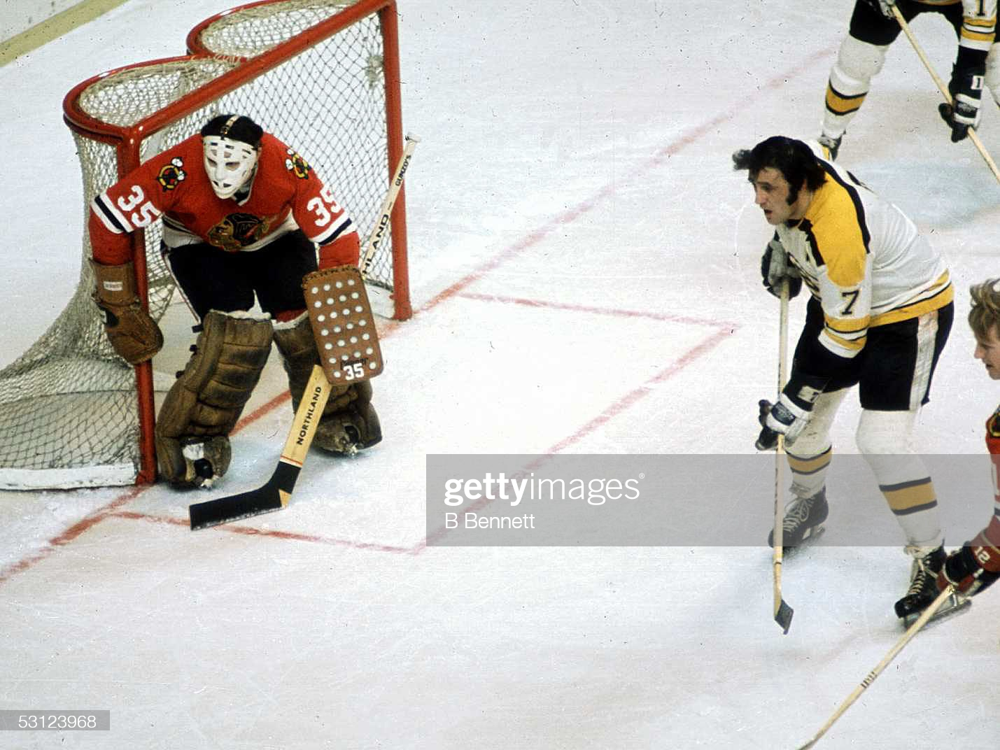

# Screw Skating to the Puck, Master the Garbage Goal

I was in my favourite entrepreneurial group on Slack the other day and we were having some great conversations about LTV (LifeTime Value), positioning, etc. when a member started asking me some questions about the pricing strategy for their software.

Anyone who knows me knows that maybe the only thing I like doing more than implementing a great pricing strategy is talking about pricing strategy, so naturally, I held court.

We started talking and getting to know their business (a local government engagement tool) and when I was having some difficulty getting her to nail down a strategic persona or ICP she said this:

"I'm skating to were I think the puck is going.. that councils, nonprofits, even brands, start asking stakeholders for their opinion a lot more - this requires a culture shift internally... and one that I'm not sure if/when it will happen"

Damn.

”Skating to where the puck is going." is a great strategy... if you happen to be Wayne Gretzky, the greatest hockey player to EVER live and the source of that quote.

But the rest of us mere mortals should stick to following the Phil Esposito plan

Not a hockey fan? Let me introduce you.

photo credit [NHL.com](https://www.nhl.com/news/phil-esposito-100-greatest-nhl-hockey-players/c-284852638)

Phil Esposito is the 10th greatest goal scorer in NHL history (Gretsky, of course, is #1)

BUT...

Unlikely Gretzky, Esposito wasn't a hockey god.

He was athletic enough, sure, and tough as they come.

But most importantly, Esposito seemed to know better than anyone what he was - and more importantly, wasn't - good at.

Armed with that self awareness, Phil Esposito became the master of the "garbage goal," positioning himself in front of the net, waiting for a deflected puck and looking for just the right moment to shove it back into the goal.

If you REALLY know your market and are skilled in seeing around corners, then maybe you can bet your company on the future.

But culture shifts, buying behaviour, and user preferences are VERY hard to change.

I'd bet there's a real problem your target market already has that you could fix today instead.

If adding revenue is really a priority for you, let that puck come to you and slap it in the goal.