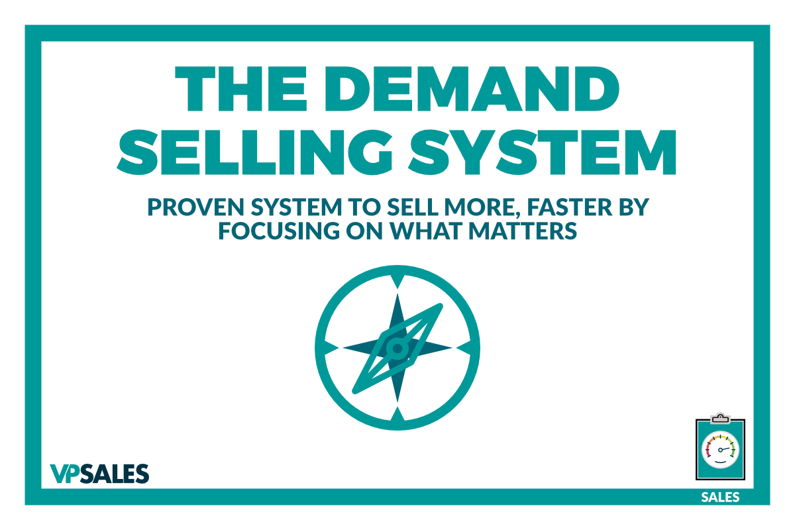

# Why Use a Selling System?

Most of the talk you hear about organizing sales in an organization comes back to one thing: the almighty sales process. And there are plenty of good reasons for that.

The main one is that effective sales processes have the power to improve performance on an organizational level. They are proven frameworks that are easy to teach and significantly improve the consistency of your sales results.

So if you already have a sales process in place, why should you invest your time developing selling systems?

Because sales processes are not the end all be all solution to sales. Selling is not a paint by numbers activity. If it were, selling would be a simple mindless task, which it most certainly is not.

**Key Point:** Selling consists of multi-layered interactions between you and your customers where only if you do everything right, you get the outcome you were looking for.

Here lies the inherent limitation of sales processes.

They can’t possibly account for every possible scenario your sales team will come across. If they did, then they would become so massive that they would lose all practical application.

As a result, every sales process has inevitable gaps. And how your sales team navigates these gaps is what will ultimately determine your team’s performance. For this reason, sales teams have so much variability in their performance, even though every salesperson follows the same process.

And this is the reason why you need a selling system. Your team needs a reliable compass to help them navigate the areas where your sales process can’t help.

This article will cover what a selling system is, how it differs from a sales process, and, more importantly, why you need one.

## What is a system?

A system, as it relates to sales, is a philosophical approach. It's a series of ideas, concepts, tasks, strategies, and tactics that help you take someone from an interested stranger to someone willing to give you money in exchange for your products or services.

In other words, a system is an overarching philosophy about what a person needs to learn about your business and how you need them to think about it to become a customer.

This means that, by definition, every sales organization already has a sales system in place, whether they recognize it or not.

## How is a sales system different from a sales process?

A sales process is just the steps - do these things, and do them in this order, and then you’ll increase your likelihood of success. The idea is that if you have an effective and well-defined process, you’ll be able to repeat it to make sales consistently. Once you can repeat it successfully, you can scale, and once you can scale, you can start automating or hiring salespeople to take over defined steps in the process.

You can view the sales process as the steps you need to follow, and the selling system as to *how* you follow those steps and all the space between them.

## Why use a selling system?

The first reason is that it is going to increase profit. If you have a battle-tested system that, and you’ve proven it works in your market, you and your team can use it to make important decisions about how to improve your sales process.

The next, and most important reason, to use a system is that if you just go about your sales ad hoc, instead of planning on doing something you believe over and over again, you're naturally going to fall into your prospects’ buying system - that is, the way they’ve always bought things before. And this is not in your best interest.

Customers are inherently bad at judging the subtle differences between your offer and your competitors. While the internet has changed how customers educate themselves before they get involved with you, they just don’t know what they don’t know.

It’s very unlikely that they will understand the critical distinctions between you and your competition. So they approach the purchasing decision with the assumption that a widget’s just a widget.

If you allow them to retain that assumption going into a sales conversation, you have now entered pricing hell. The business you’ve worked so hard to differentiate is just another number on a spreadsheet now.

You need to have a selling system that ensures that you control what they learn about your business and make sure they understand the differences between you and your competitors.

That brings us to an important point.

## You're either selling or being sold.

You often hear some version of this in a negative context, like every transaction is a zero-sum game. But that's not the way I see it at all. Because the reality is that there is always a transaction happening in every engagement you have with a prospect.

It is our job as business owners to use these transactions to help them make the right decision.

This is why it’s critical to accept that you’re either selling or being sold. Whenever you hear “I like what you're saying, but it’s not for me right now,” or “I need more time to make this decision,” or whatever reason they give you to avoid making a decision yet — they're selling to you.

Your customer is trying to convince you that their excuses not to buy are more valid than your reasons for them to buy from you.

That’s why it’s so important to have a robust selling system in place to ensure that we have a strategy for leading these transactions instead of being at the mercy of our prospects’ stalling or excuses.

I realize that sounds like I’m beating up on your prospective clients, but it’s not about that. So let’s clarify by talking a bit about the science of how people make decisions.

Let’s go over the **three main theories** about how people make decisions.

## Right Brain vs. Left Brain

I'm sure everyone reading this has heard of the concept that your “right brain” works differently from your “left brain.” [Dr. Roger Wolcott Sperry](https://en.wikipedia.org/wiki/Lateralization_of_brain_function), a neuroscientist who later won a Nobel Prize for his research on how the sides of the brain interact, developed this theory.

Specifically, he discovered that when the tie between them was severed, the sides of the brain could continue to perform independently but quite differently from one another.

This led to the belief that the left brain handles logic and the right brain handles emotions. Although no longer considered valid, it does have a useful takeaway. That is that both emotions and logic are involved in decision making.

When applied to making purchasing decisions, the reality is that most people emotionally decide what they want to buy and then find a way to justify it rationally.

## The Triad Theory

The following framework for how people make decisions is The Triad Theory, which you may have heard about from [Seth Godin](https://seths.blog/) in Linchpin.

The big idea here is that there are three parts of the brain - the reptilian, the limbic, and the neocortex - that were developed at different stages in human history and control different aspects of our behavior.

The reptilian brain is the part that’s become known as the “Lizard brain,” and it controls our reaction to fear.

This part of the brain, the theory goes, controls the basic fight or flight mechanism in our brains, controlling our gut reactions to things like fear or aggression. Seth’s famous is example is that the lizard brain decides whether that rustle you heard is just wind in the grass or a prowling lion.

The limbic or “middle brain” is our “old” mammal brain, where we do some simple reasoning about our emotions and make simple decisions about rationality or logic.

For instance, where we start thinking things like, “Okay, my instinct says reproduce, but is now the best time?” The theory is that the limbic brain starts to mitigate our instinctive desires and rationalizes a little bit.

Last but not least, the neocortex is responsible for the higher functions that make us human, like art and language and all that good stuff.

The point of this theory is that you want to sell to the lizard brain. The idea is that, by appealing to basic human instincts, you have to stimulate someone’s *no-thought* process or how they think to view the world.

This theory has also fallen out of favor with most scientists today, but it gives us a practical understanding of how people make decisions in their lives. It lets us understand that we’re not always the logical human beings we’d like to think we are.

## Bifurcation

The third common theory is bifurcation. This is currently the most widely accepted theory about how we make decisions.

The theory states that your decision-making processes fall into one of two systems. The subconscious and the conscious systems.

The subconscious is where you make fast and intuitive decisions.

The conscious brain is where we rationalize what our subconscious, or gut, already believes.

One of the key insights from the Bifurcation theory is that our brains are lazy. We have so much stimulus coming at us in the modern world that we simply can’t take the time to deeply consider each input as it comes into the brain.

We’d be blubbering in the fetal position on the floor since it would take up all our energy.

Since the brain has to filter information, we have to make sure we find ways to make it easy for our prospects to react positively to the information we present to them. Luckily there are non-conscious clues that we can send and things that we can do that make it easier for our prospects to decide to work with us or not.

One popular shortcut to sell to the subconscious is the concept of KLT. This refers to the idea that people will buy from people they know, like, and trust. Although not true 100% of the time, it works well in fields like politics. The basic idea is that if I know you, like you, and trust you, I don't have to think about the decision too deeply, and I can save that processing power for other things.

## So why does any of this matter?

Because to be successful in sales, we have to understand that people don't make rational buying decisions. People make emotional decisions. So it becomes our job to help them make the correct emotional decision and back it up with logic.

To illustrate this point, David Sandler, one of the greatest sales trainers of all time, gave the best description of sales I’ve ever heard, which is: “Sales is a Broadway play put on by a psychiatrist.”

None of those concepts covered above seem particularly complicated. So why do so many salespeople struggle to make sales successfully? What you'll find most of the time is salespeople skipping selling emotionally. They’ll jump straight to the logical arguments for their service. This is a very common problem with salespeople with process-based backgrounds like engineering or operations.

They think, “Hey, here are the 17 reasons why it makes sense to work with us,” but that's not how your prospects make decisions. They might get it, but it doesn’t motivate them to change.

## The DEMAND System

The DEMAND system works off the premise that succeeding in sales is about discovering problems and helping our customers feel like it’s time to fix those problems.

The system works because people are more likely to run away from pain than they are to run towards pleasure. It’s the difference between taking your vitamins to stay healthy and taking painkillers when you’re hurt.

### Emotional Discovery

The first part of the DEMAND consists of helping our customers discover the problems they currently have. This is then followed up by allowing them to realize the consequences of not solving their problems.

It’s not just “Hey, help me understand all these problems you have in your business, Mr. Prospect,” but instead focus on what happens if they don't move forward? What happens to your business or your personal life if this doesn’t get solved? Those are the consequences of not making a decision.

All the problems and consequences of not solving them must have an emotional connection so that they can be relevant and acted upon by your prospect.

### Give them logical evidence.

Once we have their emotional buy-in that the problem needs to be solved, we want to start helping them make a logical decision. We're going to try to give them the ammunition they need to justify saying yes.

We have to back them up so that they can defend that decision, either to themselves or someone else.

The best tool for helping our customers support their emotional decision with logic are case studies. Using previous customer success stories helps your prospect feel comfortable emotionally. It gives them proof that what you do will work for them too.

Other third-party stories, such as customer reviews, also help them justify their decision as well.

### Get a Yes or No

Critical to the DEMAND system is that we're going to ask for a yes or no, and we’re going to let our prospects know that we expect an answer. We're not going to accept any “I’m thinking it overs” or “let me get back to you’s” or anything like that. We’re going to get a definitive answer.

Often people are concerned about being too pushy or being too “salesy”. You have to get over that and ask for a yes or no because it's in everyone's best interest. Getting a concrete answer doesn’t mean you’re trying to push them into a sale. It means you agree to respect each other’s time.

### Negotiate Confidently and Getting Referrals

The next step is negotiating confidently. Negotiation is a whole topic in itself, but what you need to know for now is that there are ways to negotiate without discounting your offer. You don’t have to cut your prices all the time to close deals.

The last part of the system is developing referrals, and this is about more than just generating inexpensive leads. This is more important than just asking existing customers to recommend you to other people. It's actually about a mindset shift about how to make a referrable offer.

If you can't clearly articulate the value you bring to someone and clearly show and demonstrate the value you've delivered to them while you were working together, they're not going to refer you to anyone.

They're never going to recommend you to someone else, regardless of how you incentivize them, if they don’t understand and acknowledge how you’ve helped.

The reality is that getting referrals is pretty tough. You're asking someone to take the relationship they already have with someone and lend them to you. That's a bigger ask than money in a lot of cases.

So how do we tie this philosophy, this selling system, into our actual sales process?

## How to add the DEMAND system to your sales process

The quickest way you can add the DEMAND system to your sales process is to add a two-step system of a discovery call and a presentation.

A discovery call is all about discovering the prospect’s problems, establishing their consequences, and how they feel about them. Once they’re crystal clear about what will happen if they don't move forward, we move into the second stage.

The second stage is the presentation, where we're going to show them how we're going to fix their problems.

However, we’re not jumping into it - first, we're going to remind them about the consequences of not taking action. We just want to remind them of the problems they self-identified, the things they said would happen if they didn’t fix the problem you solve.

Then you want to share examples of people that had success in the past working with you to solve those problems, which are coincidentally pretty similar to the problem they shared with you on your first call. Then we're going to make it clear we’re going to ask for that yes or no at the end of the call.

The objective at this point is to get them to say yes. Because unless they say yes, we can’t start the negotiation phase. Referrals will come later.

The important thing to remember is that you don’t have to sell the end result. It’s natural to want to proudly share the features and benefits of your product, but that should never be your move at this point. You have to sell the next step, not the final step.

That’s why we separate our sales process into multiple steps so that you can be laser-focused on what you should be focusing on next.

Remember that **all interest is self-interest**, so if you jump the gun and start talking about yourself, your customer will disengage.

## In Conclusion

Finding new ways to get better results from your sales efforts can feel like smashing your head against the wall.

Because solving your sales woes is often a challenge that can’t be solved by simply working harder. Sometimes you need to take a step back and look at the problem from a different angle to find the correct answer.

The DEMAND selling system does just that. It takes a step back so that you can understand what makes us tick as humans and gives your sales team the tools to make the most out of this knowledge and go out there and make more sales.