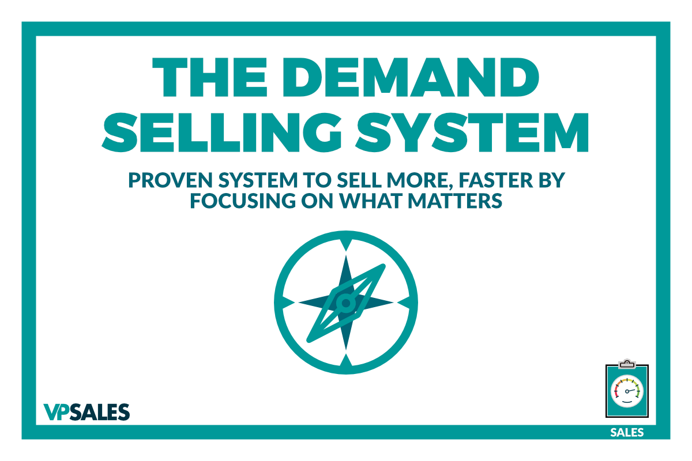

# WHY USE A SELLING SYSTEM?

## Why Use a Selling System?

Most of the talk you hear about how to organize sales in an organization comes back to one thing: the almighty sales process. So why am I insisting we start this book with selling systems?

In this chapter, I'm going to go into a little bit about what a system is and, more importantly, how it differs from a sales process. The real goal of this chapter, though, is to explain why you need to use a system at all.

Let’s start with the difference between a selling system and a sales process.

## What is a system?

A system, as it relates to sales, is a philosophical approach. It's a series of ideas - as well as tasks, strategies, and tactics that you implement - that determine how you go to market. How do you take someone from an interested stranger to actually being willing to give you money? That's what a selling system is, and you have one, whether it or not

We’ll go through the system I recommend that you use a bit later, but what you need to know for now is that, for the purposes of this book, a system is an overarching philosophy about what a person needs to learn about your business, and how you need them to think about it, to become a customer.

How is that different than a sales process?

A sales process is really just a series of steps - do these things, and do them in this order. If you have a good selling process, and a very well defined one, you’ll be able to repeat it to consistently make sales. Once you can repeat it successfully, you can scale, and once you can scale, you can start automating or hiring salespeople to take over defined steps in the process.

At that point, it’s easy to identify what your process is lacking. For instance, where are the holes in the process where you’re making mistakes or losing sales?

The great news is that your selling system will help with that.

## Why use a system?

The first reason is that is going to increase profit. If you have a system that has been battle-tested, and you’ve proven it works in your market, you and your team can use it to make important decisions about how to improve your sales process.

When you’ve sold and onboarded a client the right way, you're going to see a higher profitability per customer, and you’re going to retain your customers longer. But one of the most important reasons to use a system is that if you just go about your sales ad hoc, instead of planning on doing something you believe over and over again, you're naturally going to fall into your prospects’ buying system - that is, the way they’ve always bought things before.

While the internet has changed a lot about sales in the last 20 years, as customers are educating themselves a lot more before they get involved with you, the reality is that you still don't want to be at their mercy. That’s because customers are inherently bad at judging the subtle differences between your offer and your competitors. They don’t know what they don’t know, especially about the distinctions that make one service more effective than another, so they approach their purchasing decision with the assumption that a widget’s just a widget.

If you allow them to retain that assumption going into a sales conversation, welcome to pricing hell. The business you’ve worked so hard to differentiate is just another number on a spreadsheet now. You need to have a system to take your prospects through that ensures that you have control over what they learn about your business, and make sure the differences between you and your competitors, even if you can’t control the sale itself.

That brings us to an important point...

### You're either selling or being sold.

You often hear some version of this said as a negative thing like every transaction is a zero-sum game, but that's actually not the way I see it at all.

Sure, there's a transaction happening in every engagement you have with a prospect. Whether that’s “I like what you're saying, but it’s not for me right now,” or “I need more time to make this decision,” or whatever reason they give you to avoid making a decision yet, they're selling. They're trying to get you to believe their excuse more than they believe your reason for buying today.

If we accept that you're either selling or being sold, you can see why it’s so important to have a strong selling system in place to ensure that we have a strategy for leading the conversation, instead of being at the mercy of our prospects’ stalling or excuses.

I realize that sounds like I’m beating up on your prospective clients, so let’s clarify by talking a little bit about the science of how people make decisions.

Let’s start with a disclaimer: it's our job as business owners to help our prospects make the right decision, and unfortunately, the right decision for them won’t always be buying from us. I’m not suggesting you push anyone into buying something they don’t need. Instead, we want to show we're a good fit, and we're not going to be a good fit for everybody. But before we can determine whether we're a good fit, we need to understand how decisions are made.

With that said, let’s go over **three bigger theories** about how decisions are made.

### How people decide what to buy

**Right Brain vs Left Brain**

First things first, I'm sure everyone reading this has heard of the concept that your “right-brain” works differently from your “left brain.” It was originally suggested by Dr. Roger Wolcott Sperry, a neuroscientist who later won a Nobel Prize for his research on how the sides of the brain interact. Specifically, he discovered that when the tie between them was severed, the sides of the brain could continue to perform independently, but quite differently from one another

The short version, for our purposes, is that most people assume the left side of the brain is more logical and the right side of the brain is more emotional. While that’s largely been debunked, the myth persists in our culture and it’s a useful way to think about how those two ways of thinking influence our lives - and how we make purchasing decisions

The thing to take away from it is that there __is__ a difference between emotional decision making and logical decision making. Now, regardless of the fact that it's not rooted in different physical zones of your brain, the reality is that most people emotionally decide what they want to do, or buy, then find a way to rationally justify it.

**The Triad Theory**

The next framework for how people make decisions is The Triad Theory, which you may have heard about from Seth Godin in Linchpin (...or The Big Bang Theory.)

The big idea here is that there are three parts of the brain - the reptilian, the limbic, and the neocortex - that were developed at different stages in human history and control different parts of our behavior as a result.

The reptilian brain is the part that’s become known as the “Lizard brain,” the one that controls fear. This part of the brain, the theory goes, controls the basic fight or flight mechanism in our brains, controlling our gut reactions to things like fear or aggression. Seth’s famous is example is that the lizard brain decides whether that rustle you heard is just wind in the grass or a prowling lion.

The limbic or “middle brain” is believed the be our “old” mammal brain, where we do some simple reasoning about our emotions and make simple decisions about rationality or logic. For instance, where we start thinking things like “Okay, my instinct says reproduce, but is now the best time?” The theory is that the limbic brain starts to mitigate our instinctive desires, and starts rationalizing a little bit.

Last but not least, the neocortex is responsible for the higher functions that make us human, like art and language and all that good stuff.

The point of this theory is that you want to sell to the lizard brain. The idea is that, by appealing to basic human instincts, you have to stimulate some one's no thought process, or how they think to view the world.

This theory has also fallen out of favor with most scientists today, but again, it goes back to understanding how people make decisions in their lives. We're not always the logical human beings we’d like to we think we are.

A lot of times we know the right answer to a problem, but we don't do it because of the way we rationalize behavior in our mind.

**Bifurcation**

The third common theory is bifurcation. This is actually the most widely accepted idea about how we make decisions today.

The theory is basically that your decision-making processes fall into one of two systems. The first system is your subconscious. This is where you make fast, intuitive decisions.

The second system that controls our decision making is our conscious brain, or where we rationalize what our subconscious, or gut, already believes. A common maxim in sales circles is the idea that the decision to buy something is actually an emotional decision, that is people buy emotionally, and then they rationalize it intellectually later. That’s a bit of an overgeneralization, but it does touch on something important: the different parts of our brain that make decisions.

One of the key insights from _______ was this idea that our brains are lazy. It turns out that’s not such a bad thing. We have so much stimulus coming at us in the modern world that we simply can’t take the time to deeply consider each input as it comes into the brain. We’d be blubbering in the fetal position on the floor.

How people filter that information is tied directly to the way prospects respond to the information we're giving them, so make it easy to understand. There are non-conscious clues that we can send, and things that we can do that make it an easy decision to work with us or not.

One popular shortcut is the concept of KLT, that people will buy from people they know, like and trust. That’s not true 100% of the time, but it’s close enough for government work. The basic idea is that, if I know you, like you, and trust you, I don't have to think about the decision too deeply. I can save that processing power for other things.

So why does any of this matter if there’s so much debate about how our brain actually works? David Sandler, one of the greatest sales trainers, gave the best description of sales I’ve ever heard, which is: “Sales is a Broadway play put on by a psychiatrist.”

To be successful, we have to understand that people don't make rational decisions. People make emotional decisions. It's our job to help them make the correct decision emotionally, and be able to back it up logically.

None of those concepts seem particularly complicated, in theory. So why do so many people struggle to make sales successfully? A lot of times you'll see people trying to skip steps in this process. They’ll try to jump straight to the logical arguments for their service, especially they come from any process-based background like engineering or operations.

They think “Hey, here are the 17 reasons why it makes sense to work with us,” but that's not how your prospects make decisions. They might get it, but it doesn’t motivate them to change.

### The DEMAND System

With that said, I want to introduce you quickly to the selling system we will be introducing in this book, which is, of course, DEMAND. In the next chapter, we're going to go through each of the six stages of the system, and then the following chapters will go into each in great detail. At a high level, though, this is the system you need to grow your service business.

Succeeding in sales is about discovering problems. We want to help our customers, and if we look back to that emotional decision-making process, we want to help feel like it’s time to fix those problems. People are more likely to run away from pain than they are to run towards pleasure. This is the difference between taking your vitamins to stay healthy and taking painkillers when you’re hurt.

People are much more likely to try to solve a problem than they are to proactively try to make their lives a bit better. That’s why we want to help discover the problems they have.

The second part of this process is establishing consequences. Again, this is going to be a very emotionally-driven conversation.

It’s not just “Hey, help me understand all these problems you have in your business, Mr. Prospect,” but what happens if they don't move forward? What happens to your business or your personal life if this doesn’t get solved? Those are the consequences of not making a decision.

Once we have their emotional buy-in that the problem needs to be solved, we want to start helping them make a logical decision. We're going to try to give them the ammunition they need to justify saying yes. We have to back them up so that they can defend that decision, either to themselves or someone else.

The best option for doing this is case studies, using previous customers and customer stories to make someone feel comfortable, emotionally, by showing them that you've actually done this for other people. Logically, you can often use third party stories as well to help them justify their decision as well.

Importantly, we're going to ask for a yes or no, and we’re going to let them know we expect ann answer. We're not going to be accepting any “thinking it over’s” or “let me get back to you’s” or anything like that. We’re going to get a definitive answer.

Too many people are concerned about being too pushy, or being too “salesy,” or all of those things. You have to get over that and ask for a yes or no, it's in everyone's best interest. You’re not trying to push them into a sale, you’re agreeing to respect each other’s time.

The next step is negotiating confidently. We’ll talk more about this in a later chapter, but what you need to know for now is that there are ways to negotiate without discounting your offer. You don’t have to cut your prices all the time to close deals.

The last part of the system is developing referrals, and this is about more than just generating inexpensive leads. This is more important than just asking existing customers to recommend you to other people. It's actually about a mindset shift about how to make a referrable offer.

If you can't clearly articulate the value you bring to someone, and clearly show and demonstrate the value you've delivered to them while you were working together, they're not going to refer you to anyone. They're never going to recommend you to someone else, regardless of how you incentivize them if they don’t understand and acknowledge how you’ve helped.

The reality is that getting referrals is actually pretty tough. You're asking someone to take the relationship they already have with someone and lend it to you. That's harder to risk than money in a lot of cases.

So how do we tye this philosophy, this selling system, into our actual sales process? Everyone's sales process is a little bit different, but in the next chapter, I'm going to show you the system that works for the majority of people, the majority of the time.

It involves a two-step system of a discovery call and a presentation step.

There can be many more steps after that in the follow-up stage, but that’s the core of the system.

Whether you call it a discovery call, or a qualification call, that that stage of your selling process is all about discovering the prospect’s problems and establishing consequences. Once they’re crystal clear about what will happen if they don't move forward, we move into the second stage.

The second stage is the presentation, where we're going to show them how we're going to fix their problems. However, we’re not jumping into it - first we're going to remind them about the consequences of not taking action. We just want to remind them of the problems they self-identified, the things they said would happen if they didn’t fix the problem you solve.

Then you want to share examples of people that had success in the past working with you to solve those problems, which are coincidentally pretty similar to the problem they shared with you on your first call. Then we're going to make it clear we’re going to ask for that yes or no at the end of the call.

Sometimes we’ll get a yes, but more often, the prospect will delay anyways. Then we follow up. The point of it, obviously, is getting them to say yes there’s no negotiation until that happens. We’ll worry about developing referrals later.

The important thing to remember as an entrepreneur is that you don’t have to sell the end result. We all want to do it, and proudly share the details of the product we’ve worked so hard on, but that should never be your move. You have to sell the next step, not the final step. This is especially common with people that try to do one-call closes.

That’s why we separate our sales process into multiple steps in our multiple stages so that you can be laser-focused on what the current step is supposed to accomplish.

We want to make it about them and not about us - it’s another day, but we’re singing the same song. **All interest is self-interest**, so if you're trying to get that end step too quickly, you're talking about yourself “Here's why I think we're a great fit, blah, blah, blah.”

So, and once you do that you're turning people off. And, another one of these things I think I probably talked to a couple of you about this is this idea of carpets triangle, which is the roles you play in human interaction.

It’s like dating. The more aggressive you are, the more you lean into a prospect, the more they're going to pull away - it’s just a natural human reaction to resist. On the other hand, the more you lean back and pull away, the more they're naturally going to lean in.

The good news is that you can do that on sales calls too. If you bake that into your sales process, you’re making sure that you're focusing on the step you're on, and what your customer cares about, not the step you're trying to get to next.

Your blog post content here…