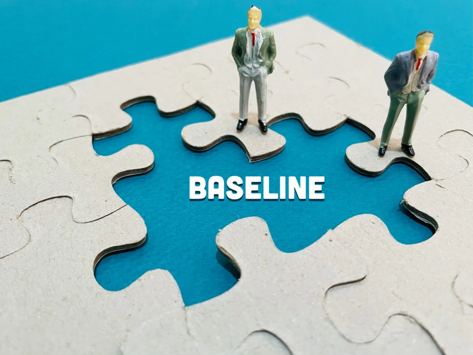

# What is a Baseline?

## In business management, companies use baselines when they analyze their budgets and prepare financial statements. 

In the process of making the statement or analysis, baselines are used to evaluate the success of a company’s projects, implemented over the course of the period it’s analyzing. 

### Definition

A baseline is a determined starting situation companies set for themselves in order to measure and compare changes in their business. Throughout their work, companies compare their new projects to the predetermined baselines during analyses, forecasting, performance improvement, and strategy formulation. 

When launching new products, services, or any kind of new project in general, companies use the baseline as a primary point to compare these with, in terms of several aspects such as how much they cost, how well they sell, and more. In this sense, when compared to a baseline, a company’s project can either successfully meet/surpass it or fall short of meeting it.  

### How Do Companies Determine Baselines

There are no strict rules to follow for establishing baselines across industries — instead, the task falls to each individual company. In general, for the purpose of serving as a baseline, companies can take any measurable achievement it has accomplished at some point, as long as it can be considered a reasonable point of departure to compare future results with.

Companies set their baselines in a way that helps them decide whether a change they’ve enacted brings them a positive outcome, measure how successful their improvement plans are, or simply compare their current outputs to the ones made during the baseline period.

A common example of a baseline would be a company’s results during its first year of work. With this baseline in mind, the company will regularly compare their output for each following year — the number of units sold, how well their sales campaign has performed, the production costs, the total revenue, etc. — to the baseline output of the first year. In this case, if, for example, during its second year of work, a company has managed to sell more of its products than the first year, it’s considered to have surpassed its baseline. 

### Where Can Baselines Be Applied

Companies use baselines across several business disciplines and sectors where comparing project outcomes to predetermined standards can be useful.

#### Project Management

One of the primary uses for a baseline is related to [project management](https://www.pmi.org/about/learn-about-pmi/what-is-project-management). Each time a company undertakes a new project, the predetermined project baseline is a significant indicator of what milestones the company should aim for — and, ultimately, how successfully the project was implemented in the end.

Companies rely on baselines to evaluate their project, usually in terms of: 

* **Schedules**, which determine the timeframe for project completion;
* **Costs**, referring to the number of resources (and funds) the company spends for the project;
* **Scope**, meaning measurable outcomes such as units sold, clients reached, and so on. 

#### Horizontal Analysis

When companies use baselines in their [financial statement analysis](https://www.accountingtools.com/articles/2017/5/14/financial-statement-analysis), the practice is also known as **horizontal analysis**. Companies do horizontal analysis to compare their financial data for different time periods — months, quarters, or years.

In the case of horizontal analysis, the initial period all others are compared to is considered the baseline period. The performance of the other periods is measured as a percentage of the baseline period — less than 100% if it fails to meet it, and more than 100% if it surpasses it. 

#### Sales Projection

Baselines are also useful for projecting future sales for a product or service. In this case, companies take an earlier product or service — or the same one in case it has been sold before — as the baseline to compare a recently launched product or service with.

The sales record of the baseline product or service helps companies put the sales of their more recent one into perspective — that is, to evaluate the success this recent product or service has had so far, and with this in mind, to project at what rate it will sell in the foreseeable future.

#### Budgeting 

To come up with future budgets, companies also use **baseline budgeting**. This kind of budgeting is an accounting method that sets the baseline at the current fiscal year rather than previous ones. 

From this baseline, the company calculates budgets for future fiscal years by taking the inflation rate and the population growth rate into account. The equation for calculating the future buget is as follows:

**Current fiscal year (baseline) budget x Inflation rate x Population growth rate = Future fiscal years budget**

However, this particular projection is only a rough estimate, however, because this equation considers that the company’s budget will continue to develop at the same rate as the inflation and population growth rates. In reality, this isn’t always the case, but it’s enough for companies to develop an overall idea of how to structure their budgets in future years. 

#### Information Technology

Baselines find their use even in IT management. Here, companies set baselines to project future performance levels, in terms of what levels they expect their future performance to reach, as well as their maximum potential performance levels.

Much like in the case of project management, IT management also usually takes **schedules, costs, and scope** as baseline references.

### Summary

A baseline is an initial point of reference that companies set themselves to be able to compare the success of their new projects with it. Baselines find their use in various business branches, such as project management, horizontal analysis, sales projection, budgeting, and IT management.