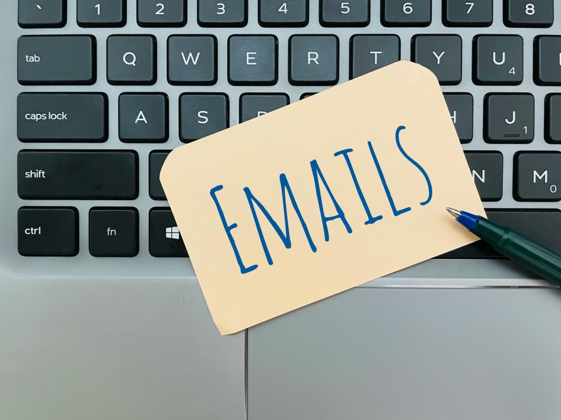

# What is BASHO Email

## When a company’s marketing team contacts other companies for the purpose of creating a business relationship between the two, sending an email will often be the first step. 

However, many automated emails are being sent out every minute, so for companies, it’s important to know how to approach their potential clients or partners successfully with an email, rather than having it end up in their spam folder.

Sending out [cold emails](https://www.quora.com/What-is-a-cold-email) is a known strategy for contacting new businesses. However, to succeed in gaining business partners, a cold email has to be done right. This is what BASHO emails are all about.

### Definition

A BASHO email is a highly personalized [B2B](https://rev.team/kb/what-is-b2b) email that a company sends out to the representatives of another company, with the aim of establishing the first contact with it. commonly addressed to decision-makers and aimed at getting the first phone call or meeting with them. This is a type of cold email that companies send to a specific, targeted group they wish to retain as business partners.

A personalized approach is vital to this strategy, and companies must have at least a basic knowledge of their target’s needs and interests. A company’s marketing and sales team will formulate their personalized BASHO email around this information, hoping this will help them attract their target’s attention.

This particular kind of email got its name from the **BASHO** brand, under which world-famous sales trainer [Jeff Hoffmann](https://blog.hubspot.com/sales/author/jeff-hoffman) invented this kind of email.

### Why Are BASHO Emails Important?

In email marketing, companies cannot afford to be plain and overly general, especially when they’re trying to contact and win over a prospect they’ve never approached before. Trying to automate all their emails to fit everyone’s needs will likely just lead to their target audience ignoring them.

In fact, personalized emails are [way more likely](https://www.forbes.com/sites/blakemorgan/2020/02/18/50-stats-showing-the-power-of-personalization/?sh=54382e3c2a94) to be noticed by the recipients than generalized ones. With this in mind, personalized BASHO emails can be extremely useful to marketing and sales teams because:

* **They improve conversion** by increasing response rates;
* **They’re visible to the relevant representatives** of the target companies;
* **They’re versatile** and can be used to initiate any kind of partnership;
* **They’re easy to write,** requiring only a couple of steps to memorize.

### What Does the BASHO Strategy Look Like

Writing a BASHO email may be fairly easy, but it does require previous preparation. There are several steps to follow in order to create a successful BASHO strategy.

#### Getting to Know the Target

To write a personalized BASHO email, companies must do previous research on their targets. This usually includes the concrete representatives and decision-makers that are likely to respond to the email — such as the CEO, for instance.

#### Creating a Personalized Subject Line

Every email starts with the subject line, and this is the first thing to pay attention to when writing one. The subject line should be concrete and to the point, without any fluff to it. Adding the name of the recipient in it is also a plus.

#### Personalizing With a Hook

The next step is putting the research into use by writing a personalized email text. Here, the BASHO email uses a **hook** — a catchy line related to a piece of personal information about the target they can use to attract their attention, such as congratulating them about a successful event, talking about an ambition they have, and so on.

#### Offering Value

As the BASHO email has a concrete aim — whether it’s a sale, partnership, or simply establishing contact — the value of what the sender is offering should be accentuated. This can be a product/service that can enhance the target company, a cooperation that will help them tackle certain issues, and more.

#### Adding a CTA

Once a BASHO email has stated the aim of the sender, it should also include a concrete **call-to-action**. This can mean inviting the recipient to a meeting, phone call, or any kind of more direct communication means in order to finalize a deal with them.

### Summary

Companies send BASHO emails to business partners it aims to attract but hasn’t had previous contact with. These are highly personalized emails that are designed to catch the attention of the recipients they’re specifically written for.

BASHO emails are easy to write and require several steps to be done successfully. A company can use a well-written BASHO email to initiate sales and cooperations, improve its conversions, and help them reach a business’s decision-makers more easily.