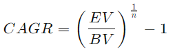

# What is Compounded Annual Growth Rate (CAGR)

## Companies can use a variety of tools and metrics to measure the growth rate of their business. One such metric, particularly useful when comparing the effectiveness of investments, is known as the compounded annual growth rate.

#### Definition

The term compounded annual growth rate (CAGR) is used to designate a metric that measures the yearly growth of an asset or investment over a particular time period. In other words, CAGR describes the growth rate from the initial investment value to the end investment value. The value of CAGR is commonly presented as a percentage.

#### How to Calculate CAGR

The formula for calculating CAGR is as follows:

**CAGR = (Ending value / Beginning value)^1/number of years – 1**

To illustrate this with an example, let’s say that an investor has invested $100,000 in a particular portfolio for four years, and the investment returns for each year were:

* At the end of **year 1,** the value of the investment shrunk to $90,000, meaning that the investment has seen a -10% growth (or a 10% decrease);
* At the end of **year 2,** the value reversed the trend from negative to positive, rising to \$135,000. From the previous year’s value of $90,000, this entails a 50% growth;
* At the end of **year 3,** the value kept rising and reached \$150,000. The growth this year, while smaller, was still positive, being at [11.1...](https://www.mathsisfun.com/definitions/recurring-decimal.html)% when compared to the previous year’s $135,000;
* At the end of **year 4,** the value reached \$200,000, effectively double the value of the original investment of \$100,000. This means that compared to the previous year’s \$150,000, the final year’s $200,000 has seen an investment value growth rate of 33.3…%.

As demonstrated above, the value of investments can be volatile and it can change each year. In this example, the value growth rate has gone from a negative -10%, sharply jumping right into a positive 50%, and then going down to 11.1…% and up again to 33,3…% for the fourth, final year.

This fluctuation, however, is irrelevant when calculating the CAGR. Only the beginning investment value (in our case, \$100,000), the number of years (4 in our case), and the ending value for the last year of the period being measured (the $200,000 for the fourth and final year in our case) are important for measuring the CAGR.

So, for our example, using the CAGR formula gives us the following result:

**CAGR = (\$200,000 / $100,000)^1/4 – 1 = 0.1892 = 18.92 %**

In other words, over the course of 4 years, the investor’s investment grew from 100,000 to 200,000, so its CAGR is 18.92%.

#### Advantages

Businesses can benefit from the CAGR metric in different ways, but its primary use is related to measuring how well individual investments perform, and for comparing them to each other.

It’s important to note that this metric presumes that the growth rate it measures stays the same for the time period in question. In real-life situations, investment growth can sometimes be inconsistent — this is something that the CARG metric ignores with the aim of simplifying the processes of tracking and comparing investment performance.

With that in mind, CAGR is a good tool for determining the average growth rate of past investments. It’s also useful for determining the performance of specific business measures undertaken by a company, especially in relation to similar measures from other companies. Comparing those business activities that perform well in the CAGR measurement to those that don’t can help companies determine what they should focus on when devising future strategies for the growth of their businesses.

When potential investors wish to evaluate how profitable a particular investment undertaking would be, they can put the CAGR metric to good use. This is because CAGR can give investors an insight into the average performance of their potential investments for specific time periods.

Measuring short-term CAGR takes into account multiple factors (notably market parameters) that have an effect on the security of investment growth. Long-term CAGR, on the other hand, tends to ignore these factors that aren’t as relevant in the long run because security recovers from unpredictable market variations over time.

#### Disadvantages

Calculating CAGR ignores potential volatility when measuring growth rates. While this can be an advantage for investors that aim to come up with a simplified digit to show the growth potential of particular investments, it’s also rather disadvantageous because it doesn’t consider possible changes in growth rates that are likely to occur in real-life situations.

The CAGR metric ignores the fact that [returns of investments](https://medium.com/@jcron_89878/roi-what-is-it-formula-5-ways-to-measure-your-marketing-roi-9e67903e9cbf) (or ROIs) are very unlikely to even out across each time period they’re measured for. As the metric doesn’t show investment withdrawals and additions, it may show inflated end results when measuring growth rates.

All in all, an investment’s CAGR shows how much it would grow if it keeps the same annual growth rate as the one it had during the period it’s being measured. It doesn’t demonstrate an actual rate of ROI. This means that CAGR should mostly just be used for measuring and comparing investment performance, and not for more complex financial planning operations.

#### CAGR and Similar Metrics

While CAGR has its disadvantages, investors can combine it with other similar metrics to be able to devise a better investment strategy.

One such metric is the [Sharpe ratio](https://corporatefinanceinstitute.com/resources/knowledge/finance/sharpe-ratio-definition-formula/). It shows investors the percentage of risk of their investments, helping them get a better grasp of their security. It also allows them to get an idea of how much the risk percentage can vary when stock market tribulations occur.

Another metric that can be combined with the CAGR is the [internal rate of return](https://www.fe.training/free-resources/asset-management/internal-rate-of-return-irr/) (IRR). In essence, the IRR metric is very similar to the CAGR, with the important difference that it’s far more flexible. Much like CAGR, IRR also evaluates investment value, but unlike it, it shows investors a projected return rate as well. The IRR calculation process is also more elaborate than that of CAGR, allowing investors to measure more complex investment and project values.

#### Summary

The compounded annual growth rate, or CAGR, is a metric used to calculate the yearly growth of an investment for a particular time period. CAGR values are commonly displayed as percentages.

The CAGR metric is useful for investors who aim to measure how well investments perform and to compare their performances. As it presumes a stable growth rate, CAGR is useful for showing simplified growth rate figures for particular investments. It can help companies accurately evaluate the success of past investments as well as that of their business measures. It also helps investors project the potential future value of their investments, presuming their growth rates would stay the same.

The CAGR measuring approach is not without its flaws, though, mainly due to the fact that it tends to ignore potential volatility in investment value growth rates. This means that it can’t demonstrate an actual ROI rate, and shouldn’t be used for more complex financial planning. However, combining this metric with similar ones such as the Sharpe ratio and the internal rate of return (IRR) can help investors come up with better investment strategies.