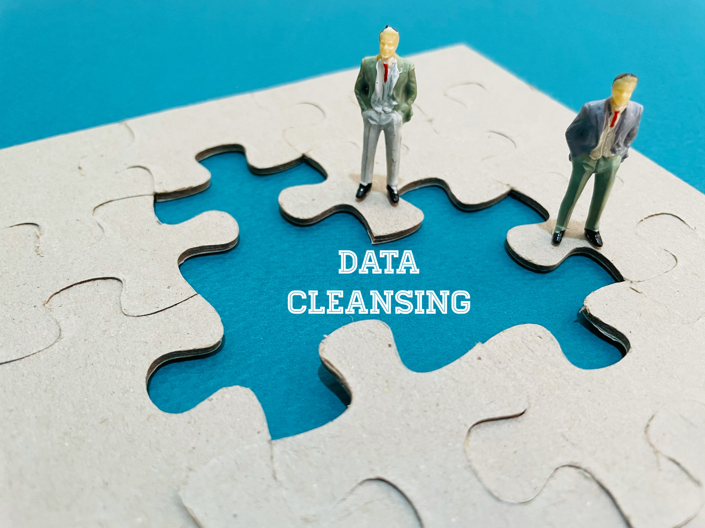

# What is Deduplicating?

## As computer technology is constantly advancing towards facilitating everyday activities, modern working has come to largely rely on using computing and computers.

Organizations and individuals using computers store information on them in the form of [data](https://rev.team/kb/what-is-data). Optimizing data usage and storage can be very useful to those that work with data on a daily basis — especially when dealing with large data volumes, typically in certain business environments. One way of making the most of the data storage capabilities of computers is by deduplicating data on them.

#### Definition

Deduplicating (also known as de-dupe for short) is a process during which unnecessary copies (or duplicates) of data are eliminated. Data deduplication helps improve storage utilization by decreasing storage capacity requirements.

#### How Deduplication Works

When data deduplication is enabled, the deduplication implementation checks the target storage volume for those duplicate data segments that can be removed in a way that doesn’t harm data fidelity or integrity. This makes deduplication a rather safe operation that doesn’t compromise data readability while at the same time optimizing storage usage and freeing space for end-users.

Oftentimes, data deduplication goes hand in hand with compression to maximize storage saving. To do so, the first step is to deduplicate data, eliminating unnecessary repetitive data segments, and then comes compression, which is used to properly encode the remaining data.

Data can be deduplicated either through an inline or a background process. During inline deduplication, data is deduplicated at the same moment it’s being stored on a [storage volume](https://searchstorage.techtarget.com/definition/volume). Background (or post-process) deduplication, on the other hand, can happen after the data in question is stored on a volume.

Both primary memory storage (such as [RAM](https://www.computerhope.com/jargon/r/ram.htm)) and secondary storage volumes (hard disks, solid-state drives, USBs, and so on) can be subject to deduplication. However, secondary storage is subjected to deduplication way more often. This is mostly because deduplication is much likelier to impact primary memory performance, and because secondary storage commonly has much more duplicate data that can be deduplicated in the first place.

The data deduplication process can occur at the location where it is created or at the one where it’s being stored. The former is known as source deduplication (referring to the “source” of data creation where the deduplication takes place), while the latter is known as target deduplication (the storage volume being the “target” where the data is meant to end up).

#### Why Is Data Deduplication Important

When working with datasets, and especially with large volumes of data, duplication is a common occurrence. For instance, user file shares can have identical copies of the same files, file backups can have negligible differences from one another (effectively acting as copies), and so on.

This means that, in such cases, because many data segments are duplicated, they take up a lot of unnecessary space. By  deduplicating these segments, storage users decrease the costs of storing duplicate data.

Data deduplication can save users different amounts of space depending on the type of datasets they use it on. In some cases, where a lot of duplicate data is likely to be present, data deduplication can save users up to 95% of the space that would otherwise have been used up.

The typical amount of space data deduplication can save varies across different types of [content](https://rev.team/kb/what-is-content) through which data is stored, such as:

* **Documents** — Common deduplication targets include files such as office documents (including word processor files, tables, presentations, and any other file type that can be accessed through an [office suite](https://www.techopedia.com/definition/10206/office-suite)), audio files (typically music and voice recordings), videos, photos, and the like. When deduplicating such files, users can typically save from 30% to 50% of the storage space they’d otherwise take up without deduplication.
* **Deployment shares** — These include [cab files](https://www.corel.com/en/file-formats/cab-file/), symbols, software binaries, and other types of repositories for [OS](https://whatis.techtarget.com/definition/operating-system-OS) images, apps, device drivers, and different kinds of software that’s deployed on systems. When deduplicating deployment share data, users typically save from 70% to 80% in storage space.
* **Virtualization libraries** — Deduplicating [ISOs](https://www.howtogeek.com/356714/what-is-an-iso-file-and-how-do-i-open-one/) and other virtual disk files is likely to save users the highest amount of storage space on average, typically from 80% to 95%.

This means that, in general, the average amount of storage space users can save from deduplicating any file type ranges from 50% to 60%.

#### Where Can Data Deduplication Be Applied?

The process of data deduplication has several usage cases. Common good candidates for deduplication include workloads such as:

* **General-purpose file servers** — These include servers that can contain work folders, home folders, software development shares, team shares, and so on. Users using such servers can greatly benefit from deduplicating data on them since each user is likely to have a copy of the same file.
* **Virtualized desktop infrastructure (VDI) servers** — These servers usually provide remote desktops to multiple users, facilitating desktop access. Deduplication is useful for VDI servers since the virtual disks that provide remote desktop access are mostly identical to each other.
* **Virtual backup applications** — Applications that deal in data backups are also ideal deduplication candidates. Different backup versions of the same file, sometimes produced periodically by such applications, are full of data duplication cases that are prime targets for deduplication.

There are also other workloads that aren’t ideal candidates for deduplication but may work well with it, and users must evaluate the pros and cons of deduplicating data in these workloads before engaging in the process. These include workloads such as:

* **General-purpose Hyper-V hosts**
* **SQL servers**
* **Line-of-business (LOB) servers**

#### Summary

Deduplicating data is a process during which unnecessary data duplicates are eliminated. This process optimizes storage utilization by decreasing the requirements for data storage.

Deduplication implementations check target storage volumes for removable duplicate data segments. The process doesn’t cause damage to the integrity and fidelity of the data which is being deduplicated, keeping it easily accessible to end-users.

Deduplication often goes hand in hand with compression to further increase storage saving. In such cases, data is first deduplicated to eliminate unnecessary segments, and then the remaining data is properly encoded for storage through compression.

Data deduplication procedures can be divided on multiple bases, such as inline deduplication (happening at the same time when data is being stored) vs background deduplication (happening after data storage), primary storage deduplication (RAM) vs secondary storage deduplication (hard disks, solid-state drives, USBs, etc.), source deduplication (happening at the same location where the data is being created) vs target deduplication (happening where the data is being stored), and more.

Deduplication is especially important when working with large datasets, as it significantly eases the costs of storage. The process can save users different amounts of storage space depending on the content type of the data they’re storing — from 30%-50% for documents, to 70%-80% for deployment shares, to a maximum of 80%-90% for virtualization libraries.

Common good candidates for deduplication include workloads such as general-purpose file servers, virtualized desktop infrastructure (VDI) servers, and virtual backup applications. There are also other usage cases that aren’t ideal deduplication candidates but can still benefit from it in some cases, including workloads such as general-purpose Hyper-V hosts, SQL servers, and line-of-business (LOB) servers.