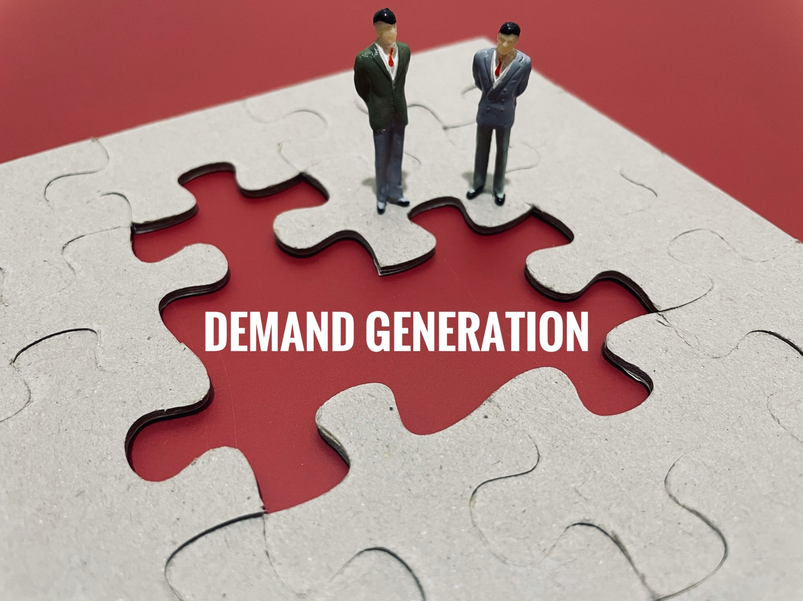

# What is Demand Generation?

## The concept of demand for products or services plays a key role in many economic theories — notably in the economic model (or law) of supply and demand.

For businesses, increasing the demand for the items they sell is especially crucial, as it makes it more likely for [buyers](https://rev.team/kb/what-is-buyer) to purchase these items (products, services, etc.) from them, earning them revenue and increasing their profits in the process. One of the main activities businesses need to engage in with the aim of increasing demand for the products or services they sell is known as demand generation.

#### Definition

In marketing, the term demand generation (or demand gen for short) is used to describe a process wherein businesses engage in activities that help them raise awareness and interest in the products or services they sell. Businesses use demand generation to popularize the items they sell among their existing and potential customers, expand to new markets, drive the loyalty of their [clients](https://rev.team/kb/what-is-a-client), and for a variety of other uses that will ultimately help them drive sales and increase revenue in the long run.

#### Demand Generation and Lead Generation

In common usage, demand generation is often associated with the similar (albeit more traditionally established) process of lead generation (or lead gen for short). Even though the two processes do share some core similarities and ultimately serve the same purpose (increasing revenue for businesses), there’s a key difference between them.

Namely, lead generation refers to the process of businesses acquiring more leads — that is, individuals or organizations that may be interested in purchasing their products or services. With this in mind, definitions of what exactly qualifies as generating a lead may vary from business to business. While some businesses have pretty strict standards when it comes to considering a lead as generated, others may even consider a simple visit to their website as a lead.

Demand generation, on the other hand, focuses more on creating interest in the products and services a business is selling, rather than finding the leads (individuals and organizations) that would buy them. This is because, as a rule, businesses target leads they’ve already generated when raising awareness about the products or services they’re selling. These are usually quality leads that are much more likely to be interested in buying from the business, which means, in essence, that it’s easier to generate demand from them. As a result, these leads are also most likely to be [converted](https://rev.team/kb/what-is-conversion) into customers or clients among all leads obtained through lead generation.

### Connecting Demand Gen and Lead Gen

Generating demands and leads is often done simultaneously in business practice. In fact, the relationship between demand generation and lead generation works both ways, as these two concepts are more or less interdependent.

As stated above, when generating demand for their products or services, businesses should also generate leads. If they only promote what they sell to a general audience without approaching particular targets (in the form of leads) that are likely to actually make a purchase, businesses will entirely depend on the personal initiative of members of this audience, hoping they’ll be the one to contact them first to be able to [close a deal](https://rev.team/kb/what-is-closing-a-deal) with them. In the opposite case, when generating leads, businesses should also raise their interest in the products and services they offer and generate demand for these because otherwise, these leads are far less likely to be generated at all (since they’re not aware of what they could actually buy) and thus even less likely to convert to customers further down the sales funnel.

With this in mind, while demand gen requires lead gen and vice versa, lead gen can still be considered a sub-category of demand gen. This is because lead generation focuses on a more tightly determined aspect of marketing, which is simply converting audiences into leads. Demand generation, on the other hand, uses a wider scope of tools and often a wider time span as well, promoting the brand of a business through a more long-term process.

#### How Demand Generation Works

To come up with an effective marketing campaign based on demand generation, marketers often go through a number of steps, usually in the following order:

* **Establishing goals and objectives** — Before launching their demand generation campaign, marketing teams have to determine what exact outcomes they’re trying to reach, whether it’s related to the amounts of revenue they expect from the marketing campaign, the number of leads they expect to convert into customers, or any other measurable objectives and final goals they aim to achieve.
* **Familiarizing themselves with their leads and prospects** — Marketers have to get to know the target audience they’re aiming to sell to before effectively generating demand from it. Businesses have many ways of acquiring information about the lives and habits of their lead and prospects, from simple features on their websites and social media that encourage them to leave feedback to engaging in more direct contact with them. The information obtained in this way can help marketers create a more personalized message when promoting products and services to their audience.
* **Creating content** — The content of the demand generation campaign is produced according to what stage of the sales funnel the target audience can be pinpointed to. At the beginning stages, marketers promote lighter content meant to promote the brand and the need for buying its products or services. Towards the middle stages, the content is meant to educate potential buyers on how the products or services the business offers can help them overcome a certain issue or challenge. At the ending stages, where buyers have already decided to purchase or are close to making one, the content serves the purpose of reinforcing their certainty that the product or service in question really is ideal for them.
* **Delivering the content** — Marketers can deliver the content of a demand generation campaign to their audience through various means. These can include social media interactions, e-mail, mailing, live events, and more.
* **Evaluating the success of the approach** — After the content has been delivered, marketers can track its performance and use the results to optimize their future approach to demand generation. This can be done through various analytics and notably by tracking key performance indicators (KPIs).

#### Summary

In marketing terminology, demand generation (or demand gen) refers to a process through which businesses raise awareness and interest in the products or services they sell. This is done to attract new and retain old buyers, which ultimately drives sales and increases revenue for them.

Demand generation is a process similar to that of lead generation (or lead gen). The main difference is that lead generation focuses more on attracting leads whereas demand generation is used to promote products or services among these leads. Both processes are interdependent and one cannot properly function without the other. However, as a whole, lead generation is a sub-category of demand generation, as it’s way more narrow in what its goals are.

A successful demand generation marketing campaign requires marketers to go through several steps, commonly in the following order: establishing goals and objectives, acquainting themselves with their audience, creating content, delivering said content, and finally evaluating the success of their campaign.