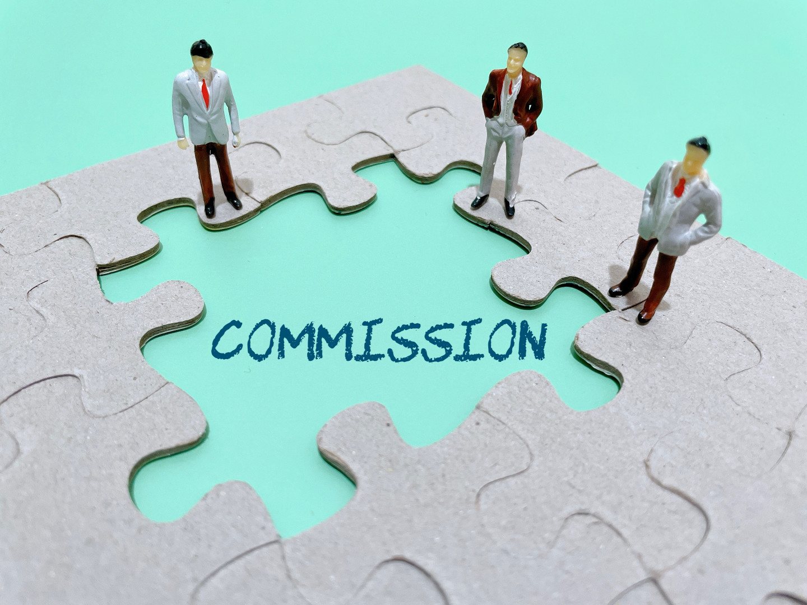

# What is Draw on Sales Commission?

## To motivate sales representatives to perform better and reach higher sales volumes, companies often use commissions as a type of (often supplementary) payment.

### Definition

A draw on sales commission, also known as a draw against commission, is a salary plan through which companies pay their sales professionals a regular paycheck for their future commissions ahead of time. Companies use this kind of commission payment plan to offer their sales team a kind of security of payment, giving them a steady income they can rely on until they get their scheduled commission check.

### How Companies Use Draw on Sales Commission

The draw on sales commission plan is used to pay sales representatives a draw amount which companies pre-determine themselves. In essence, the draw amount serves as an advance payment to the sales representative, which is paid to them regardless of the actual commission amount they’ll manage to earn later on for the same [pay period](https://www.thebalancesmb.com/what-is-a-pay-period-what-are-types-of-pay-periods-398392). The difference between the predetermined draw amount and the commission sales representatives actually earn is handled differently depending on whether the company is using a recoverable or a non-recoverable draw on sales commission.

For the most part, companies use the draw on sales commission payment plan when they’re dealing with uncertain sales periods and reduced income. This can include periods when they’re expanding into a new territory of sales, starting a new line of products, or other instances where successful sales cycles aren’t guaranteed.

When companies are hiring new sales representatives, it can take them some time — around [10 months](https://blog.thebrevetgroup.com/21-mind-blowing-sales-stats), or sometimes more — to become fully productive. This means that during the very first months of work, the average salesperson’s commission checks at the end of the month can be generally low, reflecting their lack of productivity due to the fact that they’re newly employed and less experienced in closing sales. Lower commissions can be discouraging for new employees, and this is one of the main reasons companies implement draw on sales commissions. With this payment plan, new sales employees are guaranteed to receive more competitive and stable paychecks during the time it takes them to reach their full potential, increasing their financial security and motivating them to keep closing sales during this period.

#### Draw on Sales Commission Types

There are some variations among different draw on sales commission payment plans. The differences among these are based on the experience of sales representatives, their specific responsibilities, the territory they’re covering, and other aspects of their work that may affect how they perform in sales.

With that in mind, draw on sales commission plans can generally be classified into two (or sometimes three) separate types:

* **New hire draw** — As its name suggests, this particular draw on sales commission plan is tailored for newly hired sales representatives. The plan usually remains in place during the training period of a new hire, or sometimes until they reach the company’s expectations in terms of sales volumes. This helps the newly hired employees build a relationship of trust with the company, as it shows the company is confident with their performance and expects a return on the investment.
* **Non-recoverable draw** — This plan implies that the predetermined draw that sales representatives receive is theirs to keep, and they don’t have to return the difference in case the commission they actually earn is lower, for example. In case it’s actually higher, the extra amount earned is paid as a regular commitment to the employee. The aforementioned new hire draw is also a non-recoverable draw in most cases.
* **Recoverable draw** — The opposite of its non-recoverable counterpart, the recoverable draw stipulates that the employee must return the predetermined draw amount to the company at the end of the payment period when they actually get their commission. In case this commission is lower than the draw amount, it becomes the employee’s debt to the company to be paid off from the commission during the next commission payout period.

### Summary

A draw on sales commission is a type of payment plan wherein companies pay their sales representatives regular paychecks for their future commissions. This is done by paying the representatives a predetermined draw amount before they actually earn their commission for the payout period.

The draw on sales commission serves as an advanced payment given to sales representatives with the aim of offering them a more stable paycheck to keep them motivated. Companies usually use this payment plan during times when sales efficiency is uncertain, and particularly for newly hired sales representatives that may otherwise be demotivated by their low commission checks resulting from their lack of experience.

Different types of draw on sales commission plans include new hire draw (applied to newly hired sales representatives), non-recoverable draw (which doesn’t require representatives to pay back the draw amount), and recoverable draw (which requires them to pay the draw amount back).