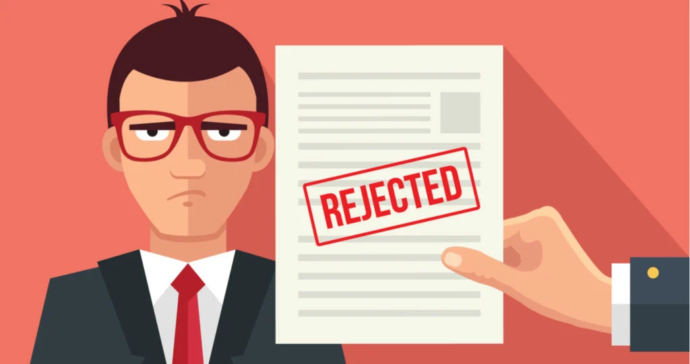

# How do You Deal with Customer Rejection in Sales?

## Whether it's a job interview or a potential sale, there will come a time when you're rejected. So, how do you deal with customer rejection?

### Definition

Customer rejection is when I prospect doesn't need your product or service and tells you "no."

#### How do you deal with customer rejection?

All of your reps have been there. They are on the phone with a potential customer and conversation is flowing. Your rep believes that they could close a deal.

Then suddenly, that sentence pops up out of nowhere and stops us dead in our tracks: "I'm not interested, thank you."  How do you deal with customer rejection?

What will you do? You might be tempted to panic, give up, or abandon sales. But you can't.

Helping your team deal with rejection is an important part of sales management. 

1. **Don't take it personally.** Rejection in sales is usually a sign that your product isn't what the prospect needs. Perhaps they couldn't afford it. It rarely has anything to do personally with you, so don’t get upset if you lose a sale.
2. **Rejection happens sometimes.** It is an inevitable part of selling. Don't be surprised if a customer says no.
3. **Professionalism is key.** It is important to be polite and professional. Your prospect will remember you if you are polite and professional when you reject them. 
4. **Ask them why.** Without asking, you won't be able to figure out what went wrong. It could be a small detail in your proposal that turned people off. Ask them why they chose not to go with your product. This information can be used to aid you in future sales calls. You may also be able to change their mind if they are open to it.
5. **Send a last-minute suggestion.** Send a new offer if you lose a contract to a competitor. You will be there to save the day if something goes wrong with the deal with the competitor.
6. **Talk to your colleagues.** Every salesperson has to deal with rejection. Everyone in life experiences rejection to some degree. Don't be afraid to share the loss with others. Instead, have a conversation with your colleagues. Instead of venting at your customer, you can talk it over with them. You'll find that you are not the only one and might even learn some useful tips.
7. **It is a positive step.** Consider each rejection as a step toward a sale. Sales rejections can be a positive thing, as each one brings you closer to a win.
8. **Be persistent.** Do not forget about the prospect. They might not be interested right now, but that doesn’t mean they won’t be in the future. You can check in with them often to see if they have changed their mind.
9. **Keep to your routine.** Stick to your schedule. This will help you keep on track even if you feel like giving up.
10. **Find the silver lining.** Every call is not a rejection. You will feel much better if you focus on the calls you won, rather than those you lost.
11. **Never give up.** Do not give up; keep going. You must make more calls if you want to succeed. 

#### Why is it important that you handle rejection in sales?

Businesses should accept rejection because it can help identify opportunities for improvement in their selling strategies. Rejection can help you learn more about your target market and customers.

Many associates include questions in selling strategies that allow them to ask customers what they want or why they don't like the offers. This feedback can help you identify trends in product or service offerings, which can help you improve your organization. These conversations are important for many reasons:

* Sales success
* Identifying improvement areas
* Potential customers to retain.
* Gaining new customers

### Overcoming Rejection: How to turn failure into opportunity.

([Source](https://www.saleshacker.com/overcoming-sales-rejection))

Some salespeople find it difficult to overcome rejection. It can be very difficult to think about losing a deal. Let's not lose heart.

Nothing can beat the rush of closing a sale. It's like winning a poker game with 8 other players.

Sometimes the strongest hand can still lose, but you can also win with the weakest hand. Timing and knowing your opponent are key.

Even though you may lose a few hands, it doesn't necessarily mean that you won't win the whole tournament.

#### Don't let rejection ruin your life.

Many people find it normal to doubt themselves when they meet someone who is a total ripoff or when their numbers start to drop.

***Sales are not about being a small fish in a big sea of "many." Instead, learn to turn every rejection into an opportunity.***

How to recover from pitch rejections. Use them in your favor and achieve your sales goals.

#### Are You Certain You Have a Definitive "No"?

Before you start to figure out how to handle rejections from sales, you might want to ask yourself the following questions: *Did you know your pitch was rejected?*

Sometimes, a reply like "We don’t have the budget for this at the moment" can mean that.

Ask when budgets will be reviewed at the company. If they reply **"We already have a solution,"** ask them which solution and find out if their contracts expire soon.

Set yourself a reminder **to rekindle the conversation.**

Keep in touch with them via LinkedIn, Twitter, Facebook, or possibly face-to-face events.

Continue to demonstrate your value to prospects by posting relevant content about your company and attending industry events.

#### Study Your Sales Approach

([Source](https://www.lucidchart.com/blog/5-step-sales-process))

To increase their sales, there are a few things that every salesperson can do to improve their numbers. These include building better relationships and not pitching early. You must also do a lot more self-reflection.

Every sales rejection can be a learning opportunity. Take the time to review each transaction in detail and identify the issues. Sometimes the reason for rejection may be external.

Sometimes, it's due to your competition offering better deals or beating you to the punch. Sometimes your product isn't the right fit for your lead. If you don't know why your pitches fail, you can't increase your sales.

How do you know your industry's average sales conversion rate? It might seem like you're hearing too many "no's," but this could be normal for your product. Without knowing how your sales performance compares to other members of your ecosystem, you can't criticize your sales ability.

Know your strengths and weaknesses. How does your behavior affect your sales? Practice your pitches in the mirror and record your rehearsals.

This will help you to better manage your objections and improve your phone, email, and social pitches.

Ask if you did a good job highlighting the benefits of your product. Did you overlook important points? To help you identify the factors that contributed to your sales success, send a brief questionnaire to customers after a sale.

Send one to any prospects who have rejected your pitch for brownie points. What could be worse? They will simply ignore your request.

### Summary

How do you deal with customer rejection? Get to know your prospects intimately. Know what your prospects are looking for before they even know it.

Show them how your product or services can help them. Be honest and human, and you will stand out from other sales professionals.