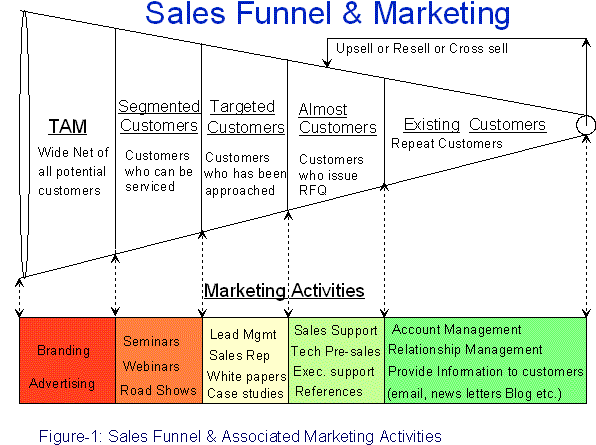

# How Do You Determine the Timeline of a Deal? It's Complicated.

## Salespeople often ask prospects about the decision timing. But is that really the best idea? And how do you determine the timeline of a deal without asking?

Let's suppose that your company needs to purchase something very expensive. As you probably know, the success of a salesperson is determined by how many deals they close in a quarter. Salespeople should be able to close deals sooner than later.

Are they trying to push you or incentivize your signing too soon? What about you? What if you could slow the process down so you can think through all options, remove emotion, and check all boxes to ensure you don't regret making the decision?

To shorten sales cycles, salespeople resort to manipulative tactics. They will do whatever it takes to close the deal.

Great salespeople spend the time to get to know their clients' timelines. They work closely with clients to create a timeline that works for both of them. These salespeople discover that clients are more open with key details, more likely to follow through on promises, as well as more likely to close the deal.

### How do you determine the timeline of a deal?

How can you improve your ability to manage timelines?

([Source](http://arunkottolli.blogspot.com/2006/03/marketing-sales-funnel.html))

#### Identify and Organize

Identifying and organizing the time required for a sale to take place is the first step.

Timing refers to the act of deciding, judging or controlling when something should occur.

**Timeline** - A chronology listing events in the order that they occurred.

Understanding the timing of prospects is key to understanding why certain times work. How can you better understand the timeline of your prospect? Ask better discovery questions...

#### Contribute To Your Own Timelines

It is important to ask about the timelines and take part in the conversation. Your timelines as salespeople should be equally important to the client. If you are working together towards the same goal, it is crucial that you and the client agree on the requirements for documents, approvals, or agreements. To avoid surprises later, you will need to be able to identify the documents and approvals required. A statement like...

> *"Our key implementation resources are booked solid for the second half of May, so it's impossible for us to commit to that time. Is it possible to push them back to June or move forward by 30 Days to March?"*

Open communication is a sign that you are eager to please your client and also practical and principled about time frames. Reciprocal trust is easy to build by telling the client in advance what steps and processes will be involved in the timeline. Another example:

> *"We will run three tests of the entire sequence before going live together. These tests can take up to five days. Is it possible?"*

#### Manage Timelines

Once you have a clear understanding of the timelines of your deal, it is time for you to manage them. Now it's up to you to make the process more efficient. These are the three best practices.

**High Yield Discovery Question.** This is the best way to help your prospect determine their timeline. It is important to ask the right questions. Be open-minded and curious. Don't limit your search for answers. You should not judge the benefits of answers by how they affect your life. To get more information about the timeline, you can channel your investigative journalist skills and ask multiple questions. You can also triangulate information from multiple sources.

These high yield questions will get you started:

> *"Your thoughts about the timing of this project."*

The client wants to know when the project will be completed. The client is not asking for a specific date but would like to know when it might be completed.

What happens if the timeline isn't met? OR Let's say that the project is completed within three months of their target date. No big deal, right?

This question is used for verification of the information provided by the client in #1. This will enable you to determine the client's commitment to the project and the reasons they have it. It also allows you to identify other stakeholders and decision-makers that can support their timelines ("It cannot be delayed, the CEO is pushing me to get it done before the quarter ends").

> *"Would you or anyone else be required?"*

Once you have a good understanding of the project's timeline, this question will help you to understand (or fill in the gaps) the various components or "timelines" that make up the entire timeline.

These timelines may include the time it takes for various leaders or board members to weigh in on the decision, important events (meetings holidays, and other milestones), and any other projects that must be completed before signing off. This will help you determine how much information your prospect is willing and able to share with you. This could indicate that you are in good standing and have built up trust.

This question is almost identical to the third, but it is rephrased as a lead question. Clients who avoid #3 are more likely not to ask about number 3. They are however more likely to address specific stakeholder(s) directly.

> *"Are other constraints, such as budgetary, manpower-related, or other priorities, necessary before the project can move forward."*

This question allows clients to ask how external factors might affect the deal. Clients may often share information they don't know. This could be vital new information that should be investigated further.

Not all of these questions should be asked at the first meeting. One person may not be able to check all the boxes and timelines before purchasing your solution. Each situation is unique, but it is important to be prepared to ask the right questions. It is important to continually challenge and refresh the information you have.