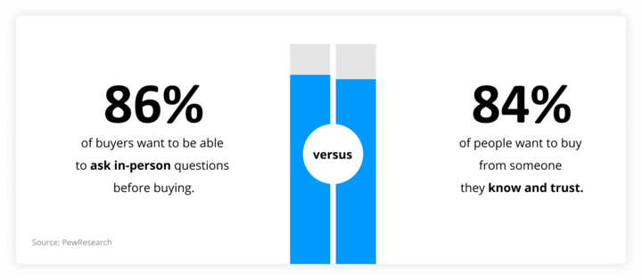

# How Do You Open A Sales Presentation?

## How should you begin your sales presentations are vastly different, due to your prospects' education level.

Your products and services are well-known by most people. Experts estimate that 50% to 90% of buyers have completed their journey before meeting with a sales representative.

Modern sales reps need different skills to present a sales presentation. 

### How Should You Begin Your Sales Presentation?

#### 1. Do your research.

Only about 1 in 10 people feel that salespeople fully understand what they need. This is a concern for salespeople. Your ability to get to know your prospects and offer a solution that meets them is key to a successful presentation.

Prospect research is an integral part of any sales pitch. Without the right background information, your sales presentation may lack context, personality, authority, and authority. We recommend that you gather the following information about your prospect/account before you present:

* The role of the prospect within the organization
* The technical background and expertise of the prospect
* Basic background information about the company
* Background information about the company's leadership structure
* Basic financial information about the company
* A profile of the company’s technological preferences and dependencies
* Information about the company's buying habits and behavior
* Industry news and important trigger events
* Background information and key industry insights
* Competitive insights and market intelligence

Getting this intel happens in many different ways.

* Current and prospective customer data
* Websites for industry and organizations
* Popular review sites
* Partner with a market intelligence provider

#### 2. Prioritize personalization.

After doing your research, you can tailor the sales pitch to address their needs and problems. While it is important to briefly explain your value proposition, listing all features and benefits will make your sales pitch more personal than yours. Instead, ask questions regarding priorities and listen to your prospect.

*Next,* describe how your product will solve the specific problems of your prospect. Use examples and references that relate to your prospect and their company.

Here's an example: In the past 12-18 month, high-performing sales teams were 2.8x more likely to say that their sales team is more focused on personalizing customer interactions. Prospects and customers tired of standardizing their selling strategies are offered personalized selling experiences by top sales teams.

#### 3. Support with visuals, and not text.

What is the fastest way to impress a prospect? Slideshows are easy to read aloud. Instead, create slides that compliment your sales pitch and don’t take away from it.  Infographics, charts, videos, and videos are more effective in proving your point.

### Elements of the Actual Open

#### 1. Use an icebreaker.

An icebreaker can be used to solve the problem of how to start a sales presentation. As its name suggests, the main purpose of this technique is to break the "ice."

Ice refers to any discomfort or awkwardness, that may be occurring. It's normal for people to feel uncomfortable in unfamiliar situations, especially when there are many things involved. Sales presentations are no exception.

An icebreaker can help overcome initial awkwardness.

These icebreakers will help you make your target audience feel more comfortable. This will allow you to connect with your audience, and make them more open to you to share what you have to say. 

#### 2. Introduce yourself.

This may seem obvious but many people fail to realize the importance of a good introduction. Your first impressions go beyond how you talk and look. It also includes what you say about yourself. Do you have any experience or qualifications that could help improve your presentation?

Your audience will be able to see things from a different perspective.

A strong introduction can help you win your audience in a presentation about sales, where your company's name and reputation play a major part in selling the product.

#### 3. Work on the design of the presentation.

While content is the main focus of any presentation, it is important that you remember that the visual aspect can also play a crucial role. Think about a job interview. What is the best way to make a first impression? It is possible that even if someone is well-spoken, you will not forget about them if they seem unprofessional or unpolished.

Your business's presentation card can be described as the presentation. Professional presentation design can help you communicate much more than what is written on the slides. This can help you look more professional and trustworthy.

A presentation design can help you communicate the brand's values. A white default slide is not the best way for a product to be displayed.

It's not always practical to spend hours designing slides. Luckily, you can always delegate it! A professional PowerPoint design can be a great way for sales presentations to begin.

Professional designers can help you create memorable presentations that will be remembered long after the event is over. This time can be used to improve your presentation and practice your delivery.

#### 4. Set the agenda.

Are you able to build a rapport with your audience? Are you working on a presentation at the same time? If you have a relationship with your audience, it might be a good idea for you to start your presentation by introducing the agenda for the session. (Building customer relationships begins during the sales process.)

It doesn't matter how many people you are interacting with, it is important that your sales presentation is professional. This is especially important if your goal is to close a deal or get into business details.

An agenda can help you demonstrate professionalism and trustworthiness when you start your presentation. It shows that you are prepared. It's a great way to show your audience you are prepared. It gives you a clear overview of your presentation points and helps you understand it better.

#### 5. Add an inspirational quote.

When you're thinking about how to start your sales presentation, a quote is a good idea.

A quote can be a powerful tool to give authority to your presentation, especially if it comes directly from an authoritative source. It is a great way to get your audience involved in a participatory presentation by simply letting them read the quote.

#### 6. Engage your audience.

Building rapport is one of the best ways for your audience to listen. PowerPoint offers many ways to make your presentation more engaging. You can get your audience more involved with polls and quizzes. It's a great way to get your audience to voice their concerns and share their problems with you.

Your audience will feel more comfortable participating in your presentation. This will allow you to share your ideas with them and help them to find solutions.

#### 7. Tell a story.

*Storytelling* is a great way to present a sales pitch. It's similar to a quote. Storytelling can give a presentation an emotional edge, and connect the audience to the topic.

Stories can be used to reinforce a message and illustrate a point. Stories can help you establish rapport with your audience and break the ice. To make your sales process powerful, tie the story to your product/service. 

### Successful Sales Presentation Essentials

There are common elements you can include in your sales presentation, regardless of your customer or business. Each element can be placed anywhere you want in your deck or presentation.

Different arrangements have slight strategic advantages. It is important to bring up the problem element in your presentation early. This is what your customers care about most.

These are the key elements of a sales presentation. They should be arranged in a recommended order.

1. **The Problem.** This element is more important than any other. It is the reason your potential customers are here. The problem, its headaches, and the consequences of letting it go unsolved should be discussed in detail.
2. **Promise & Solution.** Imagine what they could achieve if they solved their problem. This world is desirable and free of the pain points of their current problems. Next, describe your product/service. Describe briefly the problem it solves.
3. **Sales Pitch.** Your sales pitch should be concise and fast. It should explain to your audience why your value proposition is the best. Describe who you are trying to help, the problem you solve, the product or service it offers, as well as what the buyers will experience. It is a good idea to make your unique selling proposition (USP), the main focus of your pitch.
4. **Use Cases and Social Proof.** If you have specific ways you see the customer using the solution to their advantage, share your ideas with them. To show buyers how much they love your product, you can use social proof, such as testimonials and case studies.
5. **Call-to-Action (CTA).** Make your request. You will get different responses depending on the situation. While you might ask for time to ask questions at B2B meetings, you might not ask for the opportunity to meet someone at tradeshows.

### Summary

It can be tempting to limit a sales presentation to a slideshow or a speech. A sales presentation should be eye-catching.

The best sales presentations tell the story of your customer, give data, and offer a demo. This is a big undertaking that shows the strength of your product. If done well, it will keep prospects interested and make them want business.

You will be able to tell a story, show value, and demonstrate to customers how your solution can help them. This will help you create a compelling presentation that will generate interest and drive Revenue.