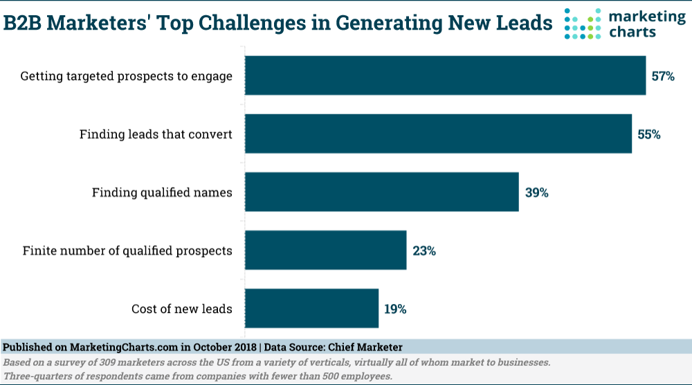
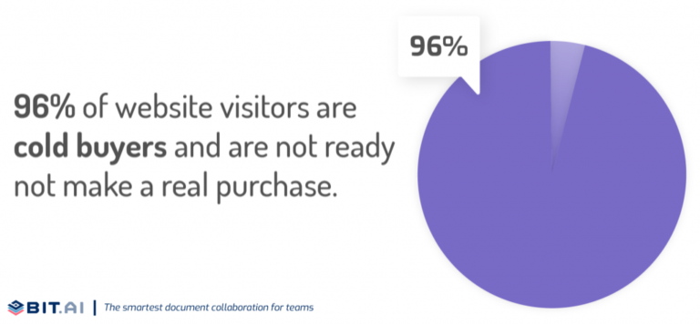
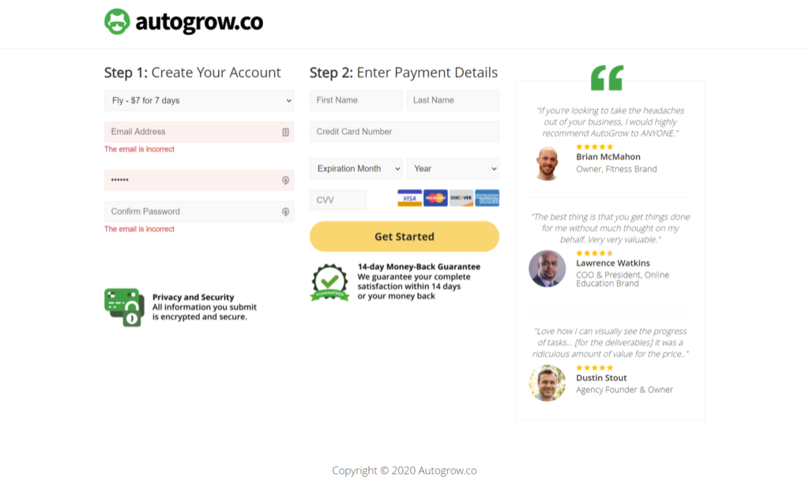
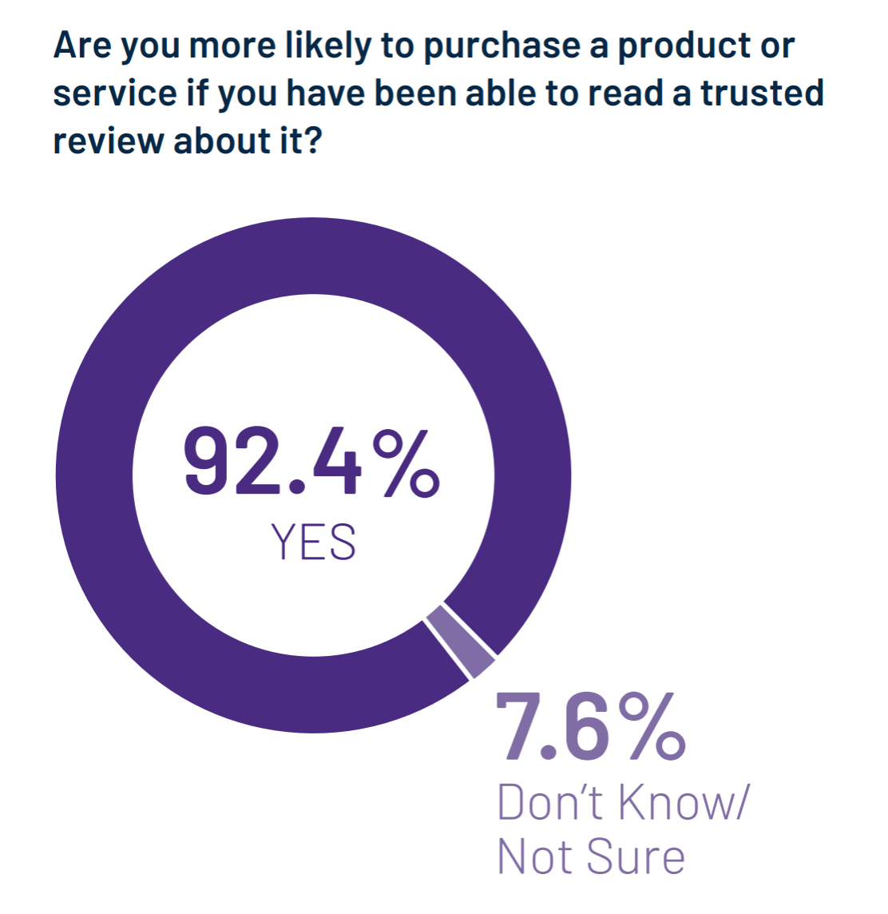
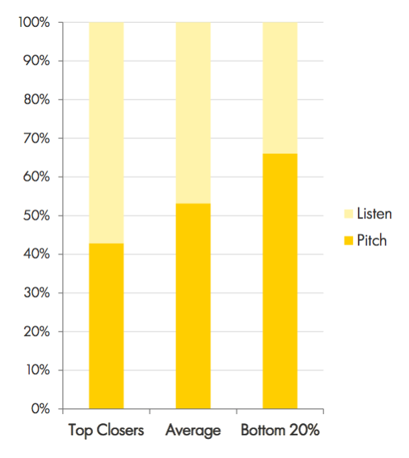

# How to Ask for the Sale and Close the Deal

## Are you looking for ways on how to ask for the sale? This guide provides 12 tips and techniques on how to close the sale, from making a strong pitch to closing the deal.

### Tip #1: Identify Qualified Leads

Qualifying prospects is an important part of how to ask for the sale. **Much of the work involved in asking for a sale is done by filtering out bad leads.**

This is a simple process of weeding out leads that are not likely to be a good fit for your products and services. The ones that fit your product or service best are the ones you want.

Clodagh Higgins, of Growit Group, suggests that prospects do a little research before they make a decision. For example, she suggests that they read a case study and fill out a questionnaire. If they don’t respond to any of your messages, it’s likely that they aren’t interested in the opportunity.

Over **55%** of B2B companies believe that converting qualified leads into paying customers is their top priority.

However, you can ask for the sale virtually if you qualify for leads.

You already know that the best strategies to qualify leads are:

1. Asking the *right* qualifying questions.
2. Creating an engaging demo video.
3. Adding an FAQ section to your sales page.
4. Surveying leads.
5. Setting a clear price.
6. Being blunt with the basics.
7. Calling out industries that are a good match, and those that aren't.

These strategies will help you qualify leads and filter out bad leads before you even pick up the phone. If no one fits your ideal customer profile then NEXT.

It is not worth your time to waste your time calling or sending emails to people who will never buy.
 
### Tip #2: Talk to the Decision-Maker

Gartner estimates that the average B2B buying group is composed of as many as **10** decision-makers. This makes your life more difficult. To be able to ask for the sale effectively, you must speak to the *right person:* **The decision-maker.**

Once you have qualified your leads and established a connection with the *right prospects*, it is time to speak to the actual decision-maker.

Do not waste your time talking with someone who does not have the authority to close the deal.

Because most people in charge of closing sales have been trained to reject or derail your proposals.

They are trained to listen to your pitch, then return to their boss for a final word.

This is problematic because these people often don't "sell" your solution to higher-ups as they should.

You're much more likely to get *in front* of the decision-makers.

Instead, you might try to close the sale with the C-suite executive responsible. You know, the person who signs checks and would agree to your sales pitch without consulting anyone else.

You should ensure that you are not dealing with an assistant or entry-level employee.

Before you start your virtual or video call, ask to meet with the decision-maker to review your proposal.

LinkedIn can be used to verify the social hierarchy of the company to which you are trying to sell.

### Tip #3: A "Yes is Great" but a "No" is Okay Too

We are wired to fear rejection. It's normal. This fear must be overcome when you work as a salesperson. You'll be laughed at, ignored, or rejected. It's a difficult thing to comprehend; it's tough.

Sales can be funny, especially when someone laughs at your products.

Rejection is not easy, but it's not impossible.

The first thing you need to do is to be *confident.*

Be confident *about yourself* and the product or service you offer.

(You can also follow one of our proven-to-convert mind-hacks to boost your self-image.

If you have built it from scratch, you will probably be able to sell it.

You are the best person to sell it!

It doesn't mean that someone dislikes you as a person if they reject it.

If you get a "no," it means that the buyer doesn't want your product or service. But don't let this discourage you.

Instead, use it as a *lesson.*

How can you sell more? Are they the right customer for your service? What feedback did they provide to help your business *grow?*

doesn't take rejection personally. It happens to the best of us. You don't have to give up if a potential client says "no."

Invesp reported that **60%** of customers say "no" **four times** before they say "yes". This means that you must be aggressive.

You will probably feel more confident when you are ready to give up.

Now that you are confident and ready for rejection, let us be prepared for something else.

### Tip #4: Prepare Yourself to Handle Objections. 

OK, so you don't just need to be mentally ready for rejection. **Be prepared for any objections** that potential buyers might have. But what does that mean?

This means that even if your product or service is perfect, customers will still have objections to purchasing what you sell. This happens regardless of how well-researched or beneficial your product may be. People will still find reasons (valid or not) not to buy your products or services.

Bit.ai discovered that 96% of your visitors aren't ready for purchase when they land on your site.

This is especially true for high-end products and services. Because of this, people will be more cautious about investing large amounts of cash in products they are still uncertain about.

This is why you should be ready to address and deal with sales objections. Follow these sales strategies to close 481%+ higher-ticket sales.

These are some of the most common objections to sales that the sales team might be forced to deal with:

* Your product/service is too costly.
* Now's not the right time to buy.
* I need to consult with other stakeholders.
* I think this won't work for us.
* We are going to choose x competitor instead.

These are the best ways to deal with objections:

* Take a deep breath before you address objections.
* Practice active listening
* Keep the flow going
* Respond quickly to leads.
* Be persistent in your contact.
* Ask lots of questions.
* But don’t ask too many questions.

### Tip #5: Share Your Social Proof 

Social proof is the best tactic for selling. It allows you to address sales objections and establish the foundation before you ask for the sale. Social proof is any content that proves that other people, like your prospects, have purchased your products or services.

AutoGrow has social proof on every page of our website, including the checkout pages.

According to Heinz and G2, **92%** of B2B buyers are more inclined to purchase after reading an online review.

Your potential buyers don't want to feel "tricked" or spend their time or money on something they aren't 100% sure about.

**This is where social proof comes in** to "lubricate” a customer's decision-making.

Customers who are interested in what you have to offer but are unsure or afraid will want proof.

They want proof that your promises can be fulfilled.

Your prospects will feel more confident if you provide them with testimonials, case studies, vanity stats, etc.

Pay attention to case studies of buyers who faced the same problem you are facing.

Collect as many customer data points as possible from different industries.

This will allow you to connect with prospects more effectively.

Use case studies to increase sales by 185%

This will prove that this product is indeed perfect for them.

On this product's landing pages, there's a summary of the case study used to launch a **six-figure sales funnel training.**

### Tip #6: Listen to your Potential Buyers. 

You can only get prospects to buy if you know *who* they are and *what* they want.

The question is: How do you refine your sales pitch?

One way is to take a step back and listen to what you are presenting.

This is one of the most important sales tips AutoGrow follows.

Sales Hacker, for example, found that the lowest **20%** of salespeople spent more than **65%** of sales conversation pitching their products.

The top closes spent just **40%** pitching, the rest *listening* to the customer.

This data shows that *listeners* have more success in closing sales and handling objections.

Listening to your prospects is only half of the battle. Ask questions!

Sales Hacker found that sales reps were more successful when they asked *more questions.*

Customers want to be treated as *people* and not just as sales numbers.

The opinions of your prospects about your products and services can help improve whatever it is that you are selling.

Even though they haven’t tried your products yet user feedback can increase your sales by **71%** (it’s happened to us).

### Tip #7: Learn *When* to Make the Move

Have you ever seen a leopard stalking her prey in a nature documentary?

She will wait and wait until she suddenly strikes.

Leopards and other big cats are successful because they know *when* to move.

Asking for the sale means knowing *when* to do so.

You will not find every moment of your sales call a good one. Why?

Sales calls are not about closing the sale, but determining if your product *or service can* solve a pressing problem for your prospects.

The truth is that not everyone should invest in your solution.

Sales Insights Labs research suggests that at least **one out of two** prospects won't be a good match for what you are selling.

To think that every moment is the right moment to ask for the sale is like imagining that you can close the sale with *everyone.*

To find the perfect moment, get as much information as possible from the prospect during the phone call.

Although the information you find may not be directly relevant to your discussion, it will give you the green signal to ask for the sale, if necessary.

Pay attention to the positive signs your prospect gives you.

### Tip #8: Use the Words That *Sell*

Let's talk about words that will increase your close rates and earn the trust of your prospects.

#### "Because"

This word is a great tip to close sales.

Ellen Langer, a psychologist, conducted a 2012 study in which an experimenter asked strangers for help using one of three lines.

The second line contained the word "because", explaining why the request was made.

**60%** was the success rate for the first line without "because." The success rates for the second and third lines without "because" were **93%, 94%,** respectively.

Langer concluded that the key to getting strangers to agree with the request was the simple addition of "because".

#### "Save" & "Free"

Although "discount" might lower the product's value in prospects' eyes, the prospect will be enticed by the opportunity to save money.

Both new prospects and existing clients are interested in hearing about any opportunity to save money and solve a problem.

Accenture claims that competitive pricing is the main reason companies switch vendors.

#### "Now"

When talking about your product, or service, the word "now", creates urgency.

"Now" is part of a group that includes words and phrases called "Action Words". These terms are especially effective at driving action from your buyers.

CoSchedule has compiled a list of action words that are perfect for creating clickable CTAs. These words are available for you to see below. 

Your prospect will feel a little more motivated if you use action words like "now."

You can help your prospect see that you can solve their problem immediately. This will allow them to make a decision sooner than expected.

The longer they wait, the lower your chances of closing the deal.

### Tip #9: Pitch Your Solution

Do not go into detail about how your product or service solves problems or pain points for your prospects. Be concise, but do it.

The success of your sales is not so much about what you sell. It's about *who* and *what* you sell.

Science Direct found that sellers are more persuasive if they believe in the products they sell.

**If your product or service does not solve a problem for your prospects or meet a need, it is not sustainable.**

Your sales pitch should focus on *how* your product or service solves a customer's problem. The product is not the problem.

This is because prospects want to know more about your company when you ask for the sale.

They want to know why you are better than your competitors.

They want your product/service to be the solution that they have been searching for.

You can build trust and rapport with your clients by explaining the value of your products and services and how they help solve their problems.

For example, remind your clients to always remember the value you add to their lives.

Always **highlight the** benefits of partnering or signing up with your business.

Poor handling of your buyer's needs can ruin even the best pitch for a *perfect product*/service.

### Tip #10: Add Urgency

Fear of missing out (FOMO) is almost *2X powerful* as the feeling of winning something.

People are more likely to take a chance or to seize the opportunity to avoid loss.

You can use this natural tendency to your advantage as a marketer or business owner or sales representative.

If you want to convince more people to buy the product or service that you are pitching, offer an incentive or increase the urgency to the prospect.

### Tip #11: Assume the Sale

**Always assume that you are selling.**

Don't assume that prospects will say no, even if they are hesitant about signing up for your service.

Instead, assume that the prospect has already agreed to the sale.

You'll see better results if you can change your negative thoughts about the possibility of a negative response.

This tactic works well, as it makes you appear professional and confident (as long that you don't try to get the sale).

You don't have to misunderstand the attitude, behavior, and words of your prospect.

Also, just because they seem to be saying "I'm not purchasing from you," doesn't necessarily mean that they won't.

### Tip #12: Gratify Prospects Especially After They Say YES

You should congratulate and thank prospects as they move through your funnel. The same goes for virtual calls with them.

Your sales team must maintain a relationship with customers by reassuring them and reaffirming the idea that they just took an important step down your funnel.

You can remind your clients and customers that they made a great decision by listening to your pitch.

### Summary

Be sure to follow these tips on how to ask for the sale. By making a strong pitch and closing the deal, you'll be able to confidently boost your sales.