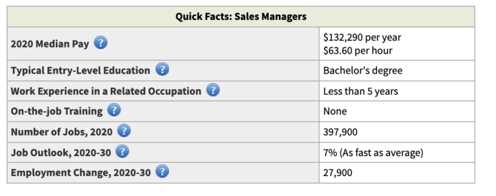

# How Do I Become A Successful Sales Manager?

## We'll teach you everything you need to know from how to become a sales manager, to the skills required, and the steps for getting promoted.

Sales has always been an art form, but sales management makes it a science. A sales *manager* is responsible for driving the entire sales team to achieve strategic goals that will grow the business. 

### Qualifications for Sales Manager Roles

It requires both business fundamentals (finance analytics) and strong leadership qualities such as communication and management.

Sales managers are responsible for overseeing a company's sales force. Their work is; setting sales goals, managing sales quotas, planning sales, and aligning the team with the company's larger strategic objectives. They mentor, train, and hire the sales team at a micro-level.

They analyze sales data and try out new, agile sales strategies. To be a successful sales manager, one must combine the proven principles of old-school sales professionals and the cutting-edge techniques and data-driven strategies of the modern business world.

According to the Bureau of Labor Statistics, there were more than 397,900 sales managers in the United States in 2020. The industry was expected to add nearly 27,900 sales managers positions by 2030.

This job rewards performance well: The average annual mean wage for a sales manager in the United States was $132,290 in 2020.

However, the competition is increasing and employers are looking for sales managers who have the right combination of education, work experience, and management skills. 

### Typical Personality Traits of Successful Sales Managers

There are many types of sales managers. Their end-products can range from software, hardware, and services. Despite the diversity of their end-products, some common traits make successful sales managers:

* **Communicative.** It's not just about selling a product, but also motivating others. Sales managers must have strong communication skills to communicate with their sales reps and understand their unique needs.
* **Mentally agile.** Sales managers who are successful don't get stuck in a routine. They must be open to trying new sales strategies and reverting to old ones in constant optimization.
* **Analytical.** In a world of data-driven analysis, the 20th-century image of a suit-clad salesman entering a business meeting with only common sense and gut feeling is no longer relevant. Sales managers today have all the bravado of their legendary predecessors but they also use hard numbers and complex statistical analysis to supplement it.
* **Goal-Oriented.** This yardstick has remained the same over the years, and goal orientation is key to success in this industry. It's not just about achieving strategic goals. It's also about setting realistic goals that align with the company’s broader goals.

### Education Requirements and More

**Step 1: Earn a Bachelor’s Degree (a 4-year degree)**

After graduation from high school, sales managers must earn a bachelor's degree. Management, accounting, finance, economics, and statistics are all good options. Although admission requirements vary from school to school, they generally include the following: a competitive high school GPA (3.5 or higher), SAT and/or ACT scores, letters of recommendation, and a personal statement.

**Step 2: Gain Early Work Experience (1-5 years)**

Sales management is not an entry-level job, and it is rare for a college graduate to be hired in this position. After graduating from university, sales managers must have some practical experience.

Employers typically seek candidates with a minimum of one to five years' experience in sales for sales management jobs. This period can be very instructive: The best education money could buy is on-the-job experience.

A sales manager will not only get to know the daily operations of a salesforce and what it takes to lead one. But they'll also discover which market niche they are most comfortable in. Some employers will also provide financial assistance for employees who wish to pursue graduate-level education.

**Step 3: Get a Master's Degree (optional, two years)**

Although not required for all sales managers and executives, it is becoming a standard for those in the top ranks. A master's degree in business administration (MBA), gives graduates a deep understanding and leadership skills that enable them to motivate teams towards short, mid, and long-term operational goals.

Although admission requirements vary from school to school, they generally include the following: a competitive undergraduate grade point average of 3.0 or higher; high GMAT or GRE scores; work experiences; letters of recommendation; and a personal essay.

**Step 4: Consider Professional Certification (optional, timeline varies)**

Many sales managers seek professional certification after obtaining their master's degree. This is a way to further their education and show their expertise. These certifications, which are peer-reviewed marks of distinction, can help one move up the stack and convince employers that one is committed to best practices.

### Tips for Up and Coming Sales Managers

To be a sales manager, you will need to take on more responsibility. The following tips can help you navigate the role of sales manager and its duties:

**Enhance time-management skills:** Managers may have more responsibilities, but they don't necessarily have more time to do them. This is why it is important to learn how to manage your time effectively and prioritize tasks to stay on schedule.

These skills can be learned by researching different sales strategies and even taking sales training programs. As a manager, you can delegate tasks to your team members, which will free up your time for more important tasks.

**Use feedback:** Feedback can help you and your team improve their professional development. It can help you make changes that will strengthen your team. You can give constructive feedback to employees by focusing on the problem and working together to find solutions.

Listen to employees' feedback and make adjustments if necessary. It shows that you value their opinions and take into consideration their concerns.

**Show interest and concern for your team:** Everyone has different work styles, communication preferences, and strengths. Your role is to coach your team. You need to understand what motivates them.

These factors will help you to improve your leadership and collaboration skills. It is also possible to make an effort to get closer to your team members. Your employees will feel more appreciated and can strengthen their relationships by showing interest.

Sales managers are often responsible for creating sales plans. These plans should be updated regularly as you build your career and sales teams. Changes allow you to adapt and grow with your team, rather than using the same techniques over and over again.

To communicate sales forecasts, market research, and other components in an easily understandable format, you can use your existing sales knowledge and skills. It helps to keep everyone on the same page and ensures consistency in their performance.

### Summary

We've discussed thoroughly how to become a sales manager. It won't be easy, but it will be worth it! Follow these steps and you'll become a success in a leadership role. 