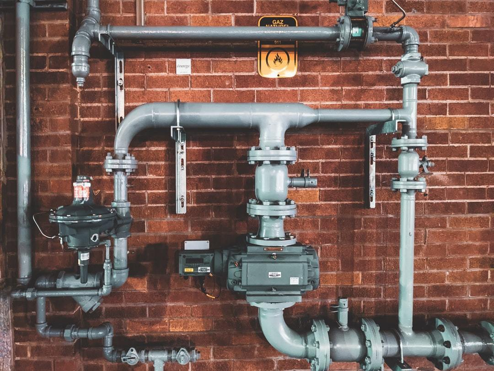
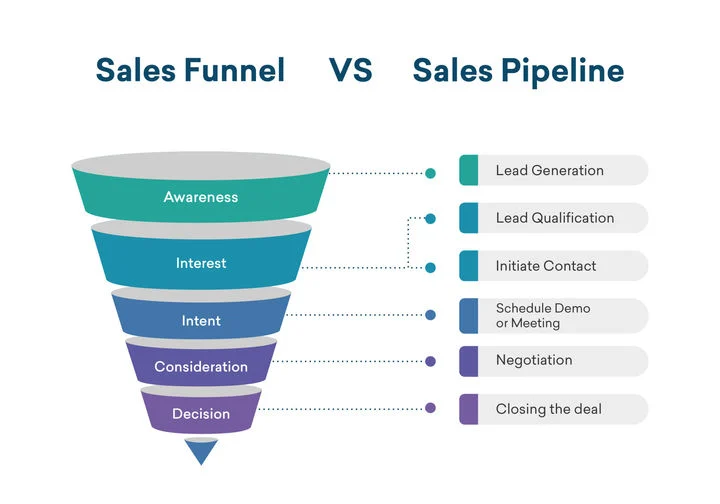

# How do you Build a Sales Pipeline?

## This article was written for businesses who want to increase their sales by optimizing sales processes and analyzing customer behavior

### Definition

A sales pipeline is a description of the sales process that a prospect goes through, and how your Revenue team interacts with them at each stage.

Sales funnels are not the same as sales pipelines. They describe the customer's journey from first meeting your brand to making a purchase decision.

These two processes are crucial because they allow you to understand how customers identify your products or services and help you decide whether to sell them.

A sales pipeline is a way to describe how customers first come in contact with your brand, and the steps your Revenue team takes with that lead to purchase. A sales pipeline is a system that allows you to create better Revenue strategies and drive more Revenue. It is based on customer data and Revenue trends. Here are some tips to help you build and refine your sales pipeline.

([Source](https://www.freshworks.com/crm/sales/sales-pipeline))

### What is a Sales Funnel?

The following five stages make up a standard sales pipeline:

1. Lead generation
2. Qualification
3. Discovery
4. Proposal
5. Sale

Your sales pipeline should be tailored to your business model and organization. However, it is important to have a starting point. Future iterations of your pipeline can be modified to fit your particular circumstances.

#### Lead Generation

This is the first stage of your company's search for potential customers. Although few leads are ready to purchase at this stage, they might be likely to do so in the future.

There are various ways to generate leads. A few ideas include

Social Media Ads
Adwords, Google's pay per click ad platform
SEO & Organic Content, such as a blog
Cold Email
Referrals 

**Building a Lead Generation System**

The foundation of any pipeline is lead generation. This starts with understanding your ideal customer by using buyer personas. These semifictional representations of customers can be used to guide your Revenue efforts.

* What are their problems and how can you help them?
* Which channels are the most active or most likely to see them on? You should consider digital channels such as email and social media, as well as traditional methods such as billboards or signage.
* What kind of content or free offer would they say yes to immediately? They would say yes to a free trial of your service.
* What would be a fun, easy, and memorable lead magnet for your company?

To create an effective campaign, you *need* to first understand your audience and what content they are most likely to respond to. You should also have a clear plan for how you will distribute your content across all channels.

#### Qualification

Once you capture interest, you must determine if they are a good fit for your business. This is called qualification. To qualify your leads, ask questions about your customers' needs in a survey. To gauge customer response and determine the most popular content, you could send targeted emails to your customers or give away freebies about certain products or services.

A qualified lead is one step closer to becoming a customer. Once you have a qualified lead, your Revenue team can start closing the sale. Now it's time to move onto the consultation stage in your Revenue pipeline.

**How do you Qualify Your Sales Pipeline?**

This is especially important if there are leads that you don't know the names of. It is crucial to ensure that your pipeline has a process for determining whether qualified leads are cold or hot.

A hot lead is someone who:

* Has the budget
* Is able to make the purchasing decision
* Knows what they want
* Willing to buy what you have to sell

Sales reps may be required to call potential clients if you are selling luxury vehicles or high-end services like private coaching. A consultation can become an initiation where your rep determines whether your products or services meet the needs and wants of potential clients.

#### Consultation

The consultation stage is when the sales rep speaks directly to the prospect by phone or videoconference. The sales rep will discuss the prospect's needs and offer possible solutions.

A purchase may or might not happen at this stage. This could be a browsing customer who is still comparing their options. B2B companies may make exploratory calls to discuss their services. It doesn't matter if the consultation fails to result in a sale, it is important that you follow-up. Final decision will be made at the proposal stage.

**Consultation Tips**

Make yourself available to prospects. You can answer any questions prospects may have via email, social media messages, or live chat.

It is important that you respond quickly. Customers and prospects will be happy if you monitor all channels they can reach you through.

#### Proposal

A proposal is when a customer makes a decision to buy. This is usually a formal agreement between both parties. A formal agreement typically outlines services and pricing. It is signed by both the prospect and the business. 

**Proposal Musts**

NEVER send the proposal via email.
ALWAYS present the proposal on a video call or in person.
Organize it so that sales reps can recreate and duplicate it easily.

#### Sale

Once a sale is made, the pipeline is not complete. The client must be satisfied. Customer Success should be able to satisfy the client by keeping track of each account and promptly responding to any issues. Existing clients should be offered cross-selling and upselling opportunities whenever possible. This should be done with a focus to maximize the client's value. Customers should be encouraged and contacted consistently to ensure they return.

**Next Steps**

Your next task is to fulfill your promise if your potential client agrees immediately. You can then put them in your post-sale nurturing pipeline until you are ready to move them into your main sales pipeline.

To follow up with customers, set up a system. Automated cart abandonment sequences can be used as an alternative. This may look more like a follow-up email or phone call to the sales rep. Push for a Yes or No, never accept *Maybe* or *I'll Think it Over*. 

### What is the difference between a pipeline and a funnel?

A sales funnel is a different thing from a sales pipeline. It describes how your Revenue teams approach a lead to convert them into customers. A sales funnel shows where prospects are on their journey to making a purchase decision.

A sales funnel has three main stages. However, the details can be modified to suit a business's specific circumstances. A typical sales funnel would include:

* **High:** High prospects are people who are interested in your product but are not actively looking to buy.
* **Middle:** Midfunnel prospects are aware they could *likely benefit* from your service or product, but they are still researching the market and aren’t ready to purchase.
* **Low:** Low funnel prospects are ready to buy now or in the near future.

To prevent prospects from dropping out, it is important to understand where prospects are coming from and which channels they are coming from.

Sales funnels, like sales pipelines, can be modified to meet the specific needs of the business that creates them. You can use subsections of the three-part funnel to help you focus on the finer aspects of your sales funnel.

### Summary

It is easier to train new employees on how to succeed in their job by creating a sales pipeline. You can improve your conversion rates and revenue by using a systematic approach.