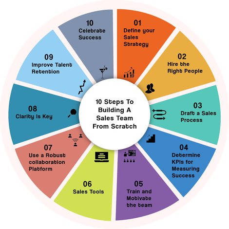

# How to Build a Sales Team

## Are you looking to build a team that is able to crush sales? This guide will show you how to build and nurture a high-performing sales team.

### How to Build a Sales Team

No matter if you're selling products or services, sales are crucial to company growth. A sales team is a group that interacts with customers and makes sales for your company. It is an essential part of any company. Learn how to build a strong team of salespeople for your business.

### Definition

([Source](https://blogs.salesken.ai/10-key-steps-for-building-a-sales-team-successfully-from-scratch))

The department responsible for achieving company sales goals is called a sales team. This department is supervised by a sales manager.

It is comprised of customer service representatives as well as sales specialists. They work together to achieve daily, monthly, and quarterly sales goals. This department is responsible both for customer acquisition and retention as well as sales generation. Depending on the company's size, a sales team might have multiple roles and hundreds of employees.

### What are the roles of a sales team?

A sales team can take on many roles. Here are some examples.

**Sales Manager:** The manager of sales oversees sales and manages sales goals, budgets, sales performance evaluations and performance-related concerns.

**Assistant Sales Managers:** Larger businesses may consider adding an assistant sales manager to their sales team to support sales manager support and team management. This position acts as a liaison between sales managers and their sales team.

**Account Executives:** These account executive, also known by sales reps, are the heart of the company. They are the ones who talk directly to clients to make sales. Sales reps can work remotely or at conventions or shows, or even door to door.

**Customer Success:** This is a common position within a sales team. This position is focused on customer retention and expansion. 

**Sales Specialists:** Many departments have sales specialists who are familiar with all aspects of the product or service. A salesperson can refer a customer to a specialist if they have a difficult question or problem.

### How do you build a sales team?

When building a strong sales team, there are many things to consider. This article will help you create the perfect sales team regardless of whether your company is just starting or expanding.

**What are your team's values?** Before you post job openings, it is important to establish expectations for your sales team.

Are you looking for immediate sales?
Are you looking for salespeople who can build lasting relationships and increase sales?
Do you only want to sell certain products or services?
Are you looking for salespeople who are only interested in a particular audience?
Are you looking to hire salespeople who are willing to go door-to-door?
Are they able to communicate with customers via phone or email?

These questions will help you determine the type and size of your sales team.

**What is your team's size?** Depending on the size of your company, sales teams can have several sales reps or hundreds with different roles.

Your company's size and requirements will impact the size of your sales staff. A sales rep might be enough to make sales calls for a small company, based on qualified leads and prospecting. You can hire more people as your business grows. You might consider hiring a sales manager or customer service representative to support your business's larger staff.

**Who to hire?** Once you have established your sales values and the size of your sales staff, it is time for the hiring process to begin. Consider hiring a sales manager.

This will enable you to train and hire sales reps. This allows you to train your employees more easily, as they are familiar with the company culture, products, and products. To help you find the right person, ask your family, friends, and colleagues. Advertise with local colleges to attract recent college graduates.

**How will you onboard new hires?** Even if your sales team is the best, they still need training. Every company approaches sales differently. Your new hires must understand your company's culture, values, and expectations. Sales managers who have been hired should receive a comprehensive training program. This can be used during onboarding.

**What performance stats to track?** You will need to monitor the performance of your Revenue team once they start selling. Your sales manager should meet with you to discuss key performance indicators (KPIs), in your customer relationship management system (CRM). ]

These KPIs could be anything, from the average sales revenue per person to their individual sales statistics. 

Are our sales territories distributed unevenly?
Are our sales professionals in dire need of additional training on the best sales process?

Your sales manager should partner with your top performers to share their insights with the rest. This will increase overall performance and generate more income.

**Do you need additional departments?** To increase revenue, you can add sales departments once your sales team has been established.

Sales operations can manage sales metrics, identify and qualify leads, and provide support to them. They can also help with territory assignments and sales support. This allows you to train sales reps, monitor their performance, and improve your sales tactics.

### Summary

Building a strong sales team takes more than hiring the right people. It is crucial to create a positive and motivating environment that supports and encourages your salespeople.