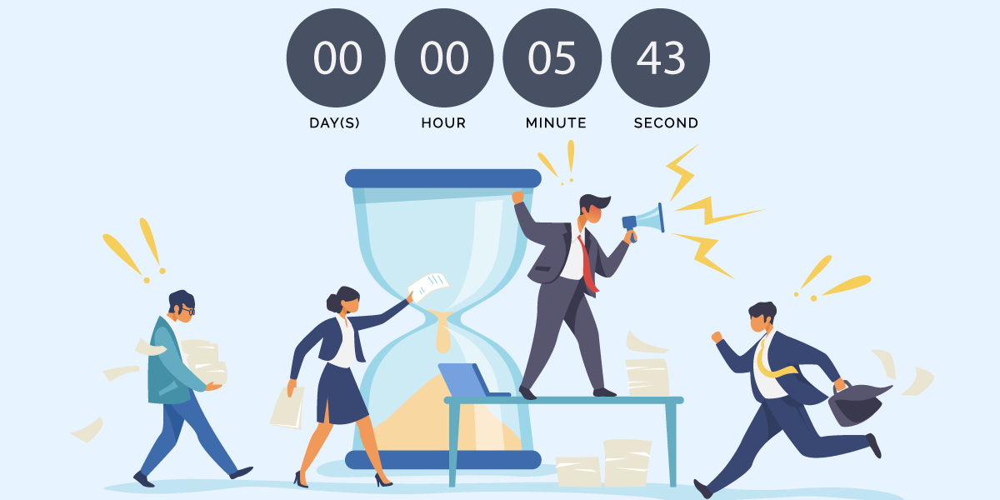
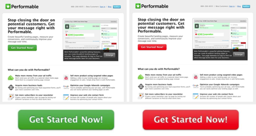
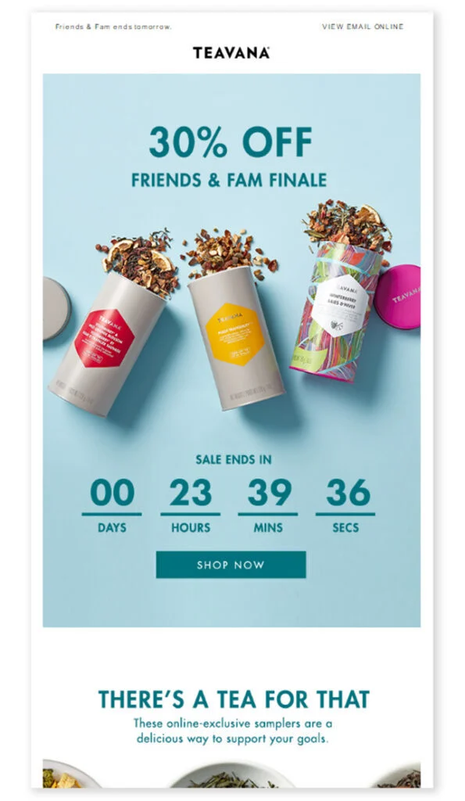
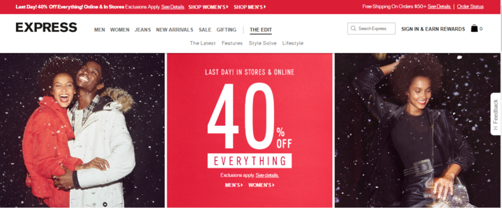
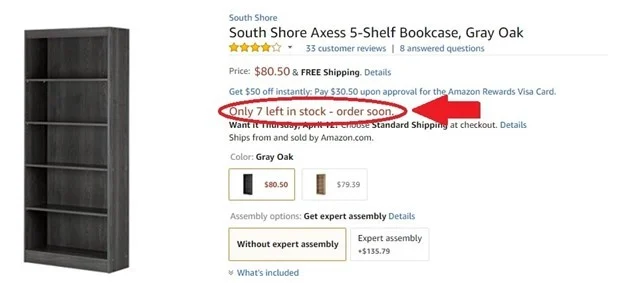

# How to Create Urgency in Sales?

## Are you wondering how to create urgency in sales? You're not alone. Many people struggle with this challenge and find it difficult to reach their sales goals.

You're more likely to buy the perfect gift when you find it. If the product is nearly sold out, you'll likely rush to grab it and get it home as soon as possible.

Skilled marketers create sales pitches that evoke a similar sense of urgency in potential customers. This is achieved by using a variety of sales techniques that include scarcity, fear of missing out, and emotional appeals. They also use incentives, deadlines, and incentives.

This article will show you how to create urgency in sales by using tactics that increase your sales, regardless of what product or service you offer.

### Wait...What's the meaning of "sense of urgency"?

It is used in business environments to communicate to people or teams that it is imperative to act quickly, decisively, and without delay. This phrase can be used in leadership and management, as well as in Revenue Teams.

#### 9 Simple Ways on How To Create Urgency In Sales Cycle

You can create anxiety among your audience by implying that your product or service may not be available shortly. People are more likely to act quickly and make a purchasing decision if they have a deadline.

These nine tried-and-true tips will help you feel more urgent.

**1. Add a deadline to your sale.** Prospects will spend time evaluating the pros and cons of your product or service even if there is no time limit.

They may look at the offers of other competitors, review reviews, and check out product specifications. Sometimes, they might simply walk away from your offer and then forget about it.

*You can avoid many of these problems by adding a deadline for your offer.*

You can offer a time limit discount or bonus if they buy within the next 24 hours.

You can even set deadlines for shipping so that the customer knows how long they have to purchase the item to receive it the next day.

**2. Let potential buyers know the value of your product.** The best way to create urgency in a sales pitch is to explain why the prospect *needs* your product or service. Begin by describing the benefits that the product or service will bring. Describe a value proposition and how your product differs from the competition.

**It is possible to highlight the negative effects of customers *who don't buy from you.***

If they decide not to buy your carpet-cleaning product, their carpets will continue to collect dirt, dust mites, and other contaminants. It will make their home unhygienic and even put their children in danger.

Instead of offering your prospects a *nice to have* purchased, offer them a *must-buy.* This will combine with a feeling of scarcity to make it more attractive for your prospects to buy from you as soon as possible.

**3. Fear of missing out is a powerful motivator to get them to buy.** FOMO (fear of missing out) is a powerful technique to create urgency. FOMO can be used to your advantage by telling your prospect how many products are still in stock or how many tickets are available at your exclusive event.

You can have your website update the remaining quantity whenever you sell online. Mark an item that sells quickly with a unique graphic to indicate it's a "hot product." This tactic is used by Amazon and eBay to show how many products are in stock, and how fast they're selling.

**4. Warm colors will sell more.** Marketers use certain colors to create urgency. HubSpot's A/B testing found that warm colors like red, yellow, or orange convert better than cold colors like green and blue. Warm colors such as red are perceived by humans as a sign of danger, importance, or action. These colors grab people's attention and convey a sense of urgency.

([Source](https://blog.hubspot.com/blog/tabid/6307/bid/20566/the-button-color-a-b-test-red-beats-green.aspx))

**5. Keep increasing the urgency.** You should keep increasing the urgency by following up with prospects. A quick email informs prospects how long they have to wait for an exclusive offer. To make the deal more appealing, you can also include a bonus that has a time limit in your emails.

([Source](https://www.liveagent.com/templates/discount))

**6. Reduce any barriers that hinder quick transactions during the sale.** Make it as easy as possible for your prospects to buy your products. A **money-back guarantee or testimonials** can help to lower or eliminate doubts in prospects who first see your product. You can also streamline the checkout process to make it easier for them to complete their purchase.

**7. Use powerful titles.**

The title should indicate urgency. Use titles that convey the exclusivity or scarcity of the offer Titles like "Final Days! Summer Sale Ends Sunday!" and "Last Chance: Limited-Edition Shoes 50% off!" quickly communicate that a limited offer is available. ([Source](https://neversettleblog.com/limited-time-offer-how-to-write-a-discount-offer-for-limited-time-only))

**8. As an incentive, you can add time-limited bonuses.** Offer a bonus item to customers who purchase within the hour. They must act quickly if they want the "free" bonus item. This urgency can be triggered by even a low-value mystery item.

**9. Use words that convey urgency.** ([Source](https://www.searchenginejournal.com/create-urgency-conversions-sales/249643/#close)) Compelling ad copy conveys urgency to potential buyers throughout the entire offer. Use time-related words as they immediately trigger a feeling of scarcity or fear of missing out. Use phrases and words like:

* Limited release
* Time-Limited Offer
* Exclusive one-day sale!
* Last chance
* Clearance
* Hurry!
* Don't miss this opportunity

### Create Urgency Without Being Pushy

Sales are only possible if you have urgency. Without urgency, deals can be delayed, stalled, or even stopped altogether. This raises the question: How can you create urgency and not fall into the trap of being pushy and aggressive?

**Ask the right questions.** Your buyers need to be able to identify their urgency. Asking your buyers questions that help them understand why they must act is the best way to create urgency. For example, "Why are you looking for a solution now?" or "Who or What is affected by this problem?"

**The more people affected or the more important the business affected, the greater the urgency.**

**Ask what might happen if they don’t take action?** It is a great way to instill urgency. Have a conversation about what would happen if the buyer chose to keep the status quo. This conversation could involve multiple scenarios rather than a single "This is what will occur."

Begin by asking the buyer to describe what they see happening if they do not address the issue(s). This discussion should be framed in terms of the buyer engaging in self-exploration. They will then be able to realize that this is an urgent matter that needs to be addressed quickly.

**Do not pressure them into reaching their conclusions.** This can make them feel pressured and may hinder their natural ability to reach the right conclusions.

**Mention the deadlines for promotions.** Make sure your buyer is aware if you offer a discount, a time-sensitive offer, or an incentive with additional incentives. When bringing up the subject, be careful not to be pushy. You can calmly say, *"Not sure if it's obvious, but we have an early adopter discounted if purchased by October 3.*

**Consider shorter communication intervals.** Your company should have a clearly defined sales pitch. This includes protocols for when to follow up. You may need to reduce the timeline in certain cases, such as when the fiscal year ends.

**Listen for the closing signs, and then act accordingly.** Sometimes, the reason for a stall-out is not due to a lack of urgency. It could be that the sales rep missed the signals to close and asked too late (or never). It is important to understand the buying signals and the steps involved in closing the deal.

There is rarely a sale if there is no urgency. Buyers need to have a reason to buy, not just to purchase shortly but also to purchase right now. These guidelines will help you create urgency without putting pressure on buyers and help them see the importance of moving forward with a solution.

### Summary

As a sales rep, adding a small amount of implied or real urgency *will not* increase your conversion rates in very few cases. It's important to not abuse power like all other things. By applying these tactics, you will know how to create urgency in sales and increase your conversion rates.