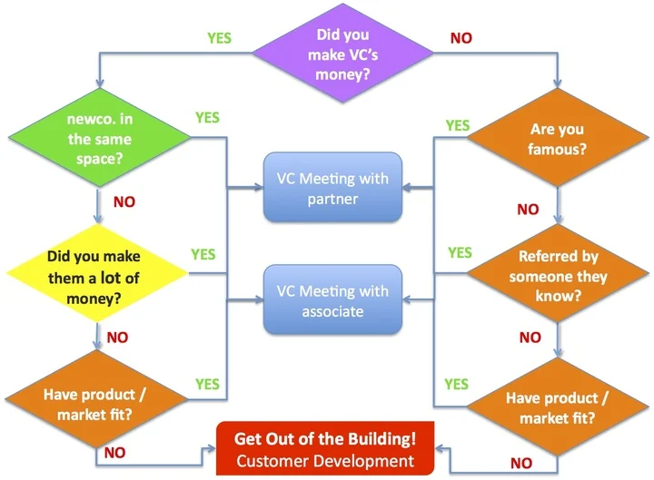

# How to Get a Meeting with Anyone

## Do you want to score a meeting with the CEO of your dream company? Or maybe you're looking to network with someone in your industry, but don't know how to get started. 

### Ways to Get a Meeting With Anyone

#### Social Media

Contact marketing is something anyone can do, even if they don't have the budget. Social media is accessible to everyone.

#### Email

Good luck with getting a response if you send an email to a CEO. They are extremely busy.

Executive assistants can intercept their emails during the week. Emailing is best done early Saturday morning or Sunday evening when they are checking email over coffee or preparing for Sunday evening. This is another tactic that will not cost you anything.

These emails should be concise. CEOs don't care if they get a cold email about you. It's not because they are self-centered, it's because they are focused on what they want to accomplish.

If you want to enter their world, you need to address what they are trying to achieve.

#### Cartoons/Comics/Physical Objects

([Source](https://blogs.berkeley.edu/2012/10/17/how-to-get-a-vc-meeting-the-flowchart))

Cartoons double email open rates. While you don't necessarily have to use cartoons, think about how humor can be combined with tangible objects. CEOs will learn everything they need if you use humor to express the truth. They will be impressed if you do it right.

#### Give Your Target Some Exposure

If you can show the CEO that your goal is to get some media exposure, it will pique their curiosity. This is how you enter their world.

The best way to start a sales conversation with a potential new customer is by leveraging an existing relationship. Establishing trust and credibility is key, so be sure to provide valuable content that will help the listener succeed. Once you've built up some rapport, it will be easier to transition into a discussion about how your podcast can help them meet their goals.

### Executive Assistants: A Quick Note

Executive assistants are important when you're chasing CEOs. Executive assistants are often called gatekeepers. This is because half of their job involves keeping people out. The other half of their job is to let the right people in.

Their job is to spot opportunities that the CEO might miss. They *listen.*

They will know if you try to get around them. They report directly to the CEO just like VPs. Consider them your partner, not your adversary.

### Summary

So, now you know how to get a meeting with anyone. By following the tips and tricks in this guide, you'll be able to make an impression and score that all-important meeting. Good luck!