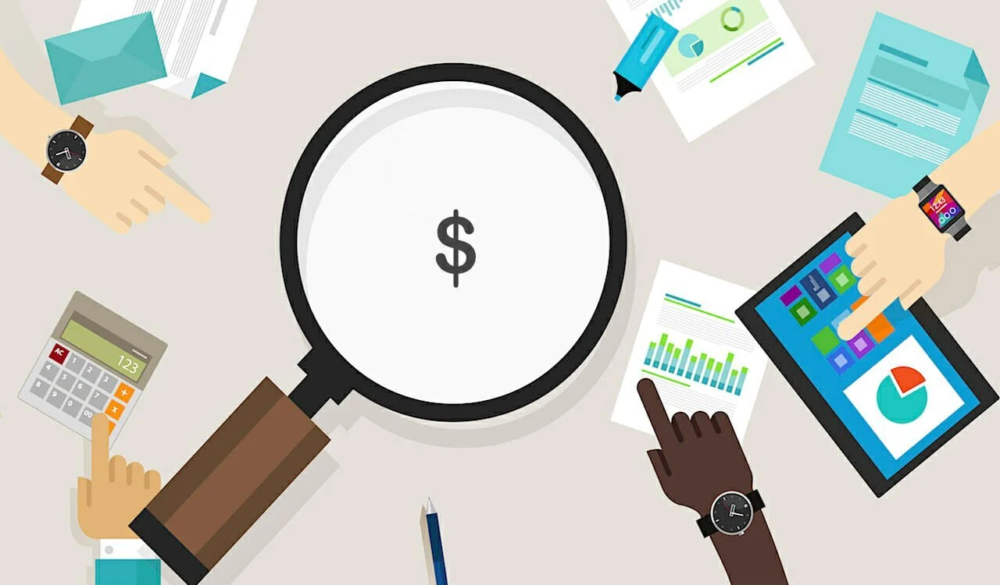
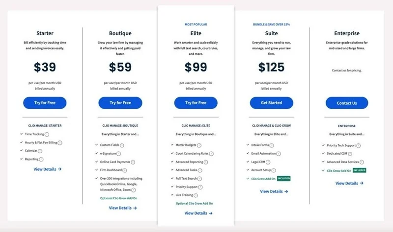
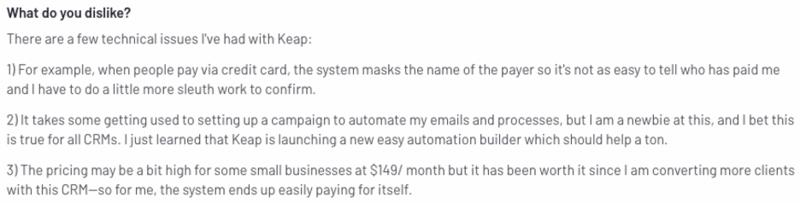

# How to Get Competitor Pricing

## Looking to get the best deal on a product, it's important to research your options? Check out what your competitors are charging for similar products. 

### Definition

The competitive analysis involves analyzing competition to better understand their strengths and then comparing that information to your business to provide differentiation value and improve your operations.

Knowing how to get competitor pricing information will help you determine where you fit in the retail landscape.

For example, are you a discount brand or retailer, premium, luxury, or somewhere in between? To gain a competitive edge, where can you lower prices? To increase margins, you can raise them.

Tracking your competitors will also highlight their pricing strategies. Are they like Amazon? They change prices every minute. Are they slower to adjust prices?

If you are aware of the market, you can optimize your price.

### How to Get Your Competitor's Pricing

It is possible to find pricing information from your competition and activate it. Pricing intelligence can help your sellers knock out competition and accelerate the sales cycle, as this example illustrates.

However, it is important to not obsess about competitor pricing strategies. It is not the only way to win competitive deals. Your sellers must show prospects how your product will alleviate their pain points and help them achieve their goals.

However, we can all agree that it *doesn't hurt* to keep up-to-date on the pricing strategies of your competitors. Today's blog will help you navigate your research by highlighting five places you can look for pricing information.

#### 1. Competitor Websites

It's amazing how many companies list prices on their websites. Some companies may not include pricing in large print on product pages, but others make it clear for everyone to see. Clio is one example.

([Source](https://www.crayon.co/blog/how-to-gather-your-competitors-pricing-information))

Imagine that you are a Clio competitor and one of your sales reps is running a demo to a prospect who can only spend $75 per month. The prospect will comment on the importance of being able to dig into metrics when your seller talks about reporting.

Pricing intelligence can seal the deal when you're neck-and-neck with your rival.

#### 2. GSA Price List

Some industries have public records that make it easy for you to monitor the pricing strategies of your competition. If your competitor sells to the government, there is a good chance that their prices are listed on the GSA (General Services Administration) price lists. Each listed company offers products and/or services to federal, state, and local buyers -- more than 11,000,000 businesses to be exact.

Go to the GSA website to unlock your competitor's list prices. Click on the following link to go there:

1. Click on "Buying & selling" in the left-hand sidebar, then select "Purchasing Programs" and navigate to "GSA Schedules."
2. Click on "12 Large Categories" from the GSA Schedule Overview page.
3. Choose a category from the left-hand menu (e.g. Information Technology).
4. Select a subcategory (e.g. Telecommunications).
5. Select a sub-sub-category (e.g., Wireless Mobility Solutions).
6. Look through the list of vendors to find out their prices.

Price lists can give you a lot of information, including the lowest-priced item, hourly rates, maximum and minimum orders pricing, cost per month, etc. This makes it easy to gather pricing information. However, we would be remiss to not point out that the contract practically *guarantees* higher sales and better profits for your competitor.

#### 3. Analyst Reports

Open Google and type in your industry followed by "report" into your search bar. You're likely to have found analyst reports. Step one is complete.

Next, you need to find reports that directly compare your company to its competitors. Reports that focus on market pricing trends (which include price comparisons) will be most common. You may also find *that are focused* on pricing analysis. Although it may take some time to find just the right report, the valuable insights that you get will be well worth it.

#### 4. Review Sites

Online reviews are a common feature in your market. You can find pricing information on sites such as Reddit, Trustpilot, and Quora. G2 even has a whole section dedicated to pricing reviews. As an example, take a look at this Keep review from G2:

You will find the information you were looking for. The user can also indicate how much she pays per month under number 3.

You may be wondering how you activate this intelligence. Let's say you are a Keap competitor. This reviewer has a strong ROI. If that's Keap's main selling point, this little bit of pricing information might indicate that it's time to arm your sellers and give them an ROI calculator.

This way, they can win when Keap is involved and pricing is a topic of discussion.

#### 5. Your Prospects (via your Revenue Team)

Consider how many calls your sellers make each day. It's likely in the hundreds. This means that your sales team has plenty of opportunities to learn about competitor pricing strategies. You can expect at least one prospect to share pricing information with you when you speak to so many prospects.

How can you ensure that pricing information is shared in real-time so you can activate it quickly? You must build and maintain strong relationships. It is crucial to have a plan of action and to be connected with sales so that sellers can share the right information in the right format at the right time.

You can keep in touch with your reps by scheduling regular check-ins or encouraging them to use a competitive pricing Slack channel to exchange intelligence. Your sellers should know that you are available to join any calls in which pricing is an issue - no matter if you're just a spectator or a guide to the conversation to close the deal.

Sometimes, the answer to your question (in this case pricing) is right in front of you!

### Analyze Competitors 

Completing all of these steps will give you a better understanding of your business's place in the market share. This is important from a price perspective. It is essential to price confidently and effectively, regardless of whether your average deal size exceeds $500,000.

Don't treat competitive analysis as a secondary task or an exception. It should be part of your daily routine.

Your direct competition also changes as prices change. To make the best decisions for your business, you need to be aware of what is happening.

### Summary

Now that you know how to get competitor pricing information through the use of competitive analysis to identify actionable opportunities, you can gain a strategic market share advantage, expose competitive gaps, provide differentiation value beyond price, and reduce the pressure to discount. 