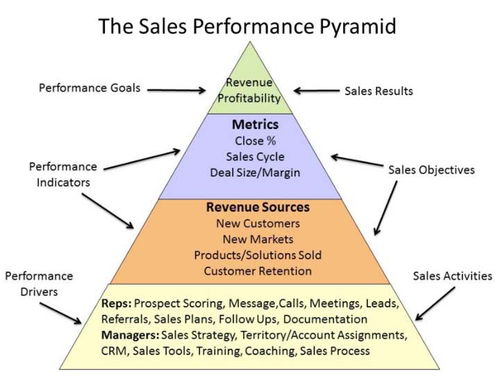

# How to Improve Sales Performance

## Are you looking for ways to improve sales performance? Learn how to improve revenue-generating tasks.

### Definition

Sales performance measures sales activity and the corresponding results including expectations and sales quota. It is highly valued but can be difficult for many salespeople to attain.

Great sales performance is dependent on consistency. A team who is consistent can achieve great Revenue results every month. But anyone can have a bad month.

The input is a table that tracks sales performance. It includes the date, product, and quantity of each sale.

([Source](https://www.business2community.com/sales-management/how-to-improve-sales-performance-02261144))

### How to Improve Sales Performance

**1. Get in the right mindset.** Your attitude towards a deal can have a significant impact on its outcome. Success is often a self-fulfilling prophecy. You will be more successful if you approach your job with the mindset of "I'm going make it".

To be a top-performing sales representative, it takes more than believing you are destined for greatness. It can take years before you become a true professional in your field.

**2. Pick the right vertical, and learn it backward and forward.** Business acumen refers to the ability to understand business operations. It helps you to be credible when positioning your products and services.

Sales are all about trust. It is important to show prospects that you are trustworthy by offering a product/service that is well worth their time and capital within a short timeframe.

It is important to have a deep understanding of the operations of similar businesses to yours. It is a good idea to spend some time learning about companies in your industry.

Approach every prospect with a picture of their industry peers and knowledge about the challenges faced by companies of similar size.

You can make small improvements every day to your business acumen. You can also read financial reports and credible business publications to gain a deeper understanding.

**3. Get organized.** One of the most important aspects of improving performance is to focus on the right task at the right time. If you don't take the necessary steps in order to properly allocate time for work, such as scheduling time, you might be neglecting important responsibilities. This inefficiency can have a lasting impact on your sales performance.

It can be useful to ask your team members for assistance if you are having trouble managing your organization. You can gain insight into their workflow and get some helpful tips by looking at their workflow. It can also be exhausting to try to focus on too many priorities at once, which can lead to lower overall performance. To achieve the best results, prioritize your prospects.

**4. Examine all relevant information regarding your position and job.** To help reach their sales goals, most salespeople are given a sales goal and activity metrics. Organizations may publish these numbers so that salespeople can compare their results with high performers.

It is important that you read the data and incorporate it into daily life.

Your macros are your metrics and KPIs. You won't be able to gauge your performance if you don't know which metrics or KPIs you need to reach your goals. Your team might have different metrics from you.

While your definition of success might differ from that of your peers, it is important to know the key performance indicators (KPIs), which your sales organization tracks. This information is essential for improving your sales performance.

**5. Be specific and set goals that are beyond job expectations.** Sales is a popular career that attracts high-energy, ambitious professionals. Many of them are driven to exceed their quotas while keeping their feet on the ground. This type of goal-setting can improve sales performance. Salespeople are no exception to this rule.

You're more likely than not to achieve your goals if you have clear goals. Don't be afraid of setting high goals and aiming to be the best salesperson possible!

It motivates you to work hard and allows you to adapt if you fail. To improve sales performance, it is important to set achievable but ambitious goals. It is important to know the difference between dreaming and goal setting.

Specific, trackable goals are better than vague, unmeasurable goals that can have a negative effect on performance.

You must clearly define your goals and create a plan to achieve them. Then, share your plans with your managers and colleagues. This will help you stay on the right track and hold yourself accountable. 

**6. Focus on your ability to learn and improve over time.** There are many opportunities to learn and grow in sales careers. This field is a great place for growth, but you must be able to plan and work hard.

This is a great way of streamlining this type of growth. It is a living document that outlines your goals and when you want to improve them.

You need to pick a skill that you are interested in if you want to make one. It is important to record the steps taken to improve your skills.

If you haven't received one within the first day, you can ask your manager for one. This is a great way to show your manager that you are new to the company. This is a way to show your manager you are interested in moving up in your job.

**7. Find a mentor/sales coach.** Sales can be difficult to navigate, especially for those who are just starting out. It can be difficult to know the best approach or where to start. A professional sales consultant can help you get started.

Your manager might not have the time and perspective to do this, but a consultant can help you get the tools and advice that you need.

You can benefit from the guidance and support of a mentor, confidant, or sales coach outside your company to help you improve your sales skills and get on the right track. An objective perspective can help you see your professional growth objectively.

It is easy to get stuck in a routine that limits your potential. If you have someone to help you, to listen to you and to criticize you, you can spot potential problems in your approach and conduct to prospects.

**8. You can track your progress in both quantitative *and qualitative* ways.** You must keep track of where you are succeeding and where you are failing to perform in order to improve your sales performance. It is crucial to continuously monitor your progress, both qualitatively and quantitatively.

This can be done weekly or monthly so you have clear evidence of where you are succeeding and where you are falling behind. This can motivate you and help you understand the relationship between your performance and the success of your wider sales team.

You can increase sales performance by keeping track of your successes and maintaining positive morale by effectively documenting them. You can keep track of your achievements and maintain a positive outlook to help you achieve great things.

**9. Use your creativity to solve problems.** There is no single way to succeed in sales. Your creativity can help you be successful over the long term.

As a sales professional, your job is to solve problems for customers and make them look good. The more innovative and creative you are, the greater your chances of success.

**10. Celebrate your wins.** Sales careers can be challenging and rewarding. To be successful long-term, it is important to understand both sides of the coin. Salespeople often focus too much on the "challenges".

It is important that you improve your weaknesses. They will become a problem if you ignore them too often. To improve sales performance, you must celebrate your wins, regardless of how small or big they may seem.

When you achieve a goal or improve your skill, share your achievements with your manager or team. Each win is important and celebrating them can help you keep going.

### How to Improve Sales Team Performance

Some elements of the above activities are necessary to improve the performance of a sales team. Complexity is added by the fact that multiple salespeople may be involved.

When there are more people involved, there are more variables to consider. It can be difficult to improve the performance of a group. These are the top strategies sales managers can use in order to improve the performance of their sales teams.

#### Use a people-first approach.

As with any other organization that is made up of people and sales, every Revenue organization should be focused on its employees. This is something that you must remember when trying to improve your team's performance. If you want your team to be productive and successful, you must win their trust as a manager.

It all starts with getting to know your team and letting them get acquainted with you. Meet with each member of your team multiple times to get a clear understanding of their individual skills, strengths, weaknesses, and demeanors.

Take a look at the quarter and past performance reviews. To evaluate their performance, look into any self-assessments that they may have made. Give them the opportunity to share their experiences.

This activity is designed to allow you to get to know your reps better while remaining professional. Once you've done this, let your reps do the same. This will encourage them and give them more ownership of the team's success. 

#### Your team should feel secure.

A team's ability to engage with diverse perspectives and encourage discussion is key to its success. Team members need to ask themselves if they create an environment that is safe, accessible, welcoming, and inclusive for all people.

It is essential to create an inclusive environment in order to build a diverse and successful team. Managers must be thoughtful in their leadership and provide a safe environment for employees to voice their concerns and offer suggestions. This will allow the team to work more effectively together and perform better as one.

Sales leaders are responsible for ensuring that everyone within their company is free to express themselves without fear of ridicule and judgment.

#### Analyze relevant team data.

If your department has not established benchmarks yet, you should prioritize the following information.

* **Keep your eyes focused on prospecting.** If your team understands how many deals must be created and when they must complete them, everything else will fall into place. This allows them to remain focused on the prospecting tasks that are necessary to succeed. To gauge the effectiveness of your prospecting efforts, you can monitor lead work rates as well as the time it takes to follow up with inbound leads. Other relevant information includes the number and depth of leads being worked each day (average prospecting touchpoints per lead), and the time salespeople reach out.
* **Check the close rate by rep data** - A lower closing rate for sales reps could indicate a bigger problem.

By closely monitoring rep performance during the sales process, you can identify and fix problems that could negatively affect your business.

#### Each member of the team should have regular one-on-one meetings.

As a manager, it is in your best interest to understand how your reps feel, perform and think about the future. This goal can be achieved best through one-on-one meetings.

These types of check-ins are also a way to remind your employees how crucial they are to the company’s vision and mission.

You must understand the *why* behind your reps' performance if you want them to succeed. These situations can be discussed with team members in one-on-one meetings.

#### Establish peer coaching.

Sales managers are responsible for providing professional insight and guidance to their reps. You are only human. You are one person with limited energy and limited time.

While you should always try your best, remember that the growth and performance of your reps are not your sole responsibility.

If your team structure allows it, you might consider pairing reps from different experience levels together. This will increase team accountability, foster peer coaching, and foster productive mentorship. This will allow your younger colleagues to learn from more experienced peers, as well as give more experienced reps the chance to share their knowledge.

This strategy has two advantages. Your less-experienced reps can benefit from your valuable perspective that will shape and improve their skills.

Additionally, reps who take on the "coach" role in this dynamic gain development experience that can be used later in their careers to better manage any management opportunities.

#### Do not be complacent.

Inertia won't make you a better sales manager or improve your organization's overall performance. Always keep one step ahead. This means being active.

Avoid surprises that could hinder your sales performance or throw your company off-track. Keep an eye on your business's health, and monitor your team's key performance indicators.

It is important to not get too focused on the performance of your lowest performers. You should also challenge tenured and overachievers.

Keep them on their toes. They deserve to be celebrated for their success. Recognize them. Recognize what they do well and let them know that there are always opportunities for improvement. Keep challenging and motivating them to achieve new heights.

To show your belief in their success, set higher goals for both the team and each individual. This will help motivate them even more.

#### Set realistic and achievable goals.

Your sales organization's larger goals can seem overwhelming. It can be counterproductive and difficult to achieve all of them at once. Reaching the big-picture goals should be a gradual process.

By breaking down ambitious company-wide goals into smaller parts, you can increase performance and morale.

These small, but achievable milestones are often called operational objectives. These milestones can be vital in ensuring that your Revenue team has the structure, reassurance, and support it needs to succeed.

This input is saying that you can't expect to get the results that you want by telling your staff to reduce the time for a new rep or to be onboarded by a specific percentage.

Instead, set operational goals like finding conversational intelligence software to streamline how managers can shadow calls, creating an easy-to-replicate training system on a weekly basis, and choosing a training method that is effective in guiding the onboarding process.

By breaking down your strategic goals into smaller and more actionable steps, you can help your reps stay on the right track and improve their professional well-being. 

#### Get involved with your reps, and not micromanage.

Sales leaders who can balance trust and guidance will help their reps achieve greater professional growth.

You as a manager need to be involved in your direct reports but not interfere with their growth as salespeople. As I mentioned, regular one-on-one meetings are a great way for your reps to make progress.

Also, consider holding standups for reps to voice their concerns, congratulate and celebrate their accomplishments, and create a culture where they can come to you with any problems.

Keep an eye on the performance of your team and work with those who are struggling to find and fix the root cause.

You should give direction to your reps, but not micromanage. 

#### Only hire qualified candidates.

If the people in your sales team aren't skilled or willing to help, you can't improve their performance. You must hire well if you want to build and maintain a high-performing Revenue team.

It is important to fully understand the product or service you are selling, then search for candidates with the right experience, skills, and demeanor. The ideal candidate is more than just technical skills. Sales reps should be able to seamlessly integrate with your team and fit into your company culture.

Morale is a key factor in sales performance. Sales reps who lack the intangibles required to thrive in the environment that you create may be subordinate, not interested in supporting their peers or weakening your leadership. This can have a major impact on your company's overall performance.

### Tracking Sales Performance

You can track the performance of sales reps individually or collectively by using a variety of key performance indicators (KPIs). These are the most important and valuable metrics you should be tracking:

* **Win Rate** - This is the percentage of prospects that reach the final stage and become customers. It is divided by the total number of prospects in the pipeline.
* **Quota Attainment** - The percentage of reps who reach their quotas in less than a quarter.
* **Sales Cycle Length** - This indicates the average time it takes for a representative to complete a sales cycle.
* **Pipeline Coverage** - Your sales opportunities are compared with your revenue target.

It is essential to continually improve sales performance at both individual and team levels in order to create and sustain a productive and healthy sales organization. This requires everyone to take responsibility.

Reps should be open to learning new opportunities that will help their professional growth. The performance of a sales team depends on its leader's leadership efforts.

They are expected to encourage, support, challenge, and provide feedback to their team members to help them improve their skills and make the most of their potential. This begins with effective training and onboarding. It continues with constant attention, thoughtful guidance, and a degree of trust.