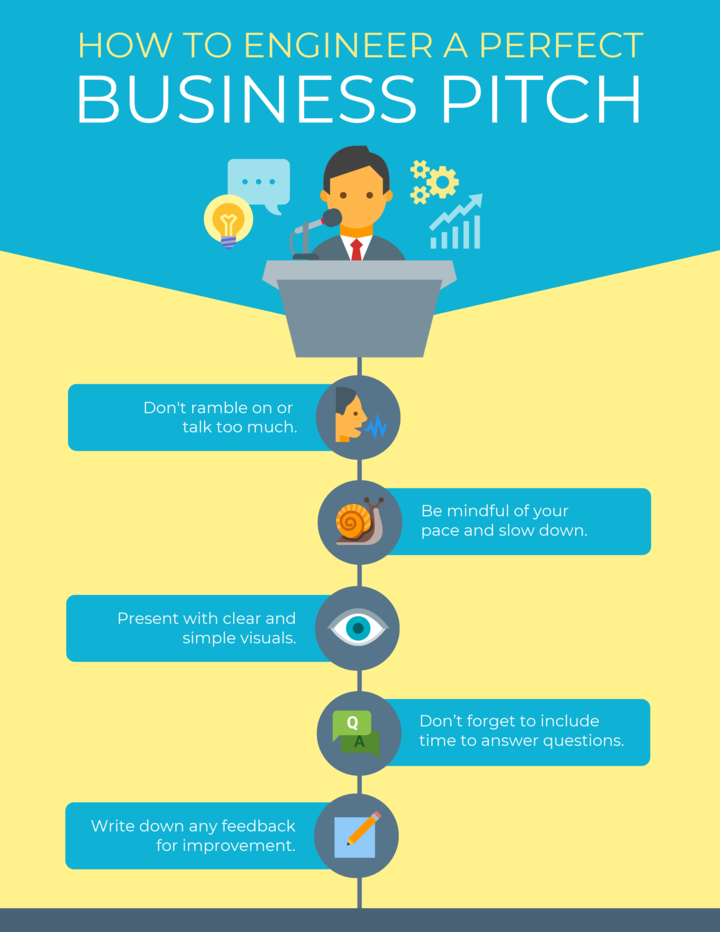
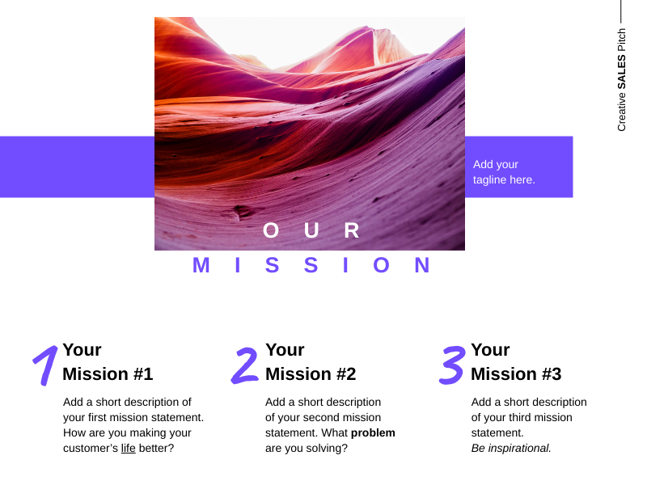

# How to Make Pitch: A Guide to a Successful Business Pitch

## Making a great pitch is essential for getting your business idea in front of the right people. But what makes a good pitch, and how can you make sure yours stands out from the rest?

### Definition

A business pitch is a presentation about a business idea to a group that can help it become a reality.

([Source](https://visme.co/blog/business-pitch/#:~:text=A%20business%20pitch%20is%20a,to%20make%20the%20right%20decisions.))

**You may pitch to:** 

* Investors who are willing to help you fund your idea.
* Potential customers who are willing to pay for your product/service.
* Advocates who will support you with your idea.

Sometimes, a pitch for a business doesn't have just to present a new idea. You might be asking for additional funding or continued support for an existing business venture.

A business pitch is successful whether it involves advocacy, investment, or purchase. It is possible to convince people to believe in your idea, pique their curiosity, and get them to learn more.

Let's now look at what a business pitch looks like.

### Types of Business Pitches

These are the types of business pitches that can be used to narrow down your pitch:

#### 1. Investor Pitch

This type of business pitch is where you [present a convincing pitch deck](https://rev.team/kb/what-is-a-pitch-deck) to potential business partners or investors.

This pitch lasts 45 minutes. There will be a presentation, followed by a discussion or Q&A. A pitch competition also includes a 5-10 minute business pitch to investors.

#### 2. Sales Pitch

A sales pitch should answer the question *"What's it in it for me?"* through the eyes of the potential customer.

Salespeople who are the best can deliver a sales pitch in under a minute. This pitch is also known as the elevator pitch. You should be able to deliver the pitch in a single elevator ride (30-60 seconds).

#### 3. Product Pitch

A product pitch is similar in structure to a sales pitch but the focus is on the product.

A sales pitch for an email automation program will highlight one or two of its benefits. A product pitch for the same automation software will highlight its features, how it works and how you can integrate it into your existing setup.

#### 4. Job Pitch

If you are applying for a job, internship, or other position and you are curious about how you can stand out from the crowd of qualified applicants, you might consider pitching yourself to potential employers.

#### 5. Workplace Pitching

Do you have an idea or an initiative that would benefit your colleagues and increase the company's profitability? Tell your boss or team!

You might pitch a remote-first culture and a 4-day workweek to your HR and the rest of the leadership team. You might also propose the creation of a role in your organization that can help you advance your career and solve a problem in the company.

### Structure of a Successful Pitch

You will know exactly what you are going to say next when you have a structure.
The structure also makes your business pitch more memorable for your audience. It turns out that structured information is retained up to 40% more accurately than information presented in freeform.

#### The WHAC Method

You can pitch to potential investors or sell real estate using the WHAC method.

The 3 Minute Rule is a book by Brandt Pividic. Pividic is an award-winning filmmaker and television producer. The book was written by him to share his experiences and tips from hundreds of pitches in Hollywood.

**What is it?** Start your pitch by answering these questions: What is it? And what do you offer?

You will then share your business plan and briefly outline the problem and solution that you offer. Let's say you want to pitch the idea for a UX researcher within your product team.

You will list the current problems and challenges your team and organization face without the help of a UX researcher. Then, you present your solution: hiring someone to do user research.

**How does it work?** Next, describe your proposal. Give a summary of the benefits of your proposal. In this example, describe how the UX researcher will assist the product team in achieving its goals.

**Are you sure?** After you have presented the solution, people who listen to your pitch will likely ask, "Will it work?"

This is where you need to give solid proof in your pitch. You can use testimonials or a short case study, as well as statistics. This is the time to highlight your research results if you have done research.

**Can you do it?** This should be the last part of your pitch.

After your audience has heard you discuss the problem, solution, and proof it works, now you need to show them how to implement the solution. This is the "actionable" portion of your pitch.

"Show that you have thought through how you can turn your idea into a real partnership or commercial outcome. This is a great opportunity to build trust and show that you care about creating value for people in the room.

### How to Create A Convincing Pitch

([Source](https://venngage.com/templates/infographics/how-to-engineer-a-perfect-business-pitch-81759855-2dd1-41e2-84cd-74e36287e175))

You now know the structure of a business pitch. Here are some tips to make your pitch more engaging, relatable, and, most importantly, convince your audience to say "yes".

#### Step 1. Learn what your audience wants from and from you.

It is common advice to "know your audience". 

If you want to improve your business pitches, you should understand your audience.

Understanding and knowing your audience is a different thing. Instead of *knowing* the origins of your client, try to understand their motivations, goals, and pain points.

How can you do it?

Talk to them beforehand, read about their online content (tweets and blog posts), and find out what interests them. This will allow you to tailor your pitch to their needs, wants and preferences.

If you are pitching potential investors and clients who are eco-conscious, it makes sense to highlight the positive impact your idea can have on the environment.

Stephen Keighery, CEO and Founder of Bald Arrow Investments USA, shares his top tip for customizing your pitch to your target audience:

> *"Do your research on the company you are pitching to. But make sure you don't divulge any confidential information. You can observe their behavior and how they speak during the transaction.  Perhaps you can use their jargon to make a connection with them while pitching."*

#### Step 2. Prepare your elevator pitch.

This is what you can imagine. Imagine that you just bumped into Mark Cuban, Shark Tank's star, at an airport lounge. He looks at your face and asks about you and what you do.

This is where you will need your elevator pitch! The Asana team recommends these elements for a great pitch:

* Introduction
* Problem
* Solution
* Value proposition
* CTA (call for action).

The exact formula doesn't have to be followed. You can vary the formula depending on the situation, your personality, and the audience to which you are pitching.

It is also important to remember that your elevator pitch may not be immediately obvious. Consider it an opportunity to make a great first impression.

#### Step 3. Use visual aids.

If you are allowed to present beyond the elevator pitch, don't use text, numbers, or endless rows and columns of data.

Our brains are wired to love visuals, from photos to infographics and icons.

Get your audience's attention and support when pitching a product, idea, or service. Your PowerPoint slides can be visually told and creatively enhanced.

Images can trigger empathy, which can help your audience better understand your pitch.

The more they know your idea, the higher the chance of venture capitalists, angel investors, and potential customers supporting you or advocating for it.

Another benefit is that visuals can elicit emotions, which can be a significant factor in decision-making.

#### Step 4. Explain your business model clearly.

Imagine investors asking you, "What's in it??" when pitching investors.

After hearing about your idea, they are interested in how you will advertise to your target market to generate consistent revenue.

Johannes Larsson, Financer.com CEO, explains that being able articulate their business model was key to their success in attracting business partners.

> *"We were relatively unknown in this industry so it took us quite some time before we signed our first contract. Things became easier after that, not only because we were building a reputation for ourselves, but also because our approach was better.  It was essential to be able to communicate our business model to potential partners to win their trust. Once that was done, we began to focus on proving the success of our partnerships. We knew that affiliates cared about this information so we made sure to gather proof of our success and present it in every pitch."*

#### Step 5. Your pitch should reflect your passion and story.

([Source](https://piktochart.com/blog/sales-pitch-examples))

Your pitch for business doesn't need to sound like it was written by someone else.

If you feel it is appropriate, add your personal touch. Your pitch and slide deck should be humanized.

This will increase your friendliness and make you feel less anxious. You're speaking about something you are passionate about.

Debbie Chew, a Dialpad SEO Specialist, has the following to say.

> *"As part of my hiring process, I had the opportunity to pitch a marketing campaign concept. To decide which one to choose, I began brainstorming potential ideas and their projected impact.  This led me to a single idea that kept coming back to my mind. It was a campaign about video meetings. Video meetings are now so popular, but how much?  How can we have better meetings? Chew shares that I pitched my idea around this concept and enjoyed it, which also helped me feel less anxious.  Your audience will remember your pitch if you share a personal story or something that you are passionate about. Yes, I got the job!"*

#### Step 6. Focus on the benefits.

Once you have captured the attention of your audience, return to your product or service and explain how it will benefit customers and business partners.

Trust.io's Carsten Schaefer says it boils down, for her, to be able to share the benefits of your product/service from the beginning.

> *"When I was first trying to raise money for my product, I had the task of delivering a pitch to investors. It didn't work out, but I learned a lot.  Investors are looking for hard facts and benefits for the end-user. They want to know if the product makes them money. I'm glad I didn't succeed because it taught me that effective sales pitches can only be made if you think about profit and common sense from a business perspective."*

#### Step 7. Highlight what makes you different from your competition.

Your business pitch allows you to tell others what makes you different from other businesses and organizations. What makes your idea unique? What makes your business model different?

It helps you to address the competition head-on in your pitch. Brogan Renshaw, Firewire Digital, believes this tactic shows investors and clients that you're an expert in your field, which gives them confidence in your offer. Renshaw says,

> *"I notice that this part of my business pitches wins the client over because they have questions and concerns about the market position of rivals."*

#### Step 8. Share the story behind your team.

Investors and business partners are also interested in the people, employees, and team behind your idea. Don't forget to include information about your team and the skills of each member when creating your pitch deck.

*"Investors want information about whether the founders have worked together before. If your startup's early hires have complementary skills sets. And whether you're flexible, open-minded, and willing to accept different perspectives,"* writes Lauren Landry (associate director of marketing and communication at Harvard Business School Online).

#### Step 9. An impressive one-pager.

A one-pager, as its name suggests, is a one-page document that outlines your business plan and mission. It is a business brochure.

Imagine if an investor or client is too busy for you to listen to your pitch. You can email or hand your one-pager to them.

Greg Cullen, Senior Account Executive at Dialpad, says that your one-pager should contain these three components.

* *What is your business pain?*
* *How your solution can solve the business problem.*
* *The platform's positive impact on the community and the solution's value is reflected in its potential value.*

This one-pager summarizes all the important points in a concise format that everyone can understand. It also ensures that everyone is on the same page. This can be used internally by the champion you are working with, including the CEO, procurement, and others.

### Summary

A well-crafted pitch balances business and emotional needs. Whether you're pitching to a company, an investor, a customer, or a potential partner, you must appeal to their emotions and business sensibilities. Failing to do so will likely result in your pitch falling flat.

Knowing how to make a pitch is essential for getting your idea or product in front of the right people. By following these simple tips, you'll be on your way to creating an effective and persuasive pitch that will convince even the most skeptical audience!