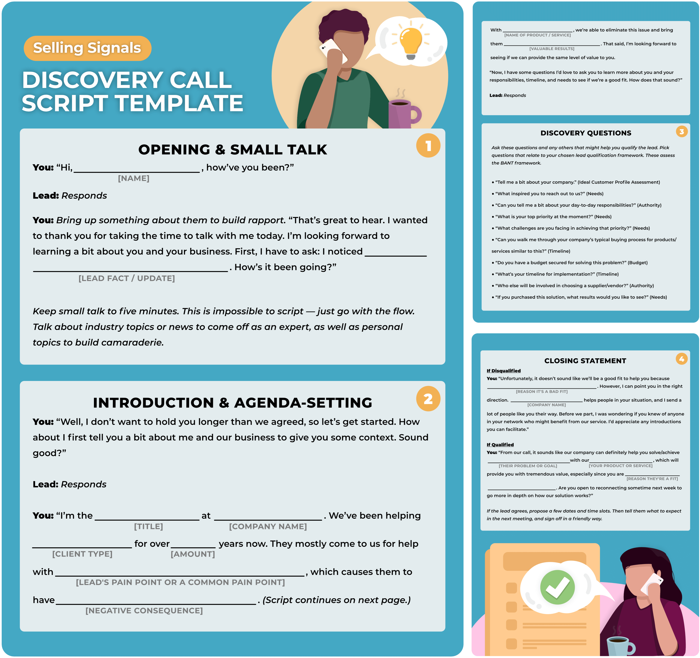

# How to Structure A Discovery Call

## The discovery call is the most important step in your relationship with a prospect. This step is essential for the sales process and also outlines all future steps. 

The discovery call is the most important step in your relationship with a prospect. This step is essential for the sales process and also outlines all future steps. The discovery call templates provided in this article will be a great help to you.

### What is a Discovery Call?

A discovery call is the first step of a sales process. [This topic is covered in greater detail in another article we've written called "What is a Discovery Call?"](https://rev.team/kb/discovery-call)

([Source](https://vipecloud.com/blog/discovery-call-template))

What is the goal for your first call? You'll need to listen to your prospect and find out their goals. We repeat:

#### A discovery call is NOT about selling prospects your product or services in the first call.

The goal is to be more like a doctor *diagnosing a problem* instead of being that annoying vendor trying to sell anything to anyone who passes by their booth in the mall.

### Discovery Call Structure

Discovery calls have 4 major components:

1. Building rapport. 
2. Meeting opening/introduction. 
3. Discovery.
4. Meeting wrap-up.

Each component serves a specific and important purpose. If your prospect feels that you are in control, they don't feel the need to take over.

### Anatomy of a Perfect Discovery Call

Sales reps typically make multiple sales discovery calls within **10 days.** On average, the sales cycle lasts about **90 days.** *Discovery calls are typically held on days **34-42,*** which is approximately a month after you first reached out to the prospect.

Our findings from the State of Conversation Intelligence show that 32% of cold calls will become discovery calls and 19% will eventually turn into Closed Won deals.

One-on-one discovery calls are more common than calls later in the sales cycle. Reps should invite a colleague (e.g., a manager or sales engineer) to discovery calls that result in Closed Won deals.

You should aim for at least two moments of engagement on discovery calls, where prospects talk for 30 minutes or more to answer any open-ended questions. 

### Why are discovery calls so important?

Sales professionals need to be able to understand the details of each prospect's situation through discovery calls. Most prospects are comfortable participating in a discovery phone call as long as it isn't an interrogation.

Here are some of the benefits of a discovery call:

**1. Prospects will be able to better understand your product and business.**

Prospects will leave the discovery phone knowing who you and your company are. Prospects might have specific questions about a product feature, a term, or both. This allows you to capture their attention and gauge their interest.

It is not about having solid product knowledge, it's about *uncovering their problems.*

**2. You'll have the opportunity to show your support for their success.**

If you conduct the call well, prospects can be sure that you have listened to their problems and will give them a professional assessment to see if you can help. You'll demonstrate to them that you are invested in their success, not just their money.

Double-check any information you have about the prospect in your sales software. To ensure that you are familiar with the prospect's business, make sure to check your CRM and lead management software.

**3. You can assess your chances of winning their business.**

The discovery call will allow you to meet with your prospect to determine their business pain, their influence in the organization, their willingness and ability to advocate for your product, and their initial attitude toward purchasing your product over a competitor's. To do this, you can use a sales qualification framework like BANT.

### How Sales Discovery Calls Work

Sales reps ask discovery questions to determine if the lead is a match for their ideal customer profile and then qualify them as a sale lead. The call is qualitative so sales reps ask the same sales questions to all leads to evaluate them objectively and repeatedly.

BANT is one of the most popular lead qualification frameworks. It assesses the following:

* **Budget** Does the lead have enough money to purchase your solution?
* **Authority** Does this lead have decision-making authority? If not, can they influence the decision-maker?
* **Lead's Needs:** Can your product or service solve their needs? Is your solution able to solve the problem?
* **Timeline** Does the lead's timeline work well for you? Are they looking for results faster than you can provide them? Are they able to do this sooner than you can?

Leads that meet a threshold are considered prospects or opportunities in your pipeline. They then move from the lead generation stage to the nurturing stage of the sales cycle. When done correctly, discovery calls allow salespeople to give the lead a final check before they decide to spend more time nurturing it to close.

As the final qualification stage between nurturing and lead generation, discovery calls are often tangibly represented in the Revenue pipeline.

Discovery calls allow you to focus on prospects that are likely to convert and remove bad leads from your pipeline. During the discovery call, you are not trying to sell the lead. Instead, you are trying to learn about them and build trust.

You will be able to create a customized pitch, presentation, or proposal later during lead nurturing.

### 9 Steps to Conducting a Discovery Call

These are the steps that sales professionals take to ensure they leave a discovery meeting with a clear understanding of your leads and a decision about their level of qualification. These are the steps you need to take to plan and hold a discovery conference.

**1. Schedule the Discovery Call.**
Make sure you have the call scheduled on your calendar and that you've sent them a calendar invite. Set expectations with the prospect for your call.

**2. Learn more about THEM.**
Online information about your lead can help you personalize your script.

**3. Write a Discovery Call guide.** 
Prepare your talking points. Include an opening, business introduction, and questions. The closing statement should contain the next steps. Then practice what you want to say out loud. This will guide you through your call. Your guide needs to be personalized for each prospect. 

**4. Establish rapport and make introductions.**
You can show that you're interested in them by sharing commonalities. 

**5. Set an agenda.** 
Tell them what you want to obtain from the call and what will happen next. 

**6. Ask Discovery questions.**
Ask questions to ensure the lead is following your qualification framework (BANT).

**7. Qualify the prospect.** 
After asking the discovery questions, assess the prospect to understand if they are a good fit or not a fit. 

**8. Provide the next steps.**
If they aren't a good fit, let them know and tell them why. If you're able to, refer another vendor. 
If they are a good fit, schedule another meeting. 

**9. Follow up & document.**
In HubSpot, or whichever CRM you use, document the notes you took on the call. If they aren't a good fit now, it doesn't mean they won't be a good fit 6 months from now. If it makes sense to follow up with them in the future, create a task in your CRM to remind you to do so.

### The First Three Steps in Greater Detail

#### 1. Schedule the Discovery Call.

In order to maximize the chance of success of your discovery call, you must plan. This will ensure that both you and your prospect are making the most of the time. Here are some steps you should follow before calling your lead.

* **Provide an Agenda:** Give the high-level agenda and goals for the call so they are prepared and can do their research and develop questions. You need to tell them how long it will take so they can plan accordingly.
* **Use a Calendar Booking Tool:** Use HubSpot, or a similar booking tool, to let the prospect schedule a time and have it added to both of your calendars. 
* **Follow up with a Reminder:** Create a reminder in HubSpot, or whichever CRM tool you use. When your CRM reminds you, send an email to your contact. This will let your lead know that you are looking forward to speaking with them. It will also remind them about your call.

These three steps will prepare you and make you feel more at ease. After the call is scheduled, it is time for you to do some research about them.

#### 2. Learn more about THEM.

Who is your prospect, and what do they care about at work? Use the DEMAND System, and DISCOVER their INTENT. 

Spend time gathering research on their company online. Here are some things you should know about your lead before you begin writing your script.

* **Job duties:** Visit their website & LinkedIn page to learn about their day-to-day activities. What challenges come up for others in their position? Who at work do they need to impress in order to get that promotion? Understand their goals.
* **Hobbies & interests:** Look at their social profiles and see what they have been doing recently to find out what you have in common. For example: *"I saw you were a Scout for 10 years - I was an Eagle Scout myself."*
* **Company:** What is their industry? Who do they serve? Who do they work with? What is their mission? Get a sense of their work environment.
* **What's going on in their world?** Have they recently attended an Industry conference? Were they just promoted? This is a great place to start.

Pre-call research can help protect your Revenue pipeline from unqualified leads that might not have been properly vetted. If you feel that the lead is not qualified, your junior rep (if you have one) might conduct a brief initial assessment or discovery call. This will save time and allow them to practice.

#### 3. Write a Discovery Call Guide.

 A written discovery call guide does not contain a script. It is a flowchart that maps the ideal conversation. It includes your opening, introduction to your business, questions that you will be asking, and how you will close the call.

This adds structure to your discovery calls and ensures that you have all of the information you need for qualification. You will write the guide and keep it with you during the call. You want the call to be natural and conversational, not stiff and mechanical. 

The four components that make up a discovery-call script.

**An Opening:** Start your opening with small talk about what you know about the person.

> *"Hi [Prospect Name], thank you so much for taking the time to speak with me. During my research, I discovered that you were promoted what's the new job?"*

**An Introduction:** Include your name, your company, your mission, and the types of people/businesses you support. Include the agenda for your call. This will help to better understand your questions.

**Discovery Questions:** This element is critical. To help you decide if the prospect is right for your business, you can ask questions that are compatible with your preferred framework.

**A Closing:** Write two closes. One for unqualified leads, and one for qualified leads. You will usually ask qualified leads to meet again, for a demo, or a deeper discovery call.

### Discovery Call Example

([Source](https://sellingsignals.com/discovery-call-script-template))

### Summary

You can use parts of the Discovery Call Template provided to make the most of your discovery call. Uncover whether your prospect is a good fit and increase the chances of a closed-won deal later down the line.