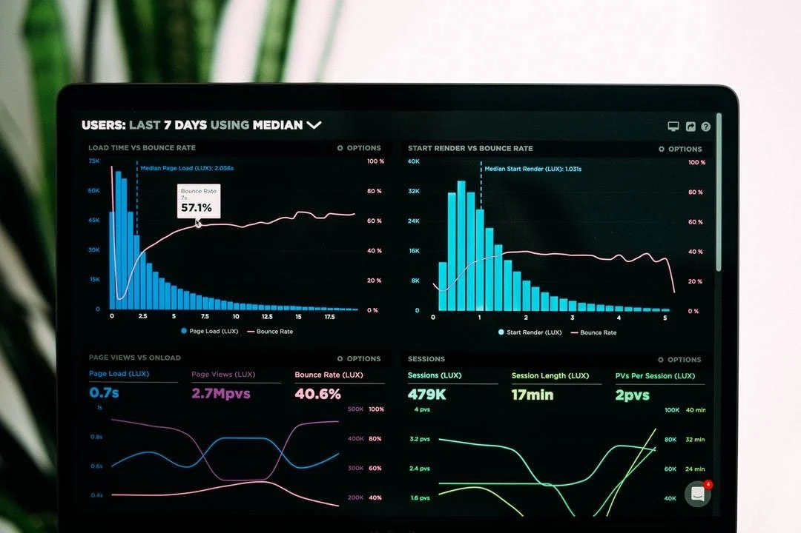
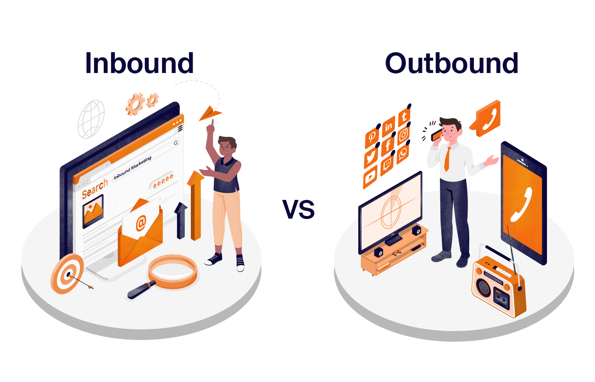

# Inbound vs Outbound Sales

## Inbound vs outbound sales are two different methods of selling a product or service. What is the difference? What is the best approach for your company?

This article will help you understand the differences between inbound vs outbound sales, then decide whether to create an inbound sales team, an outbound sales team, and/or a hybrid sales force.

Both sales approaches have their advantages and disadvantages. They should be used as tools to achieve results and goals. Let's begin by explaining the differences between the two.

### Inbound vs Outbound Sales

([Source](https://www.sender.net/inbound-vs-outbound-sales))

#### Inbound Sales

Inbound sales are sales that come from you. They saw you or your company on Facebook. They also stumbled upon valuable content or saw you mentioned by a credible publication.

They do further research, realize that they could benefit from your services, and then reach out to you. This is a warm lead that quickly becomes a client. 

#### Outbound Sales

Outbound sales are those sales you won. You reached out (probably more than once), talked with a lead over the phone, and finally closed the deal.

It is important to explain to the client how your solution will fit their needs. This is often a cold calling that leads to a client in a few weeks or months. 

Although inbound sales may be more advanced and more effective than outbound sales, they still need to work together to maximize sales. While there are many resources available on inbound marketing trends, outbound is often ignored. Marketing ninjas point out that the old-school tactics haven’t changed in the past 10 years.

#### Key Differences Between Inbound and Outbound Marketing

Marketers announced that outbound was over with the advent of the internet, which opened up access to information. Businesses that have been around for a while will remember how website content 20 years ago was manipulative (using as many keyword phrases as possible), self-absorbed and pushy (e.g., pop-up windows).

This strategy was used by a large number of websites and has even been successful. Inbound was born. Companies moved away from being pushy, self-absorbed, and manipulative in outbound to become gentle, smart, proactive inbound. This was all thanks to the new data-driven techniques for winning customers.

Outbound has evolved and adapted to technology over the past decade. The key difference between outbound and inbound B2B marketing is not the use of advanced technologies, but the behavioral model of attracting prospects.

Outbound marketing involves looking for the right company and engaging directly with them, while inbound requires you to create an environment (similarly to a spider web) and wait for the right prospect to enter it.

Outbound allows you to target prospects you desire, while inbound merely aims to make prospects notice your company, product, and service while they are reading your content. Only then can they jump into the sales cycle.

Below is a summary of the main differences in inbound and outbound marketing for B2B businesses:

Let's take a closer look at the inbound and outbound differences to better understand them.

**1. Time frame and achieved results.** Inbound is a team game that lasts for a long time. Each member contributes something that could hypothetically work out over the next half year.

The content is also slow. It takes time and money to understand why a blog or article isn't working.

This is what makes outbound so different. The entire process is managed by a researcher and a copywriter. They also work in perfect alignment with sales representatives (SDRs).

It is managed by a project manager and controlled by the point of contact (POC) for the client. Campaigns can be launched within two weeks of contracts being signed. The first results can be seen in days or weeks depending on the campaign, sales cycle length, industry, and so forth.

Outbound is much more flexible and fast than inbound.

**2. Types of communication and ROI.** Inbound marketers are reluctant to admit that high-quality content doesn't achieve the main goal of generating hot leads. People read the articles, not to buy the company's products and services. They can create a masterpiece but it does not increase sales.

Inbound ROI is difficult to measure, despite the availability of many tools to track KPIs. This is because marketers are not able to measure the impact of certain actions on prospects' decisions to buy. Prospects have the ball, they can control the process and decide when they want to become active buyers of the company's services.

Outbound is more flexible than inbound when it comes to effectiveness. One-on-one conversations between salespeople and prospects are more flexible than inbound.

SDRs have more freedom to change the subject if they feel the conversation is not going well. In a way, sales reps have control of the conversation and can adjust their behavior almost immediately if necessary.

SDRs know what their ultimate goal is: To qualify and pass prospects further down the sales funnel. They have a clear goal and clear sales growth methodologies.

ROI is easy to calculate: You invest a certain amount of money and have a set number of appointments with companies that are a good fit, which results in closed opportunities.

**3. Scaling.** Scaling is a complex process that takes months of dedication and precision work from the entire team. Outbound marketing can help you achieve your goals faster and easier than inbound. Here are some reasons.

**Faster timeline:** Outbound marketing campaigns are quicker. You can get an immediate response to your chosen strategy and then adjust it immediately to improve results (e.g. change the subject line for an email, follow-up every three days, make cold calls early in the morning).
**Quick feedback:** One-on-one conversations increase your chances of getting answers to your questions about how to improve your services.
**Control of audience:** Outbound: You are in charge.
**Increasing prospects:** Producing twice as much content doesn't guarantee better results, but it does guarantee a larger team.

**4. Outreach channels.** Prospects can only access inbound channels via passive channels that are limited to the Internet. This includes:

Website
Content
SEO
Social media marketing

Outbound Strategies are more personal and active. The most popular are:

Email marketing
Phone calling
Outreach via social networks
Landing pages
Advertisements targeted

Other outbound sales tactics include offline activities just as:

Tradeshows
Traditional media advertisitin (TV/print, billboard, direct mail)
PR/content placement
Guest blogging

### Is It Better to Go Inbound or Outbound?

Some companies feel pressured to decide between inbound or outbound sales. However, neither is necessarily better. A combination of inbound and outbound sales is the best strategy for sales.

They are each powerful tools in their way. Depending on the industry, company size, customer awareness, and average sales, a company might place more emphasis on one or the other. Both inbound and outbound sales can be effective growth channels.

There are no clear guidelines or rules that companies can follow to decide how much attention to give to inbound sales and how much to focus on outbound sales. There are many things to consider and common practices to follow, but many companies have had great success going against the grain.

Exercising outbound sales in an industry where inbound is the norm. Or doing high-touch or low-touch sales in verticals that no one has tried before.

#### When to Use Inbound Marketing

* Startups are a good option if you don't have the capital to invest in a sales staff.
* If your product is searched online by a lot of people.

#### When to Use Outbound Marketing

* If you have enterprise clients and are selling a high-end product.
* If you can solve a problem using a new and different solution, it is possible to do so.
* If your products have a long sales cycle.
* It's fine to pay generous commissions to sales reps.
* If the target audience isn't afraid to receive cold calls.
* If you have a very specific target audience, it is important to be clear.
* It shouldn't take too long to make a purchase decision.
* You have an advantage when it comes to creating content.
* Outbound sales may not work for your target audience if it doesn't work.

#### Which is the Better Choice for Your Company? 

We will share a framework to help you decide which sales method is right. Here's a disclaimer:

These are important factors to be aware of, but they are not rules that can be followed. Sometimes *breaking the rules* is the best choice. Close is the tool of choice for thousands of sales teams all over the globe.

The most successful companies are those who go against the grain. They do high-touch sales in verticals where no one else is doing it. They might also be doing outbound sales in an area where inbound is the norm or vice versa.

These "rules" will probably be applicable 70% of the time. However, 30% of the time it would be a better choice to go the opposite way.

There are no predetermined questions, surveys, or scientific methods that can be used to determine which approach is best for your company at this moment.

#### Best Outbound and Inbound Sales CRM Solutions

In 2017, 45% said they spend more than an hour manually entering data. According to the same survey, 23% said manual data entry was their biggest challenge when using their CRM.

CRM is necessary. Salespeople need a simple, reliable CRM to do what they do best: Sell.

### Tips and Use Cases to Choose Inbound vs Outbound Sales

When you have the opportunity to make inbound sales, choose:

* You have a product or service that people are looking for online.
* You are not ready for sales professionals and strong sales systems.
* You can plan and implement a strong content strategy. If your team is involved, this includes making sure you have time and money available.

When you are looking for outbound sales:

* Your product is of high value and/or your clients are business or B2B.
* Your product or service will have a longer sales cycle.
* You want immediate results.
* You are willing and able to invest money to test the viability of your product or service.
* You have a clear target profile. For example, VP or higher-ranking executives at all IT Service companies to whom you want to sell your product.

Multiple iterations are necessary to find the right formula for your company. It's obvious that this has been said before and we repeat: Follow the data and see what the results say.

### Summary

If you are unable to get the results that you desire from your inbound strategy, you can use outbound to quickly win.

If you are tired of receiving low-quality leads from outbound sales, but still have a good strategy in place, inbound marketing may be a better option. For most businesses, the real boardroom debate is not "inbound vs outbound sales." It is about how much inbound and outbound are necessary to accomplish the task.