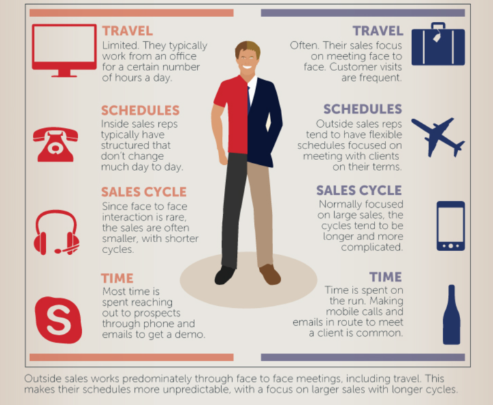

# Inside Sales vs Outside Sales: Which One is for You?

## Sales is a critical part of any business, and there are two main types: Inside sales and outside sales. Which one is right for you? 

### Inside Sales vs Outside Sales: How to Structure Your Sales Team

Are you selling inside or outside? These two strategies are often seen as being at odds. However, both roles are becoming more important in today's market.

Are the lines really blurred? Are you unsure which go-to-market to choose?

Let's compare the inside sales vs outside sales equations and see how they fit into modern sales teams.

### Definition of Inside Sales

Inside sales is the practice of selling via email, phone, or other digital channels instead of face to face. It is very popular in the B2B sector, especially in SaaS and tech.

#### Inside Sales vs Outside Sales

Inside sales representatives usually sell from their homes or an office. Outside sales representatives travel and broker face-to-face deals. Although outside sales reps are likely to have a physical office, these salespeople meet with prospects at trade shows and conferences.

According to a 2019 report, 45.5% of the 5.7 Million sales professionals in America are inside sales professionals, and 52.8% of outside sales reps are employed.

#### What are the Duties of an Inside Sales Rep?

Remote sales representatives work with potential customers to help them navigate the sales process and ensure they find the right product or service for their needs.

#### Inside Sales Activities

The following are the key responsibilities of an inside sales rep:

* Demonstrating superior product expertise to answer customer inquiries and questions.
* To establish trust and rapport with potential customers, you must build relationships.
* Nurture leads to converting them into customers and managing referrals from existing clients.
* Attaining their monthly quota goals.
* Closing customer deals.
* Reporting on relevant sales data.

Inside sales representatives don't often meet with prospects face-to-face, so they do emails, phone calls, and video calls to connect with potential customers.

Their schedule is more predictable and they often have a goal for the number of activities they complete each day (e.g., number of sales calls, meetings booked or proposals sent).

A deep understanding of your product is essential if you want to become an inside sales representative. Inside sales reps must be able to explain the functionality of their product to customers in a cold call. This is different from outside sales reps who can only give a demo in person.

Inside sales also offer the benefit of being more suited for remote salespeople and sales teams.

### What does an Outside Sales Rep Do?

Outside sales reps spend most of their time traveling to meet clients, connect with prospects, or nurture relationships.

The 2021 Xant.ai Report found that outside sales teams engage 25% more in sales calls and over 50% more in email activities.

They are often able to sell at conferences and industry events. This type of position is ideal for people who enjoy managing their own time and working independently.

Because the tools used by outside and inside sellers are so similar (e.g. CRM, email, social networking), there is no difference in inside and outside sales.

### Sales Statistics - Inside and Outside

Xant.ai conducted a 2017 study that found that field sales reps dominated large organizations (revenue > $500M).

The highest percentage of inside sales reps was 47% for small organizations with revenues below $50,000,000.

HubSpot's 2021 sales enablement survey, which surveyed more than 500 sales leaders, showed how much has changed in just five years.

68% of sales executives surveyed said they will adopt a hybrid or fully remote selling strategy in 2021.

In fact, 63% of leaders believe that virtual meetings can be just as effective, if not better, than in-person meetings.

We found that 64% (or more) of the sales leaders who made the switch to remote sales in 2020 achieved or exceeded their sales goals.

This research suggests that sales teams should include both inside and outside salespeople. Each structure can be beneficial depending on the company's goals, priorities, and priorities.

#### Inside Sales Team

You will need to fill the following key roles to create an inside sales team:

* Qualifies the lead.
* Account executive (AE) - Closes deals.
* Manages customer relationships.
* Customer success manager - Oversees customer support.

When it comes to your sales team, one SDR should be assigned for every two to three AES.

### Do you need to outsource your inside sales team?

You will need to evaluate the current situation of your company to determine the best arrangement for your company.

You may be able to outsource your inside sales team if you are a startup or small business. This will help you keep overhead costs low and your overhead costs down. An in-house sales team might be a better option for larger companies.

Let's say that your sales team is focusing on closing deals and acquiring new leads. Sales reps spend a lot of time prospecting, nurturing relationships, qualifying leads.

It might be worth outsourcing an internal sales team to help your in-house sales team focus on qualified leads that are purchase-ready.

Outsourcing has many benefits, but it is only possible with the right vendor. You will need a vendor who understands your brand, product, messaging, and pricing.

Transparency should also be a priority for your vendor:

* Their sales process
* What they will deliver (pipeline-building and the number of qualified leads per month, etc.
* Progress reports

### Salary for Inside Sales vs Outside Sales

Companies must pay the market value of salespeople to retain top talent. Glassdoor reports that in 2021, the average base salary of an inside sales rep in America is \$43,712. The base salary for an inside sales account executive is just below $80,000.

According to The Bridge Group, the median base salary for a sales development rep (SDR), as of 2021 is \$50K. Xant.ai reports the average on-target earnings of SDRs increased by 3% over 2018, and now stands at $90,434.

Sales leaders often believe that outside reps bring more experience to the role so they demand a higher base pay.

Our 2017 data shows that outside sales reps earn 36% more than inside sales. The OTE for outside sales was only 9.2% lower.

OTE should be used as an indicator of expected earnings so that inside sales positions can earn almost the same as outside sales.

### Inside Sales vs Outside Sales Quota Attainment

According to The Bridge Group data for 2021, only 66% reach quota each year.

Spotio reports that outside sales reps have a 10% average quota than inside sales reps.

Although there is still a lot to do before salespeople reach 100% of their quotas, these aren't bad results.

Salespeople may be assigned territories based upon their specific roles (inside/outside), but companies often allow inside salespeople to close smaller deals on their own and support the outsider when they are working on strategic accounts.

Future sales performance will be significantly improved by better collaboration and communication between insiders and outside sellers, marketing and sales, and increased productivity (thanks in part to AI).

### Inside vs Outside Sales Models

Here's a breakdown to help you see the structure of outside and inside sales teams.

**Inside Sales Model**

* Sales representatives connect with prospects, leads, clients, and other users via digital channels.
* Focuses on acquiring leads.
* Faster sales cycles (90 Days).
* It is cheaper and more scalable.

**Outside Sales Model** 

* Sales rep travels to meet clients face-to-face.
* Focuses on nurturing and converting leads.
* Slower sales cycles (>90 days).
* It is more expensive and less scalable.

([Source](https://www.repsly.com/blog/field-team-management/inside-vs-outside-sales-which-is-right-for-you))

When you choose a sales organization structure, you will always be available to your customer's needs. How do you prefer to be reached by your customers?

How can they make it easy for you to close a deal with them? Can you close a $1m sale over the phone? Only you can make that decision.

Some industries use a field sales model. However, this does not necessarily mean that it is the best sales model for the market.

Today's buyer is becoming digitally more tech-savvy. They'll expect this model to work in the B2B market as they continue to purchase more products for personal use on Amazon.com and other websites.

You must be prepared to meet them with a solid sales model digital -- this includes including inside sellers on the team.

There is no set of rules for inside and outside sales. Companies are constantly trying out different models and testing different organizational structures to ensure they find the right fit for their products and buyer. Find the right fit for you.

### Summary

You must have learned the differences between inside sales vs outside sales. Inside sales reps work from their home or office, while outside sales reps travel to meet with potential customers face-to-face. Now you can choose which is best to meet your sales targets and revenue goals.