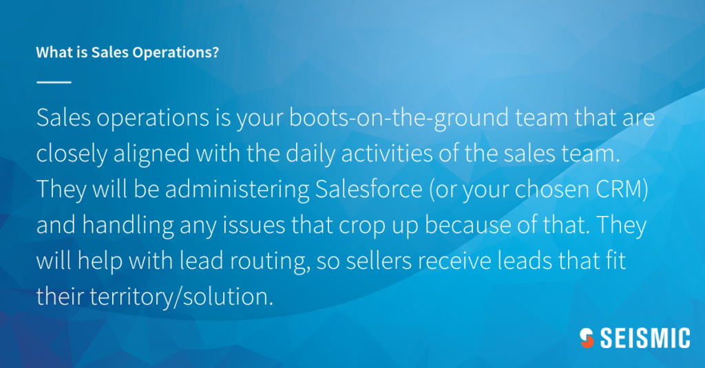
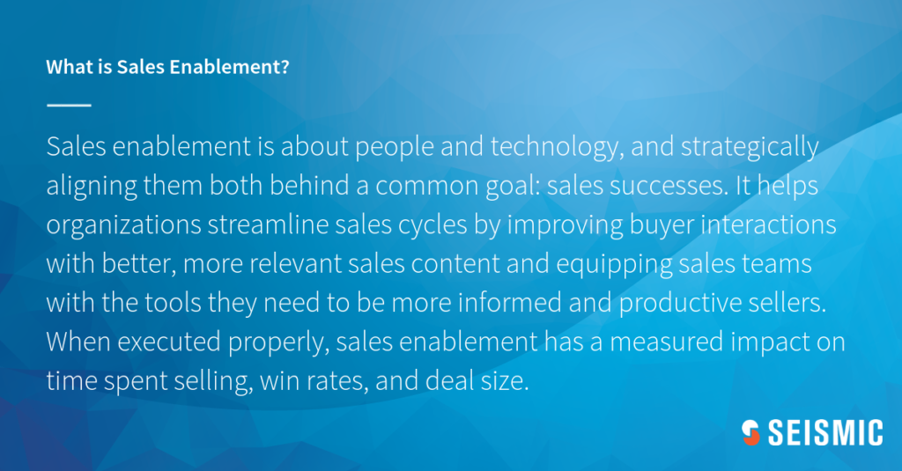

# What is the Difference Between Sales Operations vs Sales Enablement?

## Sales operations and sales enablement are two important aspects of successful sales organizations. They play a critical role in any organization. 

There are many positions in the world of marketing and sales. Simply stating that you are in sales or marketing doesn't convey enough of what you do every day. Outsiders unfamiliar with the nuances of different positions may be confused.

So, what is the difference between sales enablement and sales operations? This might seem like a simple question for those who are well-versed in sales enablement trends and all things marketing and sales. Not everyone is up-to-date with the latest trends and the finer details of different terms.

To understand the question, we must first discuss the central tenets. This question refers to sales operations, which are the more technical aspects of day-to-day sales efforts. For example, managing a CRM system closely monitoring data about opportunities, leads, and lost deals; reporting on those figures; managing the tech stack for the sales organization, and many other tasks.

### [What is Sales Operations?](https://rev.team/kb/what-is-sales-operations)

Sales operations are your hands-on team that is closely connected to the daily activities of sales. They will manage HubSpot (or any other CRM) and handle any issues that may arise. They will assist with lead routing so that sellers receive leads that are relevant to their territory/solution.

Then when it comes time to report on a monthly/quarterly/yearly basis, this team will have all the insights that leadership will need. They can provide insight at both a macro and micro level into deals, as well as any other data points related to sales engagements.

#### Top Practices for Increasing Sales Operation

Sales operations practices are like most systems. They can vary from one organization to the next. What works for one company might not work for another.

Sales operations can be affected by the company's culture and market. These are the best practices for selling operations, regardless of where your company is located.

#### Top Sales Operations Tools

Many sales operations leaders will use a tech stack that includes all or some of the following tools:

* Sales enablement platform
* Customer relationship management (CRM) platform
* Services for business intelligence
* Software for data analysis
* Communication tools
* Content management system (CMS)
* Email automation
* Software for sales-performance management
* Contract lifecycle management

In an ideal world, every element of your tech stack would communicate with each other or at least your CRM. Sales operations teams should prioritize cross-platform integrations to make it easy for sellers to navigate between the essential tools in their workflow.

### What is Sales Enablement?

Sales enablement is the overall strategy that will drive marketing and sales to achieve closer alignment, reduce roadblocks and close more deals.

Sales enablement involves people and technology and strategically aligning them toward a common goal: Revenue Success. It helps organizations reduce sales cycles by providing better, more relevant content for buyers and equipping sales teams and managers with the tools they need.

Sales enablement can have a measured effect on time, win rates, and deal sizes if done correctly.

The real divide between sales operations and sales enablement is that sales enablement focuses on the Revenue Team. While sales operations' primary focus is the sales team.

Sales enablement improves content creation, findability, analytics, sales communication, readiness for sales, reporting, and sales communication. This question can be simplified by thinking of sales enablement as a holistic strategy for the Revenue Team. Sales operations are an important cog in that overall strategy.

#### Top Practices for Improving Sales Enablement

Sales enablement is more about the sales team, giving them the tools to increase customer connections and decrease the sales cycle.

A sales enablement strategy includes a well-designed onboarding program, training materials, marketing collateral that is buyer-facing, and performance analysis to identify gaps and correct them. Sales managers, sales reps, and Revenue teams will be supported by enablement specialists to implement and maintain a sales program.

A sales enablement specialist, also known as a business development representative or a sales specialist, is responsible for overseeing everything from team performance and strategy to sales effectiveness. They also use an enablement platform to streamline the sales process.

They may also be used to assist in sales operations, to streamline the sales process.

#### Sales Enablement Technology Bridges the Gap Between Enablement and Operations

A better sales process is possible when enablement and sales operations are aligned. This will allow reps to better sell to prospects and improve their sales skills. Enablement technology is the glue that binds both teams together.

Let's say your company wants to create a new sales enablement platform. The first step is to set up the new tool and prepare it to be used by the sales team. This could include creating user accounts, building dashboards, and integrating the CRM.

The sales enablement team then steps in. Sales reps will be supported by sales enablement teams in integrating the new platform into their daily work to maximize their output. The sales enablement team ensures that the platform is adopted by all.

The right **sales platform** will integrate with your CRM, allowing sales ops to manage and organize **contacts**. Sales reps will be able to send relevant materials to the contacts in the database, which makes it easier and more efficient.

Sales reps will have access to the CRM with up-to-date data. The sales enablement platform will also provide data insights about overall sales, target KPIs, and performance. This allows sales operations teams to create effective sales strategies using historical data.

The sales enablement platform can house all sales collateral in one place, which is great for sales enablement. This makes it easy for sales reps to find the latest content they need to present to prospects.

A platform is also a great tool for sales training sessions and monitoring sales reps' performance. This data can be used by sales managers to help them understand the areas where their reps may be struggling. They can then create a plan to improve that area.

### What are the Differences Between Sales Operations vs Sales Enablement?

* Sales operations is a tactical position that allows the sales organization to run smoothly and efficiently.
* Sales operations oversee the sales technology stack and provide insights on overall progress.
* Sales enablement is a comprehensive strategy that strives to improve Revenue Team performance.
* Sales enablement assists with content creation, discovery, and analytics.

#### How Should Sales Operations and Sales Enablement Collaborate?

Sales enablement is a part and parcel of sales operations.

Sales operations analyze the data and develop new strategies to increase sales and sales effectiveness. These strategies are then implemented using a sales enablement strategy.

It is common knowledge that sales operations will know if your sales team has difficulty generating leads and will devise a strategy for helping them.

Sales enablement might invest in new CRMs, develop or hire new lead generation training, or use cold calling techniques.

Sales enablement and operations are two distinct areas that target different phases of the customer's life.

Sales enablement is very active in the initial phases: lead creation, nurturing, and training.

Sales operations are more concerned with closing and negotiating agreements. They also examine methods of giving employee incentives through better territory designs and reward programs.

Sales operations and sales support meet frequently to discuss their goals, and strategies, and to ensure that there is a clear division and no duplication of work.

#### Sales Operations and Sales Enablement Can Unlock the Potential of Your Team

Sales teams that are successful recognize the importance of collaborating with sales enablement and sales operations to make their sales process more efficient and effective. It's simple. Smart companies provide relevant content to their sales reps (sales enablement), along with standard procedures that help refine the sales process. (sales operations).

An organization can scale the efficiency of its sales by utilizing both operations and enablement. According to **89% of sales professionals, they say** that sales ops play an important role in growing their businesses. Take, for instance, the onboarding process.

To maintain consistency in sales ops and reduce mistakes, it is important to have a set procedure for onboarding new employees. Onboarding can be accelerated by using educational and useful content from the sales enablement group to train new hires.

#### Operation Plus Enablement is the Key to Sales Growth

A successful sales team is built on a combined approach to operations and enablement. The two teams can work together to help close deals, achieve team goals, and expand the company.

A company's sales operations team evaluates and manages its processes to improve the performance of its salespeople. With the help of technology sales enablement, sellers can access solutions for content management, sales training, and alignment with sales and marketing.

### Summary

Now that you've known the differences between sales operations vs sales enablement, also you need to understand that without a strong relationship between the two, sales productivity is reduced and the sales process becomes slow and inefficient.

Often, it’s more difficult for sales reps to reach their quota. With sales enablement tech, sales operations and enablement teams maximize sales productivity leading to an increase in sales and revenue.