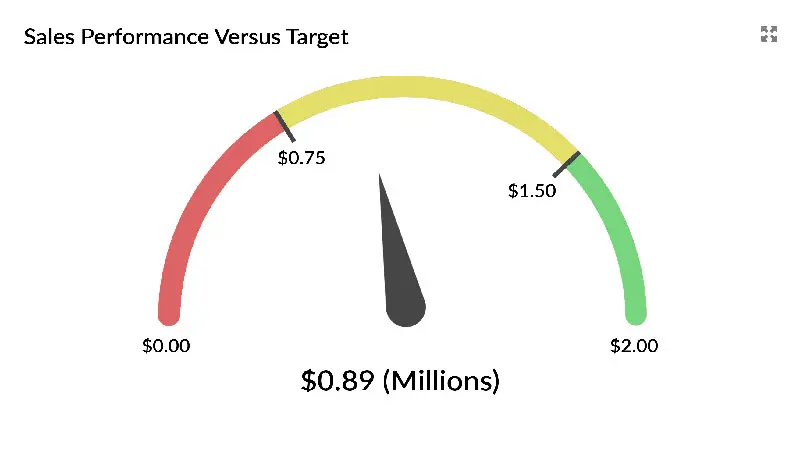
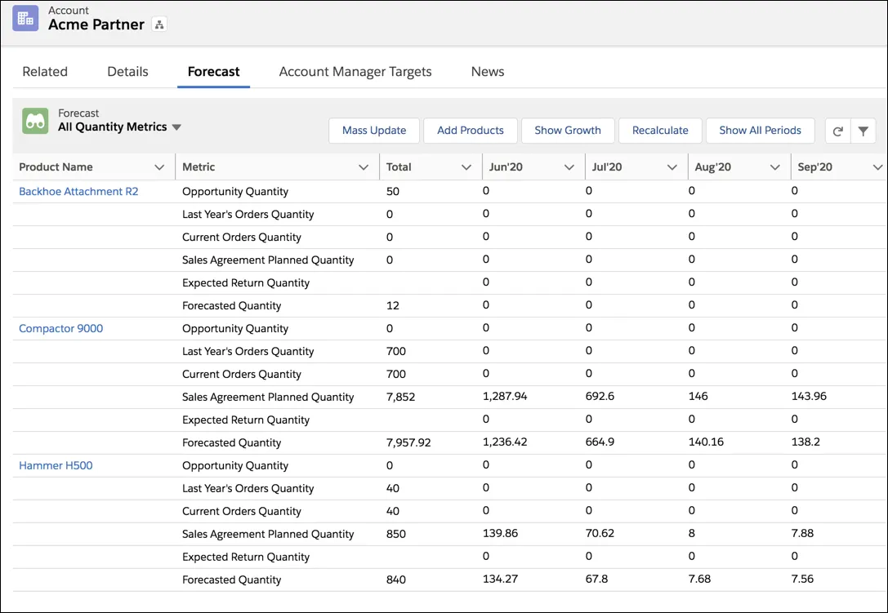

# How to Measure a Team's Performance with a Sales vs Target Dashboard

## Many executives are frustrated trying to determine sales vs target dashboards in Salesforce. Maybe you are one of them. You may have searched unsuccessfully for the Targets tab.

If you want to learn how Salesforce measures sales vs target dashboard, you are in the right place.

This is because I'll show how to answer two crucial questions regarding Salesforce quota management.

* First, how does historical sales results compare to target? This information is important for both individual reps and teams, as well as for the company.
* Second, is the funnel large enough to reach the target this month or next month? Also, is there enough pipeline coverage?

This information is essential because you can't see the road ahead. It's difficult to determine which controls need to be adjusted to ensure you reach your quota.

### [What does it mean to have a Sales Target?](https://rev.team/kb/what-is-a-sales-quota)

This article mainly uses the word "target".

Perhaps you prefer the term 'quota' in your business. Or maybe everyone uses the term 'budget'.

#### Measuring Sales Performance Against Your Targets

Active monitoring of your performance throughout the week, month, and day is essential to reaching sales targets. Sales targets should be dynamic and focused on short-term performance. The more reps are able to see and understand the contribution of their work to the target, they will be more motivated to reach those targets.

A sales versus target dashboard is a great way to track the performance of sales against targets. It can be displayed on a TV. You might also consider setting up a Salesforce dashboard.

We often want to measure the sales versus target at salespersons, teams, territories, or companies.

In most cases, however, we prefer to measure sales against three types of targets in businesses.

**1. Sales targets from the past.** The past sales targets are still valid. For example, last month, last quarter, or even last year.

Only one thing is required to understand historical sales targets. Was the target achieved?

**2. Current sales targets.** These are the goals we are currently working towards. This could be for this month, this quarter or this year.

We need to compare the target with both metrics.

First, the sales revenue has already been won.

Second, the pipeline's size due to completion during the period.

**3. Future sales targets.** Next month, next quarter, next year. These targets will ensure that there is no lost sales revenue if a deal doesn't close in the future.

### Measuring Sales Targets in SalesForce

Salesforce offers four options to track performance against sales targets.

1. Dashboard gauge.
2. Tab Forecasts
3. GSP Target Tracker.

The options offer sales managers and salespeople different levels of information and experience with target tracking.

We will explain how each works, their pros and cons, as well as when each option is the best for managing quotas.

Bottom line: We believe that the GSP Target Tracker is the best way to measure Salesforce sales versus target.

([Source](https://garysmithpartnership.com/sales-targets-salesforce)) 

This option displays overall sales against the target using a Salesforce dashboard gauge.

The arrow indicates sales won. To identify breakpoints, use the amber, green, and red segments of the gauge. For example, amber can be used to indicate 80% of the sales target achievement and green to indicate 100%.

The sales report is the basis of the gauge. The report summarises the value of all deals won during the relevant period.

**Best choice if:**

* It is important to quickly set up a target metric. This option is for you if you need a target-tracking system in less than five minutes.
* Only measure top-level sales results against sales targets. It's also possible to use it if you are willing to put in the effort to create and maintain comparable gauges for each salesperson.
* Each period has the same sales targets. It is not necessary to change breakpoints every month.

A dashboard gauge can be used to measure sales targets easily and quickly.

To get full visibility into sales performance and pipeline, the gauge should be used in conjunction with other dashboard charts or reports. The GSP Sales Dashboard is free and includes the target gauge as well as a report. 

Salesforce's standard function for target measurement is the Forecasts tab.

([Source](https://trailhead.salesforce.com/en/content/learn/modules/sales-agreements-forecasting-manufacturing-cloud/create-accurate-account-forecasts))

This advanced method allows you to compare Revenue and quotas.

Pipeline deals are also common. Sales managers have valuable information about the strength of the funnel as well as the likelihood of reaching sales goals.

Managers can override forecasts made directly by their employees. Managers can alter the overall estimate to compensate for excessive optimism or pessimism by salespeople.

There is however a downside. Many managers and salespeople find the Forecasts tab very complex. It is difficult to use. To track sales performance against sales targets, you will need to receive significant training and coaching.

**Best choice if:**

* Complex target measurement requirements are required.
* Managers often ignore forecasts made by salespeople in their business.
* The company's sales team is well-trained and has high Salesforce user adoption.
* Training is available for managers and salespeople.

Salesforce Forecasts Tab offers powerful target tracking and forecasting capabilities. Proper planning and preparation are essential for a successful rollout and ongoing adoption.

### Another Choice: GSP Target Tracker

A number of our customers use GSP Target Tracker to measure their progress against sales targets.

Target Tracker is a managed service. It is therefore plug-and-play compatible with any Salesforce environment.

Target Tracker is easy for salespeople and managers to use. The Tracker eliminates the need for forecast adjustments.

Pipeline and closed deals automatically link with the relevant sales targets. It is easy to compare sales targets when you have a combination of won deals and an outstanding portfolio.

This ensures that everyone is able to see the entire pipeline coverage.

**Best choice if:**

* You need a simple solution that provides powerful insight into pipeline coverage and target attainment.

### Summary

There are many reasons why you need to build a sales vs target dashboard. You can track real-time sales performance, compare performance across multiple sales metrics and KPIs directly, and establish a transparent and data-driven work environment. 