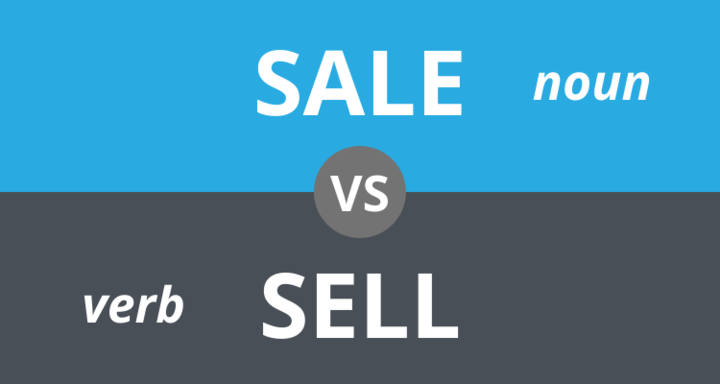
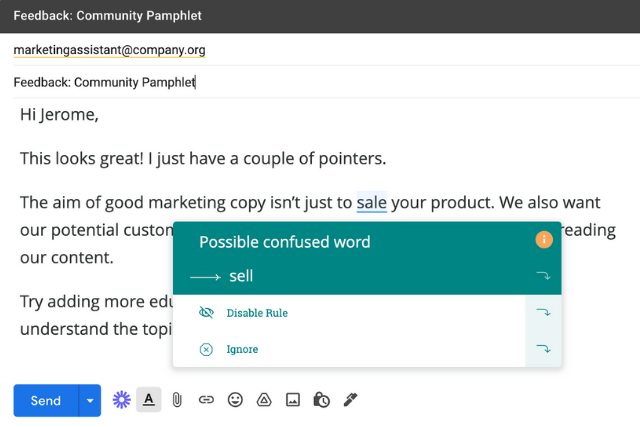

# What's the Difference Between Sell versus Sale?

## Sell versus sale -- what's the difference? The words "sale" and "sell" may sound similar, but they have distinct meanings and uses. 

### Definition of SALE

*Sale*, in its simplest definition, is the **act or practice of selling goods and services**. It can also refer either to a specific amount of something or a time when prices are reduced, for instance, a bake sale, a garage sale, or a yard sale.

These definitions are all nouns. *Sale* is the noun form for the transfer of goods or services in exchange for money.

### Definition of SELL

*Sell* is, on the contrary, a verb that means to trade goods or services in return for money and other forms of currency.

It can also be used metaphorically, such as "to sell an idea or your soul to someone."

*Sell* is a combination of an **object** (the house is what we are selling, so the object of *sale*) or without an object (referring to the act of selling a house).

*Sell* verb is irregular.

#### What is the difference between sell versus sale?

Certain words can be confusing when learning American English, especially if they sound and look alike. One example would be "sale" and "sell".

You might already be confused about the difference.

The main difference between sale or sell is the difference between actual and potential transactions (noun) as well as the handing over of goods (verb).

"Sale" can be used to refer to either an exchange or the sale at a bargain price.

"Sell" is often a verb that refers either to the act or giving up something in exchange for something.

There are many subtle differences between "sale" and "sell," so let's get clearer to help you understand these two words that are similar but different.

#### How to remember the difference between *sell* and *sale*?

You might forget which noun is which when you write *sale* or *sold*.

The "sale" noun is specific to a type or sale.

Because you are selling something, you are exchanging it in exchange for money, sell has an **e** like an *e*xchange.

If you get lost sometimes, don't panic. Grammarly can help you with that! To see your spelling, grammar, style, and corrections live, download the browser extension.

*([Source](https://prowritingaid.com/grammar/1000238/Sale-vs-sell%E2%80%94what-is-the-difference))*

#### How to use "Sell" in a Sentence

There are many ways to use the word "sell" within a sentence. It can be used as a verb form to transfer ownership of goods or a noun to convey that it is used to convince someone to accept something.

To represent the act of trading or selling, the seller is the person who does the act of selling. we used "sell" in this sentence.

* I will just *sell* my old smartphone and purchase a new one.

#### How to use "Sale" in a Sentence

You can also use *sale* in many other ways. It can be used to refer to a transaction, trade, or bargain price.

A finance term that describes business arrangements between parties (source), such as the buyer and seller of goods or services, is called sale.

* The *sale* of my old smartphone saved me half the amount I needed to buy a new one.
* The *sale of* XFL saw Dwayne Johnson and his group take control of the bankrupt American Football League.

A sentence that is used as a noun to indicate a time of bargains or discounts would look something like this:

* I am holding off on purchasing a new phone until a *sale* is available by December 31.

### Other Words to Describe Sale

"Sale" refers to the act or process of selling. There are many synonyms for "sale," including deal, transaction, bargain, and auction.

#### Are "For Sale" or "On Sale" the same thing?

These phrases can have different meanings. For example, "on-sale" could also refer to an item being sold at a discounted selling price. You can interchangeably use the two phrases to mean the same thing.

**When they have the same meaning?** Here are two examples of situations where "on sale" or "for sale" would be accurate.

1. Fox Business reports that Cadillac's first electric vehicle will be *on sale* by 2022.
2. Fox Business reports that Cadillac's first electric vehicle will be *for sale* by 2022.

### Summary

Sell versus sale: These terms are used in everyday life multiple times. These terms are at the heart of everything we buy and consume. They are often used interchangeably, but only to indicate different differences.

The term "sell" is used to describe the transfer of ownership or possession to another person in exchange for money. It can also be used to persuade someone to purchase certain goods or services. The act of selling goods or services is called "sale."

It can also refer to a time when goods are sold at a reduced price.

Another difference between the terms sell versus sale is that "sale" can be used as both a noun *and* a verb form, whereas "sell" can only be used as a noun.

The synonyms for the term "sell" can be sold, auctioned off, get rid of, vending, etc. While for the term "sale," they can be disposed of, dealt with, traded, etc.