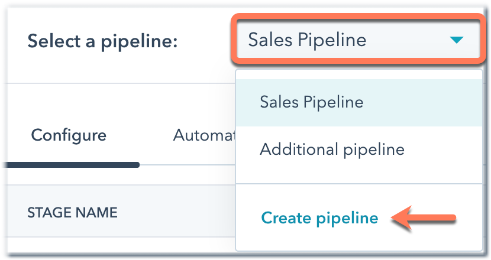
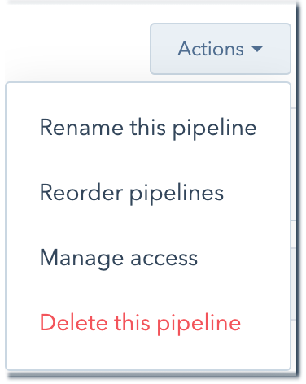
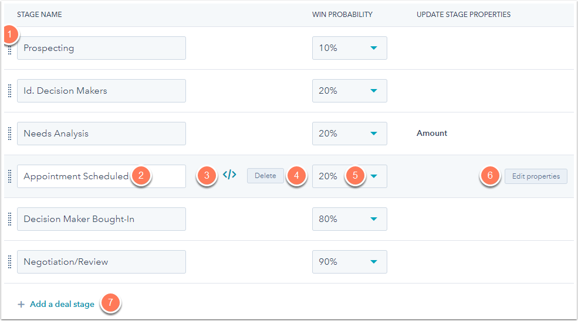

# What are Deal Stages in the Sales Process?

## What are deal stages in the Revenue process? It is more than content planning and getting traffic and leads to your site. 

This article will answer what are deal stages and how do they work to improve sales team performance. 

HubSpot CRM is an excellent tool for sales leaders to gain visibility into their pipelines and to implement measurable changes in their company.

### Definition

What are deal stages? The Deal Stages are the individual steps of your Sales Pipeline. Your sales pipeline outlines the steps every sales prospect must complete before they sign a deal.

Each deal stage represents a different part of the customer's journey from their initial exploratory call to the time they sign the quote.

#### Choosing the right deal stages for your pipeline.

Each deal stage should indicate that a sales team has taken an action, such as "Presentation Scheduled" or "Proposal Sent". This is where you want clarity. It is important to have clear indicators that correspond with each stage.

Companies should start with 6-8 stages. Some companies will simplify to just 4 stages, while others will expand to 15 or more.

Here's a simple example of a pipeline that has five deal stages.

* Discovery call complete
* Meeting scheduled
* Request for a proposal
* Closed/Won
* Closed/Lost

You can indicate the likelihood-to-close for each stage. This will give you a simplified view of your revenue forecast.

These should be updated regularly to ensure accurate monthly, quarterly, or annual projections.

You can also require additional deal properties when moving the deal process from one stage to the next. You can require additional deal properties to be entered when you move to the "closed-lost" stage. Consider other transition points and any data points you might want to add.

### How does Hubspot Deal Stages help streamline sales?

Your Deal Stages make up an important part of your HubSpot Sales Hub.

**They help standardize the sales process.** Providing the right type of contact and the right information is easier when every member of your sales team knows where each prospect is at any given time.

**Deal stages can provide additional data.** See where prospects are leaving the sales process. You can see which parts of our sales pipeline are performing well.

This will help you identify the best practices that prospects enjoy seeing.

#### How do I know which Deal Stages I should use?

Editing and modifying existing deal stages is one thing. However, setting up your entire sales pipeline and deal stage from scratch is quite another. It can be difficult to decide which Deal Stages you should use depending on the way your sales team works. 

All of the Deal Stages can be used by any company, but it's important to remember that these are only examples. The beauty of HubSpot's tools for sales is their flexibility.

HubSpot's sales tools are designed to help your sales team sell faster and better. It's up to you to create a sales pipeline that best suits your process.

#### Are there any HubSpot Deal Stages or Pipeline Templates that you recommend?

Every business and every sales team are different. HubSpot's deal stage tool is customizable to meet the needs of each customer.

If you are looking for a place to start your team that is more relevant than what HubSpot has to provide, take a look at these deal stages that we have found to be successful for other clients.

#### When to create a new deal in HubSpot CRM?

It is important that you clearly define your deal stages and that everyone on the sales team understands them.

When should a company create a new deal? This is one of the most frequently asked questions by companies when they first start using deal stages. Your first deal stage should be the first thing a leader does to start your sales process.

Common initial deal stages are "Discovery call scheduled" and "initial appointment booked."

Refrain from creating new deals too soon. This will reduce your close rate and muddy sales data. Your CRM system should not be used to manage your sales pipeline.

It should be used instead as a list of companies you might work with in the future.

#### SaaS & Manufacturing Companies Pipeline Deal Stage Examples

We found that minor changes to the default deal stages can help sales teams understand HubSpot CRM and make it easier for them to adopt it. The right deal stages for your business will depend on your sales process, your sales team, and your goals.

Here's an example of a SaaS pipeline:

* Demo requested.
* Decision maker brought in.
* Request for a proposal.
* Proposal sent.
* Closed/Won.
* Closed/Lost.
* Delayed/Deferred.

Here's an example of a manufacturing company:

* New opportunity.
* Initial meeting scheduled.
* Assessment.
* Decision maker brought in.
* Request a sample.
* Sample delivered.
* Request for proposals /RFP.
* Proposal sent.
* Closed/Won.
* Closed/Lost.
* Delayed/Deferred.

Your sales team must understand the deal stages. This will give your leadership team a clear view of your pipeline and any potential obstacles.

#### How can I get my team to use the HubSpot Sales Pipeline?

It takes some time for the team to adjust to using HubSpot for every interaction with a lead, prospect, buyer, or customer. It might be helpful for your team to use the default settings for a few days if they are new to using a sales funnel. Then, gather the entire team to discuss which stages are relevant for your sales team and which aren’t.

You may find additional steps that HubSpot's default does not account for.

After discussing what's missing and what's not, you can adjust your sales pipeline to reflect the success of your sales team.

#### How to set up or modify your HubSpot Portal's Deal Stages

**Step 1** Log in to HubSpot. From the main menu, click "Sales" or "Deals."

**Step 2**  Select your pipeline.

*Note that only HubSpot Professional + Enterprise customers can set up multiple pipelines.*

**Step 3** Add or modify your deal stages.

You can make changes to the stages of your pipeline:

([Source](https://knowledge.hubspot.com/deals/set-up-and-customize-your-deal-pipelines-and-deal-stages))

1. To change the order of your stages, click to the left of each stage and drag.
2. Click the Stage name part to change the name of any stage.
3. Click Delete to delete a stage.
4. To change the percent chance of closing a deal at this stage, use the Win probability dropdown menu.
5. Edit properties that are displayed to users when a deal has been moved to this stage.
6. Click Add a deal stage to create a new stage. Set the stage name, win probability. All users will see any newly created deal stages in their accounts' deals view.

That's it! Drag the deals you have created across your deal board to the appropriate stage. Instantly you'll see a visual representation for your sales pipeline.

This will help you to improve revenue generation performance.

#### How to Edit Your Deal Stages

([Source](https://knowledge.hubspot.com/deals/set-up-and-customize-your-deal-pipelines-and-deal-stages))

You can edit and add deal stages as you wish.

1. To **alter the deal stage name**, click the stage name field and enter your desired name.
2. To **move a deal step in the pipeline** click on the left side property and drag it to alter the order.
3. To delete a deal stage hover on the stage and click the delete button.
4. To **alter a deal’s win probability click** on the dropdown menu associated with the deal stage in question and select the appropriate value.
5. To **create new deal stages** click on the add a deal-stage button at the bottom of the chart.

### Summary

We've discussed what are deal stages in the sales process. The deal stages are the individual steps of your sales pipeline. Sales pipelines outline the steps every sales prospect must complete before they sign a deal.

Your sales stages are managing your internal sales process so you can communicate and troubleshoot your business internally. This is priority No. 1. If the questions are not answered by the stages of your sales, it's time for a refactor.