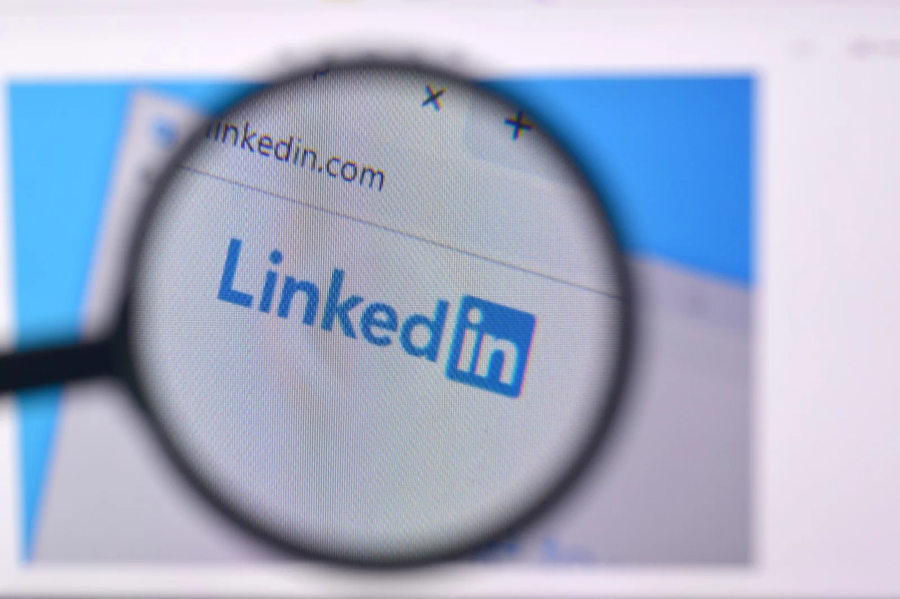

# What are InMail Messages?

## With the increase in the popularity of remote working, as well as the simplicity and convenience of searching for a job online, LinkedIn has become the go-to platform for employers and job seekers alike.

As a professional network, LinkedIn is the perfect platform that allows job seekers to find the right job or internship, and it also allows recruiters to search for and choose the best fit for their available positions. 

There are several different ways for LinkedIn users to get in touch with each other. One powerful tool that connects these professionals, and that often serves as the first point of contact between them, is InMail messages.

#### Definition

[InMail Messages](https://www.linkedin.com/help/linkedin/answer/1584/inmail-messages?lang=en) are a LinkedIn messaging feature that can be used to directly contact any LinkedIn member, without the need to be connected to them on the platform. Since this is a premium feature, this ability is limited to premium LinkedIn accounts, and the number of messages that can be sent on a monthly basis depends on the chosen premium plan. Basic (free) accounts can only send an InMail message to their connections — however, they can receive an InMail from anyone.

#### How Is InMail Different From Regular Messages

While InMail is integrated with LinkedIn’s standard messaging feature, there are some important differences between the two. InMail allows contacting people that are not part of a LinkedIn user’s network, and there is a limit on how many InMail messages each user can send per month. 

This means that receiving an InMail is rarer than a regular email or message, and thus less likely to be ignored or disregarded. Most of the [cold emails](https://rev.team/kb/what-is-cold-email) are frowned upon by users receiving them, whereas getting an InMail often feels quite more personal and indicates that there is an effort on the sender’s side. Additionally, each recipient can check the profile of the sender to get some information about them, which increases the trustworthiness and authenticity of the whole process.

As for the actual visual difference, when users receive an InMail message in their LinkedIn inbox, there will be an InMail label in bold to differentiate it from regular messages. This makes InMail messages stand out, and they’re therefore much more noticeable and more likely to get a response than their regular message counterparts.

#### Why Are InMail Messages Important

According to LinkedIn, using InMail features can help users achieve an increase of [up to 300%](https://www.linkedin.com/business/sales/blog/lead-generation/why-inmail-is-replacing-email-for-lead-generation) in response rates compared to emails with the same content. Apart from higher response rates, there are numerous other benefits of using InMail, such as the ability to contact any user without a connection request, to reach out to passive and active job seekers alike, to contact anyone regardless of whether they provided their personal info, to track message effectiveness, to get rewards for responses, and more.

### Contact Anyone Without the Need of a Connection Request

An InMail message can be sent to anyone on LinkedIn even if they do not have a premium account. There is also no need to send a connection request to contact someone, which is quite helpful when contacting users for the first time. This is especially useful for users contacting another user that has no mutual connections with them.

### Contact Both Active and Passive Job Candidates 

By using InMail and LinkedIn, job recruiters have a larger pool of suitable candidates to choose from, as they do not need to wait on or contact only the people that have shown interest in a new job. Approaching passive candidates that seem to be a good fit for a job can turn out beneficial for both sides, and the most effective way to do this is by sending them InMail messages.

### No Need for Personal Info Such as Email Address to Contact Someone

While choosing potential [prospects](https://linkedprospect.com/), it can be frustrating and time-consuming when a person has not included an immediate way of contacting them. Many users choose to hide their personal email addresses for several different reasons, so those that want to contact them need to spend additional time to find a way to contact them, or search for another prospect altogether. 

To solve these issues, InMail provides the option to contact other users without actually seeing or knowing their personal email addresses. This is beneficial for both sides as it is time-saving for the sender, and it saves the recipient from receiving numerous unsolicited email messages, too.

### Track the Effectiveness of Messages

Using InMail messaging is generally more effective than sending regular messages. Users have the ability to actually measure this increase in effectiveness. 

By using InMail, users get access to the InMail analytics page. This page provides detailed information about the messages users have sent, which can then be used for improving the messaging outreach and strategy.

### Receive a Reward for Every Response

As InMail is a premium feature, a nice addition to it is the opportunity to receive [InMail credits](https://www.linkedin.com/help/linkedin/answer/65/viewing-your-total-available-inmail-credits?lang=en) back if the recipient of an InMail message replies within 90 days. This allows for more messages to be sent without actually paying more or waiting on the monthly renewal.

#### How to use InMail Messaging

Setting up and using InMail is quite straightforward. The first thing that users need to do to start using InMail is to upgrade to a [premium account](https://premium.linkedin.com/). Each premium account provides a different number of InMails that can be sent on a monthly basis:

* **Career Plan:** 3 InMail messages 
* **Business Plan:** 15 InMail messages 
* **Sales Plan:** 20 InMail messages 
* **Hiring Plan:** 30 InMail messages 

The next step is to open the profile of the prospect and click on the **Message** button on their introduction card. InMail’s subject lines can contain up to 200 characters, while the main text body can be made up of up to 1,900 characters, including the signature.

#### Opting Out of InMail Messages

Although InMail messages have proved themselves as a powerful tool for establishing the first contact on LinkedIn, not every user will prefer to receive them. LinkedIn has provided the option to limit who can reach users, so anyone can change the preferences in their settings and opt-out of InMail messages, among other things.

#### Summary

InMail messaging is a premium messaging feature that is used to establish business communication among LinkedIn users without being connected to them on the platform. The feature enables users to contact almost anyone across LinkedIn without the need to connect to them or know their email addresses. InMail comes across as a meaningful personalized message which is more likely to engage the recipient and elicit a response from them than a regular email or message. 

This messaging feature is quite simple to use and it only requires a premium LinkedIn account. However, each of the premium plans allows for a different number of InMails that can be sent.

The limit on monthly InMail messages that can be sent increases their value and makes them more noticeable and trustworthy.

InMail comes with an InMail analytics page that serves as a measure of the effectiveness of the messages and provides the option to track the progress and improvements (or lack thereof). For anyone who may find InMails intrusive, LinkedIn has also given users the option to opt out of receiving these messages.