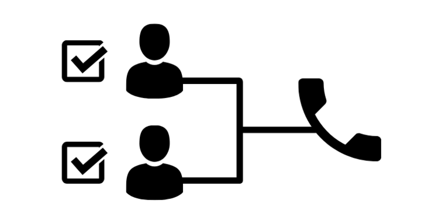

# What are prospects?

## Prospects are people or organizations that are interested in purchasing products. They have the financial resources and the power to purchase. 

What do you call potential customers? Potential customers are considered prospects by companies once they have been assessed as having certain characteristics.

### Definition

Prospects are people who fit your target market, have the ability to purchase your products or services, as well as being authorized to make purchasing decisions. Prospects don't need to have expressed an interest in purchasing; they just have to meet the criteria.

If you sell virtual support services for small businesses, a prospect is a small business manager who is able to afford your services and makes the decision to hire. If your contact does not have the permission to purchase, they are not your prospect.

#### How Prospects Work

Prospecting is the act or process of finding leads and making them into prospects. Prospects can come from many places. You can search the internet, buy lists, scan the phone book, or talk to people while waiting in line at the grocery store.

Whatever form you use to find leads, your goal is to determine whether the person could be a prospect.

This is done by qualifying them based on one criterion, usually your target audience. You can narrow your search by using the internet or phone book to find out where your target market is located.

While you wait, you can start a conversation that will give you information about the lead's location.

Once you have determined that the lead is a prospect, you can then qualify them using the other criteria. This can be done through phone calls, in-person meetings or online forms. You want to find out if the lead is a good fit for your offer and has the money and the ability to buy.

Many home-based business owners waste time in the sales process by not qualifying leads before trying to sell them, or spending too much time with unqualified leads.

### Leads vs. Prospects

Although a prospect is often mistaken for a lead, there is a fundamental difference. A lead is an unqualified contact. Any potential client or customer that you meet that hasn't been qualified to be a prospect is a lead.

You gather leads, qualify them as prospects, and then move them through the sales funnel.

#### Organizing Your Prospects

A customer relationship management (CRM) database, such as HubSpot, is the best way to track prospects and communicate with them. 

Prospect tracking allows you to keep track of your prospects and even collects notes from all conversations. It is useful to note customer questions and concerns so that you can address them in the future. You can also track where they are in the sales process.

A lead can be turned into a prospect. A prospect can then become a sale and, hopefully, a repeat customer.

### How Can You Target Potential Customers?

It is not easy to target prospective clients. Companies find at least 50% of potential clients to be unsuitable. Businesses waste a lot of money on prospects that don't turn out to be a good fit for them.

Start by researching the prospects that could become your best customers to save time and money. These are three methods that can help you.

#### Get to know your customers.

To generate prospects, it is important to understand your clientele's experience using your product. Start by compiling a list of key customers to find out what they have in common. Perhaps they are in the same industry or have similar financial indicators.

These features should be reflected in your potential customers. Another way is to ask your customer support and support teams about your clients. Customer service specialists have the ability to talk to customers every day and learn about their customers, their product use, and what makes them happy.

In addition, ask your customers to rate your product. What do they love the most about your product? What are the most useful features?

What would they change about your product's features? These answers will help you to reach new prospects who have the same needs.

#### Research your competitors' audiences.

People who love the products of your competitors could fall in love with yours. You can find out who they are by browsing through their social media accounts and researching their comments, content, and followers.

Take a look at the promotional content of your competitors. What are the advantages it highlights? What do customers think about the product?

This will give you clues as to what they value and how you can implement it.

Social proof is also important -- it shows customers what problems they have and how your competitors solve them.

Finally, pretend you are a potential customer and test the selling process of your competitors. Then, learn from it. What communication channels do sales reps use to communicate with prospects?

What channels do they use to communicate with prospects? What questions are they asking and what features are they highlighting in the selling process?

#### Set qualifying criteria.

To determine if your prospects are worth the effort, create a list. If you work in B2B, your hallmarks could be the company's industry, budget, and the market they are operating.

Incorporate financial indicators such as revenue and company growth. Companies with no financial problems are more likely to invest their money. To track their growth, you can use company profiling resources such as D&B Hoovers and VentureDeal.

If you work in B2C, create a buyer persona. Think about the ideal customer's marital status, occupation, income, pain points, interests, and geography. These answers can be both speculative and empirical.

These techniques will save you time and help you select the most promising prospects. These techniques can be applied to your sales strategy and converted into happy clients quickly.

### Summary

Potential customers are people who have needs and wants which can be satisfied by your products/services. They are considered prospects after assessment.