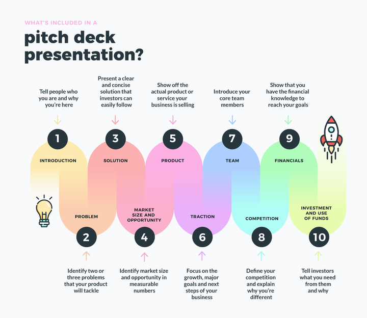

# What is a Pitch Deck and How Do You Make One?

## A pitch deck is a visual aid used to help presenters communicate their business ideas. It can be as simple as a series of slides, or it can include other multimedia elements like videos and audio clips. 

To make a pitch deck, start by brainstorming your ideas and organizing them into an outline. Once you have a rough idea of what you want to say, begin creating your slides. Be sure to use clear and concise language, and avoid overcrowding your slides with text.

### Definition

What is a pitch deck? It is a presentation that entrepreneurs or businesses use to present a concise but informative overview of their startup or company to potential investors such as angel investors or venture capitalists.

A pitch deck presentation, also known as a startup slide deck or startup pitch deck, is a visual document that provides investors essential information about your business plan, product, fundraising needs, and key metrics such as valuation, target market, and financial goals.

The best pitch decks are concise but informative and have simple, visually appealing slides. They are usually created using a software program.

#### What does a pitch deck contain?

A pitch deck usually contains 10-20 slides and is designed to provide a brief overview of your company, business plan, and startup vision. A pitch deck presentation can also be used for many purposes. It can be used to present to investors or to present to them.

A demo-day presentation should, for example, be very visual and have very little text. You will be able to see it from far away and do all the talking. A pitch presentation you plan to email should be self-explanatory.

It will be visible on a laptop monitor, so a small font is OK.

It's important to monitor your investor's activity during the presentation to determine if they have read the slides. This can be crucial when determining the frequency of follow-up emails.

#### What is the purpose of a pitch deck?

A pitch deck is designed to spark interest in a company and possibly lead to further meetings with investors. Although a pitch deck is a crucial tool for raising capital for a company, it is only one step in the process.

#### What should a pitch deck presentation look like?

Many authors, venture capitalists, and startup founders have developed different versions of what they consider essential elements for successful pitching presentations. 

### Making a Pitch Deck

When creating your pitch deck, there are several things you should keep in mind:

**Be simple.** Investors might be tempted to overwhelm entrepreneurs with too much information in their pitch decks. However, less is more.

**Be clear.** Concise ideas that are clearly explained in bullet form or infographics are more appealing than a lot of text. 

**Prioritize the story over stats.** A pitch meeting is designed to engage potential investors. A list of metrics and facts will not have the same impact as a narrative approach.

Investors will be more likely to relate to stories from entrepreneurs about their businesses, such as how customers have used their products or services.

**Make sure it can stand alone.** Potential investors may want to refer back to the pitch deck after the presentation. Make sure that the deck contains all the important information they require in PDF or print format.

**Keep it up-to-date.** Before they can secure funding, businesses often pitch multiple potential investors. To maintain professionalism and avoid outdated information, ensure that your pitch decks reflect the most recent information, including key metrics and milestones.

### What should you include in your pitch deck?

Although every business is unique, the following format is universally applicable and most likely to generate interest from potential investors.

([Source](https://visme.co/blog/what-is-a-pitch-deck))

#### 1. Vision and value proposition.

This is a brief overview of your business and what you offer your customers. Keep it simple and concise. This slide can be viewed as a tweet.

Describe your business in 140 characters.

Tech companies often compare their value proposition to other well-known companies. You'll see pitches that begin with:

> *"We are the Uber for Pets."*

> *"We are the Netflix of Video Games."*

It can work. But make sure you aren't using Uber or any other high-profile company to show growth potential. Your business model must be similar to that of the company you are referring to.

#### 2. The problem.

If you don't solve a problem in the world, your business will have a difficult climb.

This slide can be used to discuss the problem you are solving, and the people who are affected. You can talk about current solutions in your market, but don’t spend too much on the competitive landscape. That slide will be available later.

When defining the problem, it is best to tell a relatable story. Your investors will be more likely to understand your business and your goals if you make the problem as real as possible.

#### 3. Opportunity and target market.

This slide will help you to identify your ideal customer and how many there are. How large is the market and what can you do to position your company within it?

Investors will need to know the market share to gain a better understanding of the market. This is where you tell your story about the scale and scope of the problem that you are solving.

If it is practical for your business, you may want to divide your market into segments. These segments will be addressed with different Revenue strategies and possibly different product offerings.

This slide is important to be careful with. It can be tempting to try to define your market as broadly as possible.

Investors will prefer to see that your market is very narrow and easily accessible. Your business pitch will be more realistic if you are more specific.

#### 4. The solution.

Now it's time to describe your product or service. Describe the customer experience with your product and how it solves the problems you have outlined in slide 2.

It's tempting to move the solution slide closer toward the beginning of your pitch deck. But resist the temptation.

This is classic storytelling, where you create the problem and then describe how it affects many people. Your product or service now comes to the rescue to solve this problem.

Entrepreneurs tend to be too focused on their products. Instead, they should be focusing on their customers and the problems they face. This format will help you tell a better story.

When describing your solution, make sure to use pictures and stories. Almost always, it is better to show than tell.

#### 5. Revenue model or business model.

After you have described your product or service, it is time to discuss how it makes money. What do you charge and who pays for your product or service? For some businesses (content websites, for instance), advertisers pay the bills.

It's important to clarify the details.

You can also refer to the competitive landscape here to discuss how your pricing fits in the larger market. Are you a premium, high-priced offering, or a budget offering that is less expensive than the existing solutions?

#### 6. Traction and validation roadmap.

Talk about your product if you have sales and early adopters. Investors want proof that your business model has been proven to work. This is a great way to show that your solution solves the problem you identified.

This slide can also be used to discuss your milestones. What are your major goals and what are your next steps? This section is useful for companies and products that outline key milestones.

#### 7. Revenue strategy.

How do you plan to get customers' attention? What is your sales process? This slide will outline your Revenue plan.

You will need to describe the key tactics you plan to use to get your product front and center for potential customers.

Finding and winning customers can be a challenge for startups. It's important to demonstrate that you understand your target market and the sales channels you plan to use.

It's important to highlight any differences in your Revenue processes with your competitors.

#### 8. Team.

Why are you and your team the best people to grow and build this company? What are the unique skills and experiences that you can offer the company? Highlight the achievements of key team members at other companies and the expertise they bring to the table.

Even if your company doesn't have a large team, identify the key positions you need to fill and explain why they are important for company growth.

#### 9. Financials.

Investors will want to see your financials, including sales forecast, income statement (also known as profit and loss statement), and cash flow forecast for at most three years.

For your pitch deck, however, you should not have complicated spreadsheets that are difficult to read or consume in a presentation format. You should limit your charts to Revenue, total customers, total expenditures, and profits.

It is important to be able to talk about the assumptions you have made to reach your Revenue goals. Also, discuss your key expense drivers.

Try to be realistic. Investors are used to seeing "hockey stick" projections and will mentally reduce your projections by half. It is very useful to be able to explain your growth using traction you already have, or comparing it with a similar company in the same industry.

#### 10. Competitors.

Every business faces competition in some way. Even if you open up a new market, your customers may already be using other solutions to solve their problems.

Describe your position in the market and how you differ from the competition. What are your key advantages over the competition? Is there a "secret sauce" you have that others don't have?

It is important to explain how you are different from other players on the market and why customers will choose your company.

#### 11. Investment and usage.

It's finally time to ask for the money. Potential investors need to know how much you are seeking.

You must also be able to explain why you are asking for the money and how you plan to use it. Investors want to know how your money is being used and how it will help you achieve the goals that you have set for yourself and your business.

If you have investors already, you should now be talking about them and why they chose to invest.

### How to make a PowerPoint slide deck.

You may be asked to create a slide deck in PowerPoint.

1. Open a PowerPoint presentation.
2. A structure should be created for your content.
3. Add a Title to the first slide.
4. Design the remaining slides.
5. Use images that are relevant to the content.
6. Add animations and transitions.
7. Make a *Thank You* slide.
8. Save your slide deck.
9. Share the presentation with your team.

([Source](https://visme.co/blog/what-is-a-pitch-deck))

### Pitch Decks: Do's and Don'ts

**DO: Use bullet points when presenting slides.** This is a presentation that will last only a few minutes. Avoid overwhelming your audience with too much text. Don't try to explain everything in detail on your slides.

**DON'T: Stuff text into every slide.** As you can see, bullets are better than paragraphs on slides. Also, make sure to use large font sizes and lots of visuals. This will allow you to create an engaging and informative presentation.

**DO: Include your contact details.** To let your audience know who to contact with questions, make sure to include your contact information at end of the presentation.

**DON'T: Include too many team members.** Stick to the core members of your team. Too many executives can be overwhelming; investors want to know who is steering the ship.

**DO: Tell a story.** Your audience should feel that your business is solving a problem and how it will affect them.

### Summary

Now that you've learned what is a pitch deck and how to make one, you start by brainstorming your ideas and organizing them into an outline. Once you have a rough idea of what you want to say, begin creating your slides. Be sure to use clear and concise language, and avoid overcrowding your slides with text.