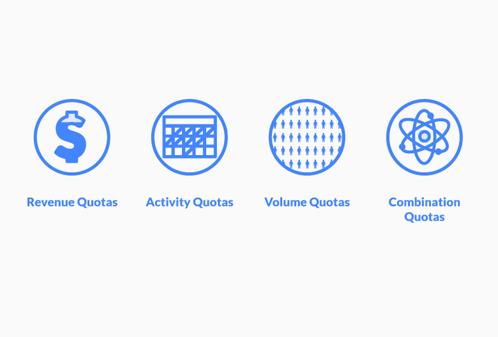

# What is a Sales Quota?

## What is a sales quota, and how can you make sure that you achieve it? 

### Definition

What is a sales quota? It can be described as a sales goal, target, or minimum sales level that sales teams or individuals are trying to reach. Sales quotas can be time-sensitive and must be met monthly, quarterly, or annually.

Sales quotas can be measured in many ways, including dollars or units sold, new customers, or product demonstrations.

#### Sales Quotas vs. Sales Goals: What's The Difference?

Sales goals and sales quotas do not always match. A sales goal is a projection of the future based on past performance from the previous quarter of last year. Forecasting is also part of sales quotas.

However, they are usually fixed requirements that are tied directly to a sales rep’s compensation plan. Sales reps who meet their sales performance quota within a certain period are eligible for compensation that is linked to those activities.

### 5 Sales Quota Types

Sales managers employ a wide array of quotas to motivate employees in the sales process.

1. **Volume quota:** A volume quota is a sales quota that rewards sales representatives for the number of deals or qualified leads they generate, regardless of deal size.
2. **Revenue quotas:** Revenue quotas are sales quotas that reward gross revenue. If a team member only makes a single sale in a given timeframe, but the sale generates massive revenue, the sales rep can still meet a manager's sales quota.
3. **Profit quotas:** A profit quota is similar to a revenue quota, but it considers the net income of sales activity. That is to say, it calculates gross revenue minus selling expenses. This incentivizes sales representatives to work efficiently in their sales calls and meetings.
4. **Activity quotas:** This type of quota rewards volume of activity, such as requiring a certain number of phone calls (including cold calls and follow-ups), as well as various tasks in a consumer relationship management (CRM) system.
5. **Combination quota:** A combination quota combines multiple sales metrics to reward different kinds of success in the sales pipeline. Different companies and different managers may employ their templates for a combination quota.

([Source](https://www.propellercrm.com/blog/sales-quotas))

### Why Are Sales Quotas Important?

Sales quotas allow sales teams to reward prospecting for new customers and increase conversion rates within a given period. Setting sales quotas and paying sales commission allows a business manager to link employee compensation with the revenue they generate.

Sales reps can share in the rewards if they reach a certain dollar amount during a sales cycle.

We all know the importance and value of goal-setting. It is often more effective than letting someone just do their thing.

Sales are no exception. The sales quota is a large number that is visible for all to see. The quota is determined by the salesperson's pay mix and the number of target earnings they have.

It also sets the expectation of where the salesperson will be at the end.

If you fail to meet quota requirements, you can expect channel conflict, ownership confusion, and salesperson disengagement. It's not that the salesperson isn't motivated to make sales, but a discouraged mindset can lead to fewer sales if the plan is perceived as unfair or unattainable.

Not only will the salesperson miss their targets, but the entire sales organization will suffer if they are not tied to strategy.

### Sales Quota Tips

There are many ways to miss the mark, despite how powerful sales quotas may be. Here are some things to remember when setting quotas.

#### 1. Quotas should be matched to sales activities.

Consider retail sales incentive programs. Employee motivation is key to success. Since salespeople have no say in markups and discounts, tying quotas to gross margin would not make much sense.

They might not be able to achieve their goals, regardless of how hard they try or how skilled they are.

#### 2. Quotas should encourage positive behavior along the way.

Salespeople should not be encouraged to sacrifice their quota goals to reach them. If the quota is based on driving sales from existing customers only, salespeople should be encouraged to build strong customer relationships which will increase the likelihood of repeat customers.

#### 3. Quotas should not be handed down but built together.

Management should not just give out quotas without consulting them. Instead, sales should have discussions about what they are seeing and experiencing in their territories.

Finance and sales ops should also be involved, as they have the best insight into historical trends and market conditions. It's easier for chefs to cook when everyone knows what's in the recipes.

#### 4. Yesterday's quota should not be confused with yesterday's sales tactic.

It is not a sound strategy to say, "It worked last time" because it is not true. It is dangerous to try to roll quotas from one period to another without considering the current environment, especially when there are so many variables.

At the very minimum, an organization's goals will be constantly changing, so quotas should be adjusted to match.

#### 5. Yesterday's quota should not determine today's.

Past performance does not necessarily indicate future results when it comes to quota setting and sales volume. You might think you are doing the right thing by making your star reps' quotas more difficult, but you should stop and consider all the factors, even with your sales leaders.

If an individual is responsible to bring in new business in a territory and succeeds, it doesn't necessarily mean that they will have the same success in the next. You can argue that they will have a harder time because there is less opportunity.

This is just one example of a single variable, but it illustrates the point.

Setting your quota attainment goals should be a carefully planned and thought-out process. This will ensure that you achieve the motivation and accuracy you desire. Sales Performance Management (SPM), technologies are crucial for tracking historical data to determine appropriate and effective quotations.

### How to Set A Quota

Before you set your quotas, you should determine which performance measures are most appropriate for your business. When deciding on your performance measures, consider your business goals and your structure.

Next, you need to choose quotas that can be reached by 60-80% of your sales force. Your sales team will burn out trying to achieve these quotas, even if you are pushing for growth. You can increase your quota if more than 80% of them are reaching their goals.

You must be careful not to set them too high. When setting quotas, you will need to consider many factors, including the different customer segments, verticals, and territories your reps sell to. Your sales reps must feel that their quotas are achievable.

Otherwise, you could lose motivation and cause high attrition.

You must ensure that the sum of all individual quotas is sufficient to achieve your business goals, even after taking into account the average 80% achievement. Quota planning is a difficult discipline that requires deep insight into your business and strong analytical skills.

### Conclusion

Sales quotas are an essential part of any salesperson's career. Meeting your quota is key to ensuring that you have a successful and productive year in sales. But what is a sales quota, and how can you make sure that you exceed it?

This guide has taught you everything you need to know about quotas and how to achieve them.