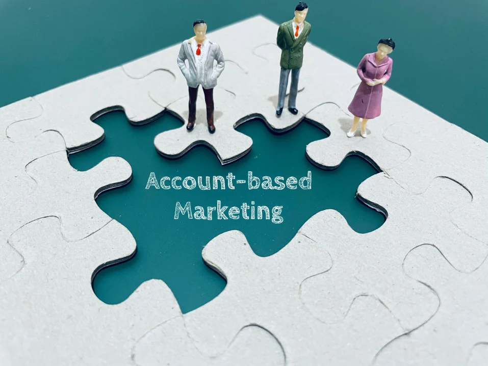

# What is Account-Based Marketing?

## Account-based marketing (ABM) can help companies achieve a better return on investment (ROI) compared to other marketing strategies. ABM enables companies to deepen existing business relationships, enhance their sales, marketing, & other teams.  

### Definition of Account-Based Marketing

**Account-Based Marketing (ABM)** is a strategic framework that engages qualified individual prospects or customer accounts as unique markets in themselves, worthy of focused, hyper-personalized treatment by sales, marketing, and other teams, [according to SalesHacker](https://www.saleshacker.com/sales-terms-glossary/). 

When implemented by companies, ABM puts in motion numerous coordinated and integrated processes of targeting clients with individually tailored marketing propositions. As such, ABM necessitates coordination from different business functions, most commonly marketing, account management, and sales, and requires the integration of their input into a single marketing proposition.

[The Information Technology Services Marketing Association (ITSMA)](https://www.itsma.com/account-based-marketing-hot-topic/#:~:text=HOW%20DO%20WE%20WORK%3F,specific%20new%20and%20existing%20accounts.) has another take on defining account-based marketing, according to which ABM is a “strategic approach that combines targeted, insight-led marketing with sales to increase mindshare, strengthen relationships, and drive growth in specific, new and existing accounts”.

### Account-Based Marketing: An Overview

Even though ABM is not a novel approach, this strategic marketing (and sales) framework has recently drawn a lot of attention from marketers and managers interested in acquiring, retaining, and growing high-value accounts.

Broadly speaking, account-based marketing is a strategic marketing method aimed at a qualifying subset of clients that utilizes a tailored approach facilitated by multiple business units. Over the past couple of decades, the effectiveness of ABM in yielding high ROI has been proved in practice by companies such as Microsoft, Oracle, and Hewlett-Packard. Yet, the renewed interest in ABM today is driven by changes in technologies that invigorate the underlying techniques and drive the effectiveness and scalability of ABM. This makes ABM a viable marketing approach for firms of all shapes and sizes.

### The Key Principles of Account-based Marketing 

The four main principles that account-based marketing is based upon are:

* **Client-centricity and insight:** Outside-in problem solving, not sales pitches;
* **Marketing and Sales partnership:** Extensive cooperation for an integrated approach;
* **Reputation, relationships, and growth:** Objectives which are more than just near-term revenue;
* **Tailored programs and campaigns:** Personalized propositions, content, and “plays” to raise interest and engagement.

#### Types of ABM

**Strategic ABM**, also referred to by some as ***the*** account-based marketing approach, is a one-to-one strategy focused on creating and executing highly-customized programs for individual high-value accounts. As the name suggests, companies use strategic ABM for strategic accounts where one-to-one interaction is not only a must but an absolute necessity. Therefore, strategic ABM projects are spearheaded by senior-level marketers who work directly with a handful of key accounts at a time, supported by sales teams that deliver completely customized marketing plans.

**ABM Light** is essentially a broadened version of strategic ABM that relies on a one-to-few approach. ABM Light is centered on creating a somewhat customized marketing strategy for groups or clusters of accounts with similar needs and concerns. Unlike strategic ABM that treats each account as a unique market in itself, ABM Lite clusters similar accounts and develops a customized approach on a cluster level. Focused on a group of key accounts that share similar business characteristics, ABM Lite is usually led by one marketer that develops programs for several groups of accounts in collaboration with sales. The importance of accounts targeted with ABM Lite is lesser compared to Strategic ABM and as rank and resources are scaled back, technology becomes more important. Therefore ABM Lite relies on automated account campaign execution, account insights, and measurement which makes this approach less resource-intensive per account compared to Strategic ABM.

**Programmatic ABM** is the wide-casting net of account-based marketing as it’s aimed at many, less strategic accounts. Programmatic ABM utilizes a one-to-many approach and relies more on technology than people to achieve goals. Characteristic for programmatic account-based marketing is the use of custom marketing campaigns for selected accounts at scale. Such marketing campaigns are then scaled using digital technologies that automate ABM tactics across hundreds of identified potential clients.

### What Account-Based Marketing Is Not

Account-based marketing often gets confused with allied types of marketing techniques such as lead generation, demand generation, or inbound marketing. At their core, these marketing techniques are quite distinct from ABM as they serve different purposes in creating a more comprehensive and effective strategic roadmap. Here is how they differ:

**Lead generation:** While lead generation revolves around engaging broader target customers or “leads” that might be interested in a product or service, account-based marketing is greatly targeted and more precisely determines the relevant market.

**Demand generation:** Unlike ABM, which mainly concerns itself with particular targets and regards each account as a market of one, the demand generation marketing technique aims to get as many people as possible familiarized with the product or service.

**Inbound marketing:** While this type of marketing strives to attract customers by using content marketing and social media, ABM is not focused on individual customers, but on targeting significant accounts. 

### How Account-Based Marketing Can Help Companies Grow

All companies have an impetus for growth. However, what often distinguishes the ones that succeed from those that don’t is a coherent and robust growth strategy. The path to business growth is paved with consistent and conscious efforts aimed at overcoming challenges and attaining milestones and it can be achieved through increasing revenue and market share, acquiring assets, and improving the organization's products or services. 

Since ABM enables teams to focus on high-value prospects or accounts as unique markets in themselves, account-based marketing can also be regarded as a viable and focused growth strategy. In fact, adopting ABM can help companies grow by increasing the value of existing accounts, adding new clients, or even breaching into new customer segments.

In each of these scenarios, ABM can be particularly advantageous as, in its essence, account-based marketing is all about empowering marketing and sales teams to collaborate and create personalized buying experiences for high-value accounts. Additionally, with the input of other business units and management, ABM enables companies to approach high-value accounts as if they're individual markets.

### Benefits of Account-Based Marketing

Account-based marketing is becoming [more widely adopted across B2B markets and industries](https://www.statista.com/statistics/1133631/b2b-abm-marketing-adoption-level-world/), particularly by businesses trading in long sales sequences with large accounts and transaction values. ABM can grant numerous advantages over other marketing strategies.

#### Improved ROI

ABM is precise, targeted, personalized, and measurable, and because of that, it [leads to higher ROI](https://www.itsma.com/revolution-is-almost-here-2018-abm-benchmark-study/). On top of that, ABM is unrivaled in precision and measurability compared to other B2B marketing tactics.

#### Tailored Marketing Approach

Rather than casting a wide net, marketers can use personalized communication to target accounts. By extrapolating from the data they have on their clients, marketers can craft creative assets and campaigns to resonate with the clients' specific needs and attributes.

#### Line up Marketing and Sales

The nature of ABM necessitates collaboration from sales and marketing teams. The combined skill set and experience allow the teams to target accounts more precisely, develop highly customized campaigns, and join forces to align and move individual accounts through the pipeline.

### The History of Account-Based Marketing

ABM has gained prominence since the 1990s when the book [“The One to One Future”](https://www.goodreads.com/book/show/724622.The_One_to_One_Future) by Don Peppers and Martha Rogers was released. The publication set the scene for what would grow into an innovative marketing framework by putting forwards the idea of targeting clients individually, rather than a myriad of them at once.

In the 2000s, the Information Technology Services Marketing Association (ITSMA) set forth ABM as a strategic toolkit to propel their competitive advantage. Over the years, ABM has been applied on a large scale by some of the biggest tech companies such as BT, CSC, Fujitsu, Oracle, and Microsoft.

According to the [Third Annual ABM Benchmark Study](https://www.itsma.com/research/moving-abm-maturity-2019-abm-benchmark-study/) by ITSMA, companies that apply ABM are allocating 29% of their marketing budgets to ABM and have good performance across different indicators.

### Account-Based Marketing Experiences From Real-World Companies

As mentioned before, there are many real-life examples of the successful application of ABM. Among the companies that welcomed ABM is Fujitsu, the Japanese multinational information technology equipment and services company.  

#### Fujitsu, Japan

[Andrea Clatworthy, head of ABM at Fujitsu, points out that](https://www.youtube.com/watch?v=FaBoaBqVOLA) “ABM is a strategic approach, not a simple campaign or tactic, but a business strategy, not one and done, it is connected and always on for each account.” Clatworthy's experience suggests that the best way to begin with ABM is to run a pilot in two or three accounts for one-to-one ABM activity. The lessons that can be learned from Fujitsu's case are that it’s crucial to involve both sales and marketing in a joint effort to get the most value out of ABM. 

#### Oracle, USA

[Oracle, the US multinational computer technology corporation](https://www.oracle.com/cx/marketing/account-based-marketing/) that also applies ABM, indicates that an important part of account-based marketing is data, as targeting the right accounts is crucial. “Successful ABM campaigns start by assessing first-party data and digital body language, which is the sum total of an account’s online activity such as websites visited and for how long, to find the accounts with the highest lead scores. This data shows you where to focus your sales and marketing efforts.”, advises Oracle.

#### Microsoft, USA

In the case of Microsoft, training was key: “We decided to go ahead with a Strategic ABM approach about two years ago, and it’s been a change management journey since then. Training has been critical.”, [pointed out David Armijo from Microsoft](https://www.itsma.com/launching-abm-lessons-from-juniper-microsoft-and-teradata/).

### ABM: Key Takeaways

ABM is a strategic marketing framework that is becoming increasingly relevant for the new generation of marketing professionals across diverse industries.

It is important to stress that ABM should not be perceived as a substitute for a wider forward-looking marketing strategy. Instead, it should be a piece of the overall marketing puzzle. The techniques and approaches characteristic of ABM should fit in the broader marketing strategic framework.

Philip Kolter, a classic marketing author, consultant, and professor, said “marketing takes a day to learn and a lifetime to master.” So it goes with account-based marketing too, and there is no easy way to win. ABM marketing results should be expected after a year, at the earliest. Furthermore, ABM can be costly; so it is advisable to apply ABM only to key accounts.

However, ABM is more than a buzzword in B2B marketing discourse, as its benefits outweigh these two caveats. ABM provides a chance for brands to get personal, accelerate the sales process, and enhance customer acquisition. 