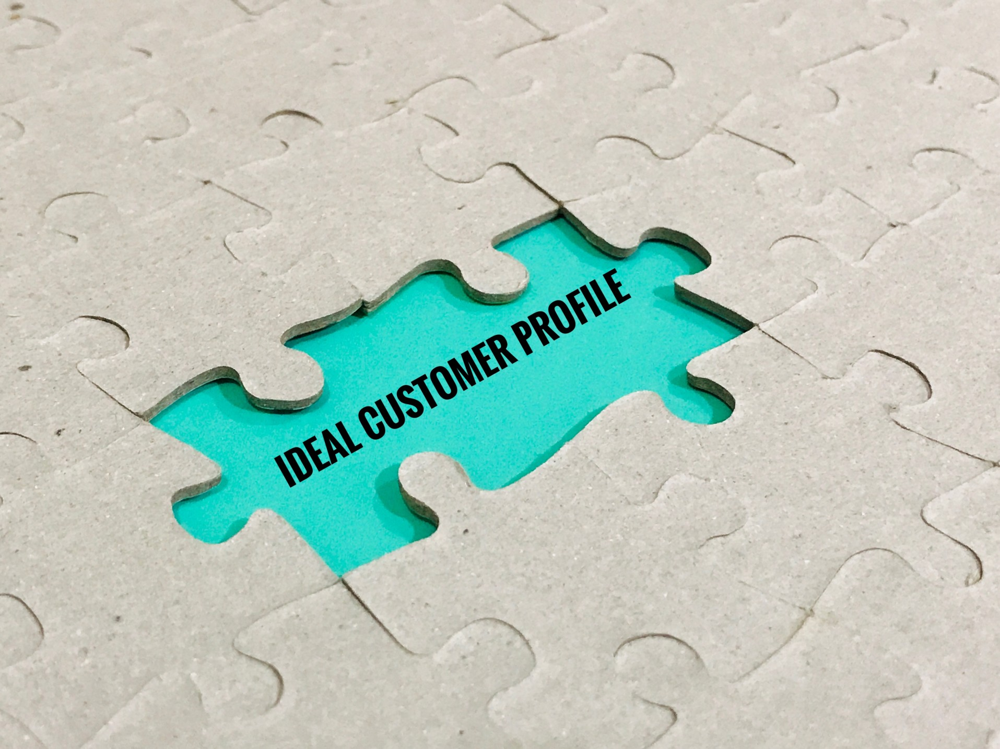

# What is an Ideal Customer Profile (ICP)?

## For every business to grow and succeed on the market, it needs to engage in economic activities — that is, selling products and/or providing services — and generate revenue. To do this, businesses need customers to sell to.

While many businesses tend to aim for every customer they can get, in reality, there exist different kinds of customers that may decide to pay for a product or service. As their primary target will be to [close more deals](https://rev.team/kb/what-is-closing-a-deal), businesses should evaluate how much each deal costs them in terms of resources (time, efforts, materials, and so on), and what exact customers are worth spending these resources on.

Because of this, skilled marketers and sales professionals know how to differentiate between customers, and how to adapt their approach to each customer type accordingly. One of the concepts they use to make this distinction is that of the ideal customer profile, or ICP for short.

#### Definition

The term ideal customer profile (ICP) is used by businesses to describe the theoretical customer type that would bring the most value to them during commercial transactions. The term is used in [B2B](https://rev.team/kb/what-is-b2b) marketing and typically designates a hypothetical type of business customer that is most successful at selling to customers, retaining them, and promoting products or services to them.

#### How to Define an ICP

To construct their ICP, businesses need to follow the following three steps: identifying ideal customer traits, market research, and profile building.

### Identifying the Ideal Customer Traits

To start with, businesses have to determine the traits that their ICP has. It’s widely accepted that a business that fits another business’ ICP should have most (and ideally all) of the following traits:

* **Readiness** — Businesses should have a need that they’re prepared to fulfill by buying a product or service from the business that has designated them as fitting its ICP;
* **Willingness** — These businesses should also show that they’re enthusiastic (or, in the very least, interested) to purchase a product or service;
* **Ability** — They should be materially able to make the purchase, which usually means they should have the money to buy a product and service. Apart from the financial aspect, businesses that fit the description of ICP should have no other technical obstacle to make a purchase;
* **Skillfulness** — ICP businesses should be able to make use of the products or services they’re buying in technical terms. They should have the skills needed to benefit from these products or services to their full potential;
* **Profitability** — ICP businesses should be successful in their fields, and that success should reflect in their earnings. Businesses that see a drop in their profits usually don’t fit the description of an ideal customer, as they’re more likely to have to cut their expenses by spending less on products and services;
* **Growth** — Successful businesses that aim to expand also fit in the description of an ICP. This is because these businesses usually renew their purchases over time, and are therefore more likely to accept [upselling](https://www.shopify.com/encyclopedia/upselling) proposals;
* **Connections** — ICP businesses have a wide network of partners, leads, and [clients](https://rev.team/kb/what-is-a-client). This means that they’re likely to promote the products or services they’re purchasing within their networks.

Here, it’s important to note that the way to obtain this kind of information about customers will depend upon the experience of the business that’s trying to construct an ICP for itself. Newer businesses, for instance, will have to do [market research](https://www.entrepreneur.com/encyclopedia/market-research) to try and estimate what their ICP would look like.

More established businesses, on the other hand, can compare their previous and existing business customers to come up with data relevant for determining their ICP. This can be done mostly by analyzing which businesses have been easiest to sell products or services to, have made the best use of these products/services, have the shortest sales cycles, best customer satisfaction, were the cheapest to acquire as customers (lowest [CAC](https://rev.team/kb/what-is-customer-acquisition-cost-cac)), were most keen on renewing deals, and so on.

### Market Research

Once businesses have determined all (potential) customers that fit their ICP profiles, they then need to do market research to understand why these ICP businesses have the above-mentioned ideal customer traits. To do so, they’ll often have to directly contact the representatives of some of these businesses.

During this research, businesses need to find out what made their ICP matches use their products or services, what was their best feature (price, practical application, simplicity of use, time-saving, and so on), what can be done to make them more satisfied as customers, and so on.

To be able to gain a more detailed insight into the exact type of business that would be the best fit for its ICP, a business needs to use [firmographics](https://rev.team/kb/what-is-firmographics) to explore several key characteristics of its targeted businesses. For different businesses, these characteristics may include some (or all) of the following:

* **Average business size** — what number of employees each ICP business;
* **Average earnings** — how profitable each business is;
* **Industry type** — the industry or business area each of these businesses operates in;
* **Location** — where these businesses are based, and where they operate (locally, regionally, nationally, and/or internationally);
* **Key figures** — what are the [decision makers](https://rev.team/kb/what-is-decision-maker) within each business;
* **Corporate structure** — how these businesses arrange their internal workforce hierarchy;
* **Objectives** — what is their vision, what do they strive to achieve;
* **Pain points** — what issues do they have that can be solved by a product or service sold to them;
* And more.

It should be noted that the exact characteristics that will be relevant here vary from business to business, depending on what they sell, their branding, and several other factors.

### Ideal Customer Profile Building

The final step of this process is to build the ICP itself. For this purpose, businesses should gather all the above-mentioned [data](https://rev.team/kb/what-is-data) and insights, and display these in an easily accessible format such as a spreadsheet.

From there, they need to do cross-referencing for all the businesses that display very similar characteristics to each other. This is done to create groups of businesses for the profile building process.

Next up, businesses need to evaluate each of these groups for the data that repeats the most — this data will be the primary reference for what traits the business’s ICP has. From here, several ICPs can be extracted, and for each one of these, businesses can determine the needs, level of responsiveness, current interaction level as well as emotional attachment to the brands of the businesses.

#### The Importance of ICPs

Throughout their lifetime, businesses will acquire many [prospects](https://www.thebalancesmb.com/marketing-sales-prospect-1794386) — that is, individuals and organizations that are most likely to be interested in buying their products and/or services — which they can potentially [convert](https://rev.team/kb/what-is-conversion) to paying customers further down the line. Businesses use ICPs to determine exactly how likely it is for them to convert each one of their prospects.

Whenever a business obtains prospects for the first time, it can compare them to its ICP to see to what degree each prospect matches this profile. The more a prospect fits the ICP description, the likelier they are to convert if the business focuses its efforts on them. This means that prospects who are a very strong or almost complete ICP fit should get the most attention, whereas those that fit the ICP slightly less can be a lower priority, given less attention, or left aside to be targeted for conversion later on.

With this in mind, ICPs help businesses save time and effort by helping them eliminate those market elements that aren’t worth it. When businesses don’t create ICPs for themselves, their marketing and sales representatives are likely to end up investing themselves in a wide, dispersed target audience, most of which will probably never be converted into paying customers. With ICPs, businesses avoid this type of situation, stick to those parts of the market that are likely to generate income for them, and save money in the process.

#### Ideal Customer Profile vs. Buyer Persona vs. Target Market

The concept of an ICP is often compared to similar ones, such as that of the buyer persona and target market. While not all businesses always make the difference between these three, and some may even use them interchangeably, these similar concepts do differ from each other.

The difference between a buyer persona and ICP, for instance, is that, while the ICP is used to describe entire businesses as a whole, the buyer persona focuses on the people behind these businesses. These people are usually those decision makers within each business that have a say whenever purchases are being decided upon. Because of this, to determine the buyer persona, [demographics](https://www.thoughtco.com/what-are-demographics-and-how-are-they-used-38513) are used as a tool instead of firmographics. Many businesses use buyer personas as an aspect of their ICPs.

The term target market also has a different, albeit similar meaning to that of the ICP and buyer persona. Namely, the difference is that the concept of a target market is used in [B2C](https://rev.team/kb/what-is-b2c) instead of B2B situations. In other words, a business’s target market is made up of individuals or groups of potential customers that may be inclined to purchase its products and/or services.

#### Summary

A business’s ideal customer profile (ICP) describes the hypothetical customer type that’s most likely to purchase a product or service. The ICP concept is used in B2B transactions and analyzes businesses as customers.

To begin creating an ICP for themselves, businesses need to start by identifying the traits of their ideal customers. Ideal customers should be ready, willing, and able to purchase from the business. They should also have the skills to make the best use of the business’s products and/or services, be profitable, have the aim to grow, and have a wide network of partners, leads, and clients.

From that point, businesses can do market research and use firmographics to determine certain key characteristics of their ICP fits, related to their business size, earnings, industry, location, decision-makers, structure, objectives, pain points, and more. With all this data, businesses will have enough insights to connect the dots and locate repeating patterns to construct their ICPs.

ICPs are an important concept for businesses because they can be used as a basis to compare their prospects against. The more a prospect fits a business’s ICP, the likelier they are to convert to paying customers, and businesses should invest more time and effort in them. By helping businesses eliminate those market elements that are less likely to bring them revenue, they also help them save money.

The concept of an ICP is often compared to the similar but different buyer persona and target market. The difference between a buyer persona and an ICP is that the buyer persona focuses on the individuals working for a business rather than the business itself. Likewise, the target market concept is different from the ICP because it’s used in B2C instead of B2B, being made up of individual potential customers instead of businesses.