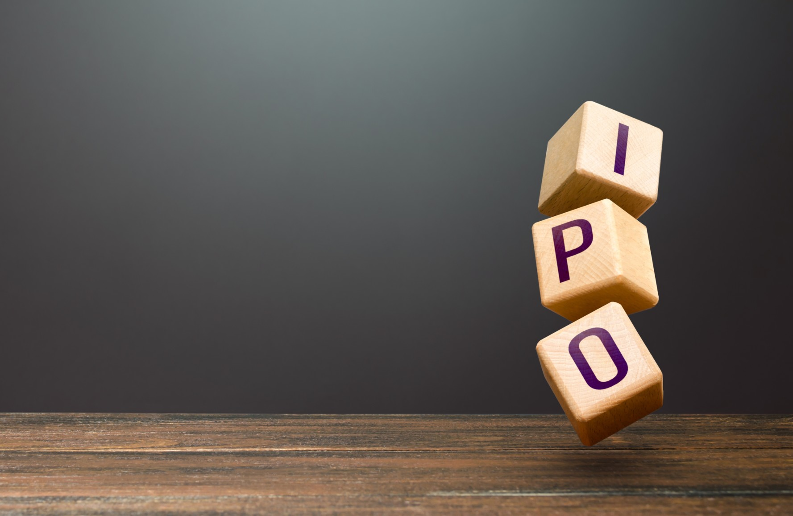

# What is an Initial Public Offering (IPO)?

## There are various different ways to classify companies in business. 

When it comes to how they trade their equity, which represents the value of their assets (stocks or shares) without liabilities, companies can generally be divided into private and [publicly traded](https://www.fool.com/investing/stock-market/basics/publicly-traded-companies/). Here, private companies are those that don’t offer or trade their shares to the general public on the stock market exchanges, whereas publicly traded companies are those that do offer their shares for anyone to purchase. One key aspect of the process of public equity trading, specifically related to the conversion of private companies into publicly traded companies, is the initial public offering (IPO).

#### Definition

The term initial public offering, or IPO for short, refers to a process wherein a private company decides to start trading its shares publicly. In this way, the private company effectively becomes a publicly traded one, since it starts issuing stocks for the general public to buy.

#### Why Companies Hold IPOs

The process of holding an IPO — that is, issuing shares to the public — can be undertaken by companies in need of expansion and capital generation. Before they hold an IPO and become publicly traded, private companies usually experience limited growth because they’re supported by a smaller number of shareholders — those who invest in them early on in their stage of development, such as the founders themselves, members of their families, friends, early investors ([venture capitalists](https://sleek.com/hk/blog/what-is-venture-capital-financing/), [angel investors](https://www.forbes.com/advisor/investing/what-are-angel-investors/)), and the like.

Private companies that make the decision to go public are usually those who have reached a certain point of growth at which they can consider themselves experienced enough to comply with [SEC](https://www.sec.gov/about/what-we-do) regulations, and responsible enough to take up public shareholders. Many companies consider this point to be the reaching of the [unicorn status](https://www.freeagent.com/en/glossary/unicorn-companies/), which is when they achieve a [private valuation](https://www.cfainstitute.org/en/membership/professional-development/refresher-readings/private-company-valuation) of $1 billion.

Apart from unicorn companies, other companies with different valuation levels can also hold IPOs if they have a solid basis to do so — usually determined by whether they can prove they have a strong outlook to be highly profitable. Whether such companies can actually be qualified for an IPO or not depends on how capable they are to fulfill requirements for a public listing, as well as on the competition within their respective markets.

### The Importance of an IPO

The main reason for a company to decide to go public through an IPO is the fact that this process allows it to tap into a much larger source of capital provided by public investors. This means the company can get access to much more money, which in turn allows it to undertake expansion operations.

What’s more, a company going public through an IPO becomes more transparent to the public in this process. The credibility gained through listing its shares for public trade helps the company attract more funding from public investors, too.

When companies go public by holding IPOs, as a common practice, they usually introduce share premiums for their current private investors. This allows these investors to get better insights into what they gain from their investments.

#### IPOs and the Value of Shares

When a company holds an IPO, the price of its [equity](https://rev.team/kb/what-is-equity) is determined by [underwriting](https://economictimes.indiatimes.com/definition/Underwriting) due diligence. During the conversion from private to publicly traded, the shares of current private shareholders become public, and thereby their value becomes equal to the trading price set for the general public.

As mentioned above, when shares are underwritten, there can be special provisions for the current private investors accompanying this process. When a private company takes the initiative to go public by holding an IPO, it’s widely considered the best moment for its private investors to sell their shares via public trading and get the [ROI](https://investinganswers.com/dictionary/r/return-investment-roi) they expect from their initial investment. Alternatively, they can also decide to keep some (or all) of their shares if they deem they’ll be worth more later on.

At the same time, by holding an IPO, the company opens up to countless public investors — individual and institutional alike — to acquire shares by providing the company with capital, alongside that generated by its private investors earlier on. The first issuance of stock from a private company for public sale further increases the value of shareholder equity.

#### Summary

An initial public offering (IPO) is a process through which a private company starts trading its shares publicly. By doing so, the company transitions from a private to a publicly traded one.

Private companies in need of expansion and capital generation are the ones that hold IPOs. Before the IPO, private companies usually experience limited growth because they’re supported by a smaller number of shareholders such as the founders, family, friends, venture capitalists, angel investors, and the like.

To hold an IPO, a company has to reach a certain point in its growth where it’s deemed experienced enough to take on SEC regulations and public shareholder responsibilities. This usually happens when companies reach unicorn status, although not necessarily.

IPOs are important for private companies because, through them, they can get access to a much larger amount of money provided by public investors. This capital can help companies expand their operations. The transparency and credibility private companies gain by going public help them attract a large number of public investors.

During an IPO, the price of a company’s equity is determined by underwriting due diligence, wherein the shares of its current private shareholders become public and their value becomes equal to the public trading price. Underwriting shares is a good opportunity for private investors to cash in on their shares and get their return of investment.

IPOs are a great way for companies to access the capital of individual and institutional investors, adding to that of their previous private investors. The first issuance of stock through an IPO increases the value of its shareholders’ equity.