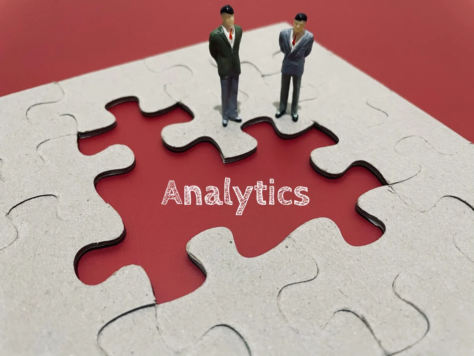

# What are Analytics

## In general, the term analytics is used to describe a systematic analysis of data or statistics pertaining to a certain field of research. Analytics can be applied in many ways across different areas that treat any kind of data. 

When it comes to the business sector, in particular, its systematic analysis is referred to as **business analytics.** 

### Definition of Business Analytics

Business analytics is the usage of analytical skills and technologies to look into data related to a particular business in order to learn more about its performance. This kind of analytics is meant to help businesses make data-driven decisions and pinpoint the most useful data-related practices that can help them improve their work.

By using business analytics, businesses can turn simple data into information they can use to help them increase their revenue in the long-run. 

### How Business Analytics Works

Some of the statistical techniques that business analytics makes use of include:

* **Data Mining** — A process that has already established a name for itself, data mining is at the core of business analytics. When mining, businesses go through big amounts of data with the help of databases, statistics, and machine learning. They use this data to locate current market trends.
* **Text Mining** — A kind of data mining that focuses solely on text. Businesses mine for larger textual data that isn’t necessarily organized at first, in order to convert it into a coherent set of textual information.
* **Data Aggregation** — Businesses go through mined data and filter it in order to create ready-made datasets for processing. This process helps them come up with organized collections of data to use as information.
* **Statistical Analysis** — Also going by the simpler name of “statistics”, this kind of analysis helps businesses use their collected data to discover underlying patterns they can use in their work.
* **Forecasting** — For this process, businesses use insights of data from a certain time period in the past. This information helps them predict certain future patterns and behaviors and prepares them for dealing with these when they happen. 
* **Optimization** — This is a step businesses take after collecting all the relevant information, identifying all necessary patterns, and making forecasts for future outcomes. The step includes tests that directly simulate possible situations to determine which ones would suit the business best so that it can reproduce them in its future work.
* **Data Visualization** — This method aims to simplify the gathered data by putting it into visualized forms, like charts and presentations. This simplifies data access wherever possible, allowing for quicker analysis in the future.
* And more.

The process starts by setting the business goal of the analysis. Then, the analysts pick a concrete analysis methodology, adding the relevant business data needed for the analysis they’re doing. 

To get all the data they’ll need, analysts often find themselves browsing through several business systems and datasets. After the analysts gather a certain amount of data, they start filtering it to determine what data pieces are most relevant to them, so that they can store it in a data repository for future use. 

At this stage, the analysts can start analyzing their data by going through small amounts of it at first, and then expanding to cover bigger datasets. There are a number of tools that can be used for this purpose, including anything from using the statistics functions in spreadsheet documents, to full-fledged apps designed for analytic purposes. 

Throughout the process, analysts will determine certain patterns by using the primary data they mined, which will raise more questions, prolonging the analysis. This goes on until the analysts conclude that they have met their pre-set business goal.

### Business Analytics Types

Business analytics can often be categorized into one of the following types: descriptive, predictive, or prescriptive analytics.

#### Descriptive Analytics

This particular type of business analytics monitors [key performance indicators](https://www.klipfolio.com/resources/articles/what-is-a-key-performance-indicator) (KPIs) which helps analysts get an insight into the current situation of the particular business they’re analyzing.

Descriptive analytics is used to analyze past data related to the business in question, with the aim of determining how certain units can react to different sets of variables when exposed to them.

#### Predictive Analytics

Predictive analytics is used for analyzing trend data with the aim of predicting how certain presumed outcomes are likely to occur in the future.

To make its predictions, predictive analytics also uses past data related to the business in order to foresee patterns that are likely to repeat.

Prescriptive Analytics

This type is basically a combination of both of the abovementioned — the descriptive and the predictive type. 

It takes the descriptive analysis of what already happened and the predictive forecast of what is likely to happen in the future. It puts these two together to come up with a generalized idea of what can happen next, when exactly it will occur, and for what exact reasons. 

### Analytics Examples

A good example of using business analytics is the production process at fast-food restaurants. Analysts can determine at what time of the day, and what day of the year they get the biggest number of customers in their restaurant. This can help them determine when and at what rate they should prepare their popular items, how many employees should be taking shifts during each period, and so on.

Another example includes companies that rely heavily on advertising to attract their customers. Business analytics can help them determine what kinds of customers are likely to be attracted to what they offer, and what customers are likely to return to buy their products.

Apart from these, business analytics can be used in virtually every business sector, from the healthcare sector that uses it to work with clinical information systems to casinos that analyze what clients they can retain more easily, and many more.

### Summary

Analytics is the systematic analysis of data across different sectors. Business analytics, in particular, focuses on analyzing business-related data in order to help businesses make smarter, data-based decisions in their future work.

Business analytics can generally be categorized as descriptive, predictive, and prescriptive analytics. It’s used in many business-related fields to help organizations with their work and improve their revenue.