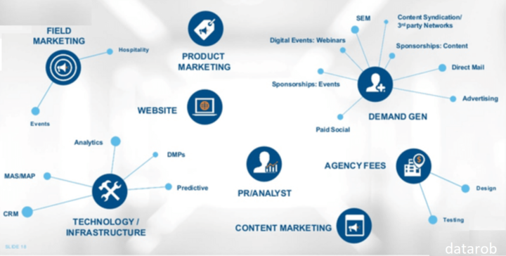

# What is B2B SaaS?

## What is B2B SaaS? Software as a Service allow businesses to outsource their computing needs to a third party. 

### Definition

*([Source](https://datarob.com/outbound-lead-generation-service-for-b2b-saas))*

SaaS (Software as a service) is a model for software distribution in which a third-party provider hosts the applications and makes them accessible to customers via the Internet. SaaS customers are mainly businesses. They may not always be end-users of the applications.

Google is a typical example of a SaaS provider. Every day, we use Google Docs and Google Drive. Google Analytics is used by almost all businesses to track their work. These apps are SaaS products.

Business customers don't need to install the app on their computers. Instead, they can use the application. Instead, they can access the app's copy via the internet from any device, desktop or mobile.

The source code is the same for all users. New features will be made available to all customers. Depending on the service contract, each module's data can be stored locally or in a cloud.

#### What is the term B2B SaaS?

If you understand the term "SaaS", you can now properly understand the meaning of B2B SaaS. B2B is when companies sell products/services to other companies. **B2B SAaS** is a term that refers to companies that provide software (apps, extensions, add-ons, etc.) to other businesses as part of a service. Their products help businesses operate more efficiently and effectively using highly automated technology. Its primary purpose is to reduce human resource costs. This is why many companies use SaaS software to optimize sales, marketing, customer care, and customer service to improve store performance and generate more revenue.

Other than Google, Microsoft, Adobe and Slack are all well-known B2B SaaS. The next section of this article will provide more information about them.

Customer success is the key to any business's success. E-commerce companies have made a strong investment in customer care systems. They will become loyal customers if their first-time customers win. You can now see that many top B2B SaaS companies are providing successful apps for business customers.

There are a few B2B SaaS companies that have stood out from the rest in recent years. Let's take a look at the top 10 B2B SaaS organizations to get a better idea of what they look like and what makes them successful. You can definitely learn something from this list.

### Advantages of SaaS

**Accessibility.** The best thing about SaaS applications, other than the fact that they can be used through any internet browser, there is no need to install any operating system. As you may already know, the internet is used extensively in almost all urban areas around the world today.

**Cost-effective.** SaaS products offer a great alternative to merchants who want to install and run applications on their own systems. They can also save on hardware purchase, maintenance, bug fixing, and other costs. This saves a lot of time and effort on support and installation.

**Flexible payment options.** Customers can subscribe to SaaS products on a monthly, yearly, or any other basis than spending one-time payments. Merchant customers will be able to better manage their operations by moving to scheduled operating costs. This will allow them to budget more effectively. Users can also stop SaaS subscriptions at any time they wish to save these recurring costs.

**Auto-updates are available.** SaaS products also have the advantage of being able to be updated automatically and centrally via app providers. This update will not impact the business customers' operations in any way. Auto-update and managing pathways help to reduce the time and resources required by the in-house IT department for business users.

### Top 7 SaaS B2B Companies

The following list, compiled by G2 Crowd, contains the top 10 SaaS-based B2B companies that provide software to many businesses around the world. They are not only well-known and successful for their product portfolio, but they are also known as the best service providers within the industry.

GA used Grid Scoring Technology to build the top Software companies, based on customer reviews, social media, and other sources.

#### 1. Google

Google is the most popular name in search, and they have a wide range of products, including Survey tools, Cloud Content Collaboration software and Document Creation applications. Google Forms and Google Drive are two of their most popular products, with satisfaction ratings of 94% and 93%, respectively.

#### 2. Adobe

Adobe is well-known for its digital media, digital marketing and printing products. Adobe Photoshop, Adobe Illustrator and Adobe Dreamweaver are just a few of the many computer software products that this company has. Adobe was also ranked 92 for satisfaction, 86 for market presence, and a total score of 91.

#### 3. Slack

Software companies cannot ignore Slack. This vendor offers solutions in Business Instant Messaging (BIM) and Productivity Bots (PTB). It's a chat tool. Slack is the company's main product. It allows for collaboration and chat, as well as video conferencing and AI bots. According to the report, Slack scored 94 in satisfaction and 85 in market presence.

#### 4. MailChimp

Mailchimp is a top-rated marketing platform for small businesses that offer solutions in Email Marketing and Transactional Email. Mailchimp allows customers to automate and trigger-based email sending, as well as provides detailed results reports that help customers improve their marketing strategies.

#### 5. Shopify

Shopify is a well-known platform and application provider. It is widely used by e-commerce stores as well as retail POS. This vendor is fifth in the market with Shopify, Shopify Plus and Burst by Shopify. It has 87 market presence and 99 satisfaction.

#### 6. Microsoft

Microsoft offers a wide range of cloud products that can be used in different industries. The company's flagship software is Windows, Office, Azure SQL Server, Exchange SQL Server, SQL Server and SharePoint. Microsoft also offers CRM, Dynamics ERP and CRM as well as Xbox, Skype and Windows Phone. The company has a market presence score of 89 and 98 in satisfaction. Its overall score is 94.

#### 7. SurveyMonkey

SurveyMonkey is a web-based service provider that offers surveys to businesses of all sizes. It offers a variety of services, including Survey, Online Form Builder, Enterprise Feedback Management, and Market Research Services. The survey is used to analyze and represent data. SurveyMonkey scored 91 points in total.

### Summary

B2B SaaS products can be a great option for those who run e-commerce shops and want to increase their customers' business. We hope you find this blog useful in understanding the SaaS-products trend in today's world. You can also look at the huge B2B SaaS names all over the world to learn more about SaaS products and services, as well as their methods of conducting SaaS marketing on B2B eCommerce websites.

What is B2B SaaS? Simply put, it is a type of software that allows businesses to outsource their computing needs to a third party. This can include anything from email hosting to CRM systems. By using B2B SaaS, businesses can save time and money while still getting the benefits of having an in-house IT department.