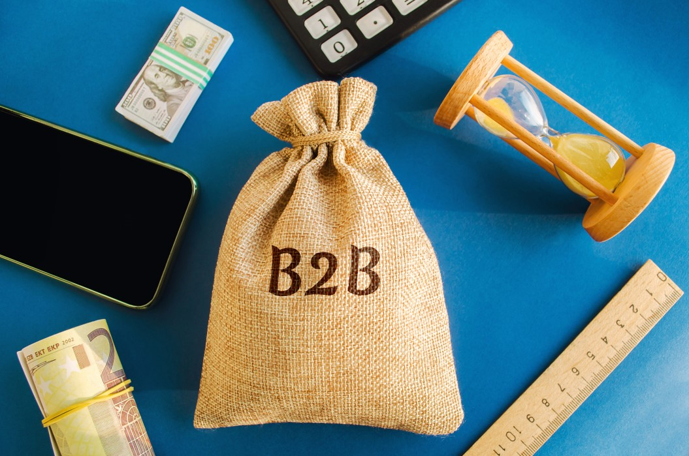

# What is B2B?

## Businesses can perform commercial transactions with different kinds of partners. On these grounds, business transaction models can be divided into several different categories, depending on who the business exchanges with.  

One of the most common business transaction types is business-to-business (B2B), usually as opposed to the business-to-consumer (B2C), and sometimes the business-to-government (B2G) types.

### Definition

The business-to-Business — or B2B — model is used to describe commercial transactions or relationships between two businesses. Simply put, whenever a company buys to or sells from another company, that’s a B2B transaction; when a company reaches out to or communicates with another company in any way, that’s a B2B relationship. Businesses that mostly deal in this kind of transactions and relationships are also referred to as B2B businesses.

B2B interactions usually describe the exchanges that happen in [supply chain](https://www.investopedia.com/terms/s/supplychain.asp) networks, where businesses buy materials and products from other businesses for the purpose of producing their own goods or reselling ready-made products to customers. The manufacturer-wholesaler, as well as the wholesaler-retailer relationships are based on the B2B model.

### B2B And B2C

When describing business relationships, the B2B model is most commonly opposed to the B2C — that is, the business-to-customer model. In fact, these two are very much interconnected.

B2C exchanges mean closing deals with end-users and selling them a product or service, which is the most visible kind of transaction — customers buying from companies. However, for this kind of everyday B2C activity to happen, a number of B2B transactions — dozens, hundreds, or sometimes even thousands — have to happen in the background first.

### Examples

To illustrate the B2B model, and how it’s related to its B2C counterpart, let’s take the examples of some common business-related transactions and relationships.

For example, smartphones are being sold on a regular basis nowadays — there are numerous retail businesses that sell them to their end-users. To do so, these retailers have to buy off large quantities of smartphones from wholesalers first, oftentimes from phone brand companies such as Apple, Samsung, Nokia, and so on. This implies a B2B transaction, as the retail business has to establish a connection and purchase from the wholesale business in the first place, in order to be able to sell the product to the customer in a B2C transaction.

Furthermore, to sell smartphones to retailers, the companies that produce these phones themselves have to engage in B2B purchases with other companies first. As they often don’t produce all phone parts in their own facilities, they have to buy some parts (batteries, screens, electronics, etc.) from other companies that specialize in producing them. These companies, in their turn, do B2B purchases from companies that produce and refine the raw materials needed for each phone part, and so on.

B2B transactions aren’t limited to production, either. The service industry also relies on the B2B model. For instance, property management companies will often engage in B2B transactions with businesses that need spaces to rent for work. Another example of B2B in the service sector would be companies that outsource their entire customer service management to specialized call-centers.

Apart from the actual commercial transactions of products and services, the term B2B is also used to simply describe any interaction between different businesses. Companies that use any communication channel to reach out to other companies — by contacting them through their website contact form or social media pages, for instance — are engaging in B2B communication.

In fact, companies that work with [eCommerce](https://ecommerceguide.com/guides/what-is-ecommerce/) can also use the B2B model. Even though internet purchases are commonly considered a B2C activity, it is not always so. In fact, online sales are so accessible nowadays that they’ve quickly reached a stage in which they’ve become more automatized than ever. This allows for wholesale transactions over the internet, for example. Retailers will often browse a wholesaler’s website before making an order — an interaction that is both a B2B communication and a B2B transaction at the same time.

### B2B Companies

Apart from direct commercial transactions, communication, and relationships, the term B2B is used to designate entire companies as well. Simply put, any company that relies on interacting with other companies and engaging in commercial transactions with them can be considered a B2B business.

Many B2B businesses will engage in B2B as well as B2C interactions, but some will only deal with other businesses throughout their whole existence. As mentioned above, wholesalers are a good example of companies that usually only deal with other companies, whether it’s about selling or buying from them. Therefore, wholesalers can be considered B2B companies.

Industrial suppliers — that is, businesses that create and/or sell machinery supplies and equipment used in the industrial production and storage sector, are also a good example of companies that solely rely on the B2B model. Another example of this kind of company is that of payroll processors, which are businesses that specialize in processing the payrolls of other companies, related to the timely payment and registering of the salaries they pay to their employees.

### Summary

In commerce, the term business-to-business (B2B) designates a model of commercial transactions and relationships between two businesses. A B2B business is, therefore, any company that relies on B2B interactions to function.

As a model, B2B is most commonly distinguished from the B2C — or business-to-customer — model. However, every B2C interaction depends on several B2B transactions that happen beforehand.

B2B interactions usually happen in the supply chain — that is, when manufacturers buy raw materials from the companies that distribute them in order to produce their own product; when retailers buy products from wholesalers in order to resell them to end-users, and so on. Apart from production, service-providers can also rely on the B2B model.