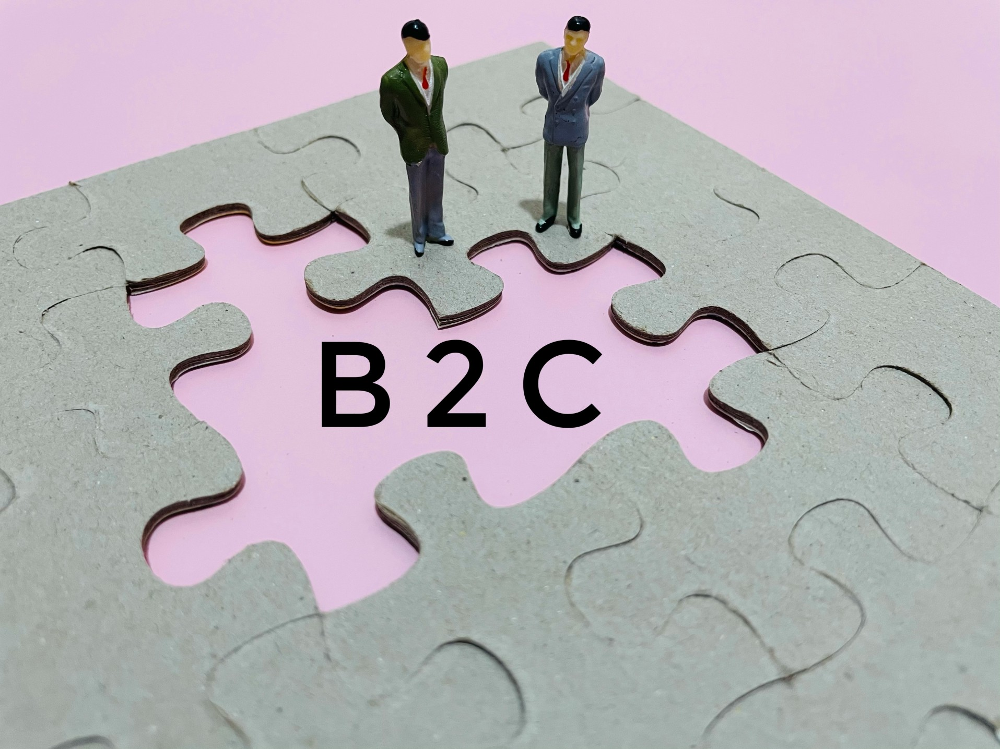

# What is B2C

## To survive and thrive, businesses mostly depend on the sales they close with different buyers. According to the nature of most of their buyers, which define the dominant sales model they’re using, businesses can be divided into different categories.

With this in mind, most businesses can either be defined as following the business-to-consumer (B2C) or the [business-to-business (B2B) sales model](https://rev.team/kb/what-is-b2b).

#### Definition

B2C is an acronym for business-to-consumer, a model for selling, relationship-building, or engagement that happens directly between a business and its consumers as the end-users of its products or and services. Apart from the model itself, businesses that mostly use it in their dealings with their customer base are also referred to as B2C businesses.

As a model, B2C is commonly opposed to the B2B (or business-to-business) model, which, in turn, is used to describe transactions and relationships between businesses. While the two models are completely different in terms of the objects of their transactions, they are also very much intertwined and interdependent; in fact, for a B2C transaction to take place, several B2B transactions have to occur first.

#### Background

The concept of businesses directly selling to and dealing with their customers isn’t new at all, having traditionally encompassed businesses such as malls, bars, restaurants, cinemas, and many more.

It was, however, after the Internet became widely used that the term B2C and the idea behind it started gaining prominence. During the [dot-com bubble](https://corporatefinanceinstitute.com/resources/knowledge/trading-investing/dotcom-bubble/) that characterized the late 1990s, the world saw a significant increase in the practice of [e-commerce](https://searchcio.techtarget.com/definition/e-commerce) — that is, companies being able to sell their products directly to their end-users without having to go through retailers first. This opportunity quickly launched a huge amount of businesses from the B2B (selling products and services to retail businesses that then physically resold them to their end-users) right into the B2C sphere, becoming online retailers themselves.

However, right after the period of the dot-com bubble came the [dot-com bust](https://www.pcmag.com/encyclopedia/term/dot-com-bust), when those B2C businesses that fared the worst after they’d switched to e-commerce went bankrupt. On the other hand, those that ended up on the other, more successful end of the bust managed to continue growing, and some of them even became B2C leaders. Perhaps the most notable examples of the latter include well-known B2C businesses such as [Amazon](https://www.amazon.com/) and [eBay](https://www.ebay.com/).

### The Impact on Retail

Before the dot-com bubble, businesses sold the products they produced to retailers, who profited from reselling them to their end-users at a higher price, cashing in the [markup](https://www.investopedia.com/terms/m/markup.asp). With the advent of the internet and e-commerce, however, many of these manufacturers switched from B2B sales through retailers to direct B2C online sales.

This switch had a severe impact on physical retail. For one thing, it eliminated the need for middle persons, a role physical retailers had played for a very long time. It also allowed the manufacturers, having switched from B2B to B2C, to provide their consumers with products and services at lower prices than those they’d usually get for the same items at retailers who try to turn in a profit for themselves, effectively out-competing them in the retail sector. All this sudden turbulence made many physical retailers face the choice of either launching themselves into e-commerce too or risking losing their business altogether.

Throughout the years, e-Commerce continued to grow exponentially, as many end-users were willing to buy a cheaper product or service online and wait for its delivery, instead of having it bought at a physical retailer for a higher price. To date, B2C businesses are way more successful than their physical retail counterparts in most fields.

#### What B2C Businesses Should Pay Attention To

An important part of the success of B2C businesses is the way they treat their customers. As they’re directly dealing with the end-users of their products or services, successful B2C businesses know how to engage their customers on a personal level and build a meaningful relationship with them. This is why good B2C marketing campaigns mostly focus on the emotional connection to their customers, rather than the sheer quality of the products or services they offer, which is the focus of B2B campaigns.

When selling products and services online, B2C e-commerces deal with a lot of competition nowadays. As more and more businesses try to establish their presence on the online market, focusing on optimizing their pages for search engines is a wise approach. When browsing for their desired products and services online, internet users will usually only consider those products that appear on the first page of search engines such as Google, which is why good [search engine optimization](https://searchengineland.com/guide/what-is-seo) (SEO) can help businesses attain success in online B2C sales.

However, once a potential customer has clicked on the link of a business’s website, it doesn’t mean a deal has been concluded yet. To be able to go through the whole process of online purchase, from finding the product or service that suits them best, to paying for it and checkout, the average internet user has to be able to navigate through the business’s site properly, and even intuitively if possible. This is why B2C businesses should make their websites as easy to use as possible, even to the least skillful internet user.

#### E-Commerce B2C Types

Online B2C businesses can generally be divided into five different categories:

* **Direct sellers** — A majority of B2C businesses fall under this category. Anyone who directly sells items online, from product manufacturers to online-based stores that resell products or services is considered a direct seller.
* **Online intermediaries** — Those businesses that fall under this category put the sellers in contact with the end-users of their products and services. Unlike direct sellers, online intermediaries do not own the items that are sold on their platform but instead take a part of the profit made through the transaction as payment for their intermediating.
* **Advertising-based** — This category includes businesses with content-based websites that are free to use. To turn in a profit, their websites include online ads from other companies who pay these B2C businesses.
* **Community-based** — Community building websites such as social media fall under this category. These websites also feature ads, allowing for more advanced ad targeting options too.
* **Fee-based** — This category includes businesses with websites that offer paid content. Ranging from online newspapers to streaming services to any other kind of website that provides content it deems more valuable, these B2C businesses profit from charging fees to their end-users.

#### Summary
The term business-to-consumer (B2C) is used to designate a commercial transaction model where businesses directly sell to and interact with the end-users of their products or services. Businesses that predominantly use this commercial model are known as B2C businesses.

In commerce, this model is notably opposed to the B2B — or business-to-business — model. While these two models are different, they’re also interconnected — several B2B transactions have to happen in the background to enable any B2C transaction that follows.

While many businesses that directly deal with the end-users of their products or services can traditionally be considered as part of this category, the B2C concept became widely known when it was attached to e-commerce businesses during the dot-com bubble period of the late 1990s. During this period, many manufacturers who would traditionally sell their products to retailers started switching to selling them online instead, creating a sudden surge in B2C e-commerce.

In their marketing campaigns, B2C businesses mostly focus on the personal relationship with their end-users rather than the value of their products or services. It’s also important for B2C online businesses to optimize their website for search engines and make it easy to use to facilitate online transactions through it.

B2C e-commerce businesses can generally be divided into 5 categories: direct sellers, online intermediaries, advertising-based, community-based, and fee-based.