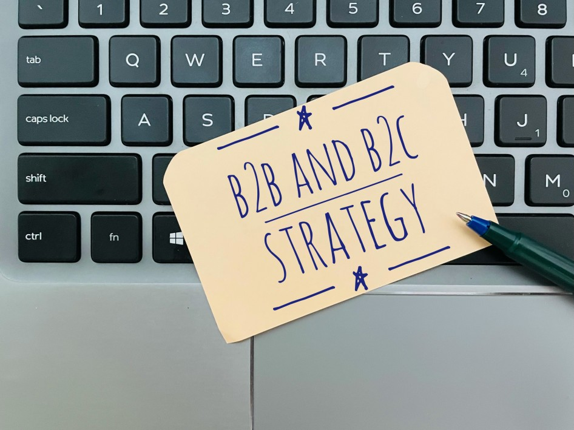

# What is B2C2B

## In business terminology, a company’s business strategy can be divided along many lines. One particular classification distinguishes several business models according to the different kinds of parties a company has commercial interactions with.

In this way, business models are usually classified as either [B2B](https://rev.team/kb/what-is-b2b) (business-to-business) or B2C (business-to-customer), referring to a business’s transactions and relationships with other businesses or with clients, respectfully. Although B2B and B2C are traditionally the most well-known business models according to this classification, there are other models that have recently emerged as well, including the less-used but increasingly relevant B2C2B model.

### Definition

The business-to-consumer-to-business (B2C2B) model is an interesting combination of both of the traditional models — the B2B and the B2C. With B2C2B, businesses want to reach out to other businesses in order to sell a product or service to them (which is the B2B part of B2C2B), but to do so, they first interact and sell to the employees of their target businesses (the B2C part, in which case these employees are the customers).

### How B2C2B Works

The main aim of the B2C2B model is for the business to acquire another business as a B2B client or contact. As this happens through a B2C relationship, any company that wants to try out the B2C2B model must first make sure that the employees of the other company they’re trying to gain as a client have enough influence in it to be able to affect its commercial decisions.

The first step in any B2B interaction is when a business attracts its customers — the target business’ employees — with a product or a service that it sells to them. Sometimes, the business even hands out these products/services to the customers for free, or under [freemium](https://bmtoolbox.net/patterns/freemium/) license conditions.

The next, final step — and the idea behind the whole exchange — is for these employees to somehow convince their employers to engage in a B2B relationship with the business in question.

### Examples

There are many examples to cite when talking about B2C2B. All these come from very recent history, as this mixed business model is the result of the latest trends and innovations.

One famous example of successful B2C2B is Apple’s iPhone. Since its conception in the mid-2000s, the product’s quality made it gain popularity very quickly. This success made many people buy iPhones. Notably, technologically inclined individuals — many of whom were working for IT-related companies — were keen on buying Apple’s increasingly successful product. This came at a time when Windows was widely used by IT companies, though. Soon thereafter, these companies would find themselves with many of their employees using iPhones and asking their IT-teams to adapt the company’s network to allow their iPhones to work with it. As a result, many companies started using iPhones on the corporate level, making Apple’s product their standard.

Another good B2C2B example can be found in the practices of [LinkedIn](https://www.linkedin.com/), the famous online employment and job-seeking service. For end-users, signing up for LinkedIn is free. As ever more job seekers join LinkedIn, companies have found themselves with a simplified way to recruit online through their own LinkedIn profiles. In this way, having established a B2B contact with these companies already, LinkedIn proceeds to benefit from the opportunity of B2B deals as well, offering companies various [premium](https://premium.linkedin.com/#premium-business) versions.

A number of other online services have successfully used the B2C2B model, too. From communication software solutions like [Slack](https://slack.com/intl/en-mk/), to file hosting services such as [Dropbox](https://www.dropbox.com/?landing=dbv2), many web-based businesses have made their way to enterprise deals with companies by becoming popular with their employees first.

### Who Can Use the B2C2B Model

Even though it’s a result of recent trends, the B2C2B model is not used by every company because it simply doesn’t fit in the nature of every business. There are some particular kinds of businesses that can make the most out of the B2C2B model.

The [SaaS](https://www.cloudflare.com/learning/cloud/what-is-saas/) economy, in particular, has benefited from the B2C2B model greatly. SaaS cloud companies offering subscription-based services to end-users, who then often bring these over to the IT companies they work for, for corporate usage.

Companies that rely on [account-based marketing](https://rev.team/kb/what-is-account-based-everything-abe-or-account-based-marketing-abm) to function can also make great use of B2C2B. Knowing how to target the employees of a target company with a personalized approach is crucial in this case. Attracting these employees as customers on the basis of the B2C can later lead to closing enterprise-level and premium B2B deals with the company they work for.

### Why Is the B2C2B Model Important

If done right, the B2C2B model can prove very advantageous to those companies that are best suited for using it. Their success with this model will depend on the cooperation of their production, marketing, and sales departments.

The most significant plus of using the B2C2B model, as opposed to a regular B2B approach, is that a good B2C2B strategy can slash customer acquisition costs. Companies that mostly rely on a simple B2B strategy spend large amounts of money trying to attract other companies to their products or services by using traditional marketing strategies. Ads and promotional events can drain a company’s budget — a problem that doesn’t exist for those using the B2C2B model. A successful B2C2B acquisition will usually cost nothing in terms of money. Usually, the cost only comes in the form of having to give out free products or services to the employees of the target company, which can be a negligible setback, especially when it comes to service providers. Even so, not all companies that focus on B2C2B will always have to hand out free products/services or freemium accounts.

Making use of the B2C2B model also gives companies the invaluable opportunity to leverage data about what business sectors their products or services have the biggest sales potential in. Through B2C2B, companies can focus on measuring what kinds of companies most of their end-users work for. This can help them realize where they’re most likely to sell products or services, and use this information to help them optimize their sales efforts.

### Summary

The business-to-consumer-to-business (B2C2B) model is used by companies that aim to provide their products or services to the employees of another company, with the ultimate goal of acquiring the employing company as a client or simply initiating a business-to-business relationship with it. For this purpose, companies often give out free versions of their products or services to these employees.

In order for the B2C2B approach to work, the target company’s employees should be able to influence their company to the point where it can be inclined to engage in a B2B transaction or relationship with the business that initiated the B2C2B exchange.

B2C2B is a combination of the more common B2B and B2C models. Unlike these, B2C2B is not very popular because not all companies can employ it. For those who can, however, it can be a useful tool for cutting customer acquisition costs and gathering valuable demographic data they can use to increase their sales.