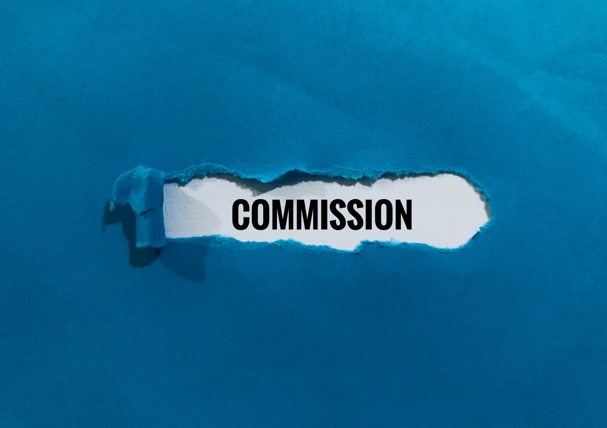
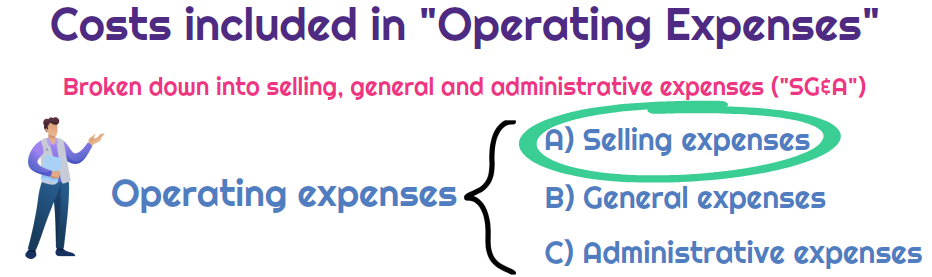
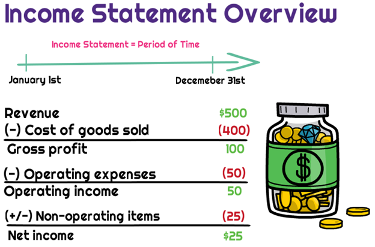
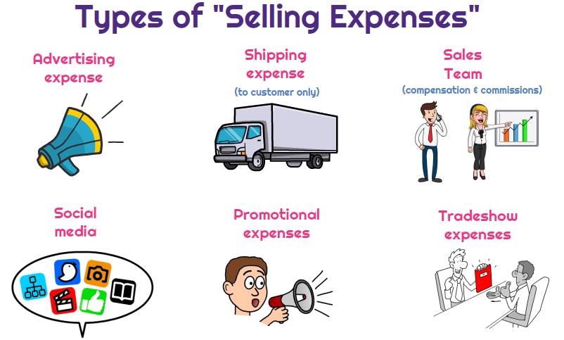

# What is Commission?

## When job seekers decide on what companies they want to apply to for positions, the decision will often depend on how high the pay is. 

The same logic applies to companies when it comes to retaining their old employees — they may leave if a competitor offers them higher pay. This is why companies always try to offer competitive salaries to their employees, often complemented by additional payments as a reward for the value they bring to the business — especially so in the case of sales departments. One type of complementary payment businesses can offer is commission.

### Definition

In sales, a commission is a specific kind of payment that salespeople receive when they achieve particular sales volumes or close a particular number of deals. The amount paid as a commission is part of an employee’s total compensation and is usually a complementary sum paid to them in addition to a base salary.

### Types of Commission Plans

Companies can pay their sales teams commissions by using several different kinds of commission plans or structures. Some of the most common commission plans businesses use are the following:

* **Base salary plus commission structure** — This is a structure where businesses pay their sales teams commissions in addition to their fixed base salaries. Here, fixed salaries and variable commissions can come in various ratios, most commonly in a 60% salary to 40% commission ratio of the whole compensation. This type of structure is mostly used by businesses that heavily rely on retaining the members of their sales teams. Through this structure, businesses invest in the development of their salespeople and provide them with a clear incentive for increased performance.
* **Straight commission structure** — This structure doesn’t give salespersons a base salary at all. Instead, their whole pay is based on their commission, that is, on how many sales they can close. This isn’t a popular plan for more experienced companies that want to retain quality sales professionals. On the other hand, this structure is more convenient for startups with relatively low budgets that cannot afford the risk of failure. By using straight commissions, startups can outsource the risk to their sales team by having them give up on receiving base salaries. While experienced salespersons can get the most out of this structure, it still has the obvious downside of being an overall unstable option for a company’s employees in general.
* **Relative commission structure** — With this structure, businesses pay commissions to their salespersons for certain predetermined targets or quotas. These quotas represent the amounts of money salespersons should bring to their employers through sales. In case a salesperson manages to meet only a certain percentage of the quota, like 50% for instance, they will also get the same percentage (so only 50% in this case) of the total commission amount corresponding to this quota. As this commission is added to a fixed salary, it can help businesses motivate salespersons while still providing them with a somewhat stable income in the form of a base salary to rely on.
* **Straight-line commission structure** — This structure is almost identical to the relative commission structure, with the sole difference that in case a salesperson exceeds 100% of their quota, their commission will also increase respectively. This approach to paying commissions is perfect for businesses that aim to encourage overperformance.
* **Absolute commission structure** — This structure is used to pay determined amounts in commissions for salespersons that fulfill particular objectives that don’t imply monetary amounts. For instance, a sales representative can get a fixed amount in commission for each sale they make, or each new [buyer](https://rev.team/kb/what-is-buyer) they conclude a deal with. In this sense, it’s also similar to the relative commission structure, but it rewards a salesperson for their activity instead of for the profits they bring to their employers.
* **Territory commission structure** — This is a structure that assigns sales representatives to work in particular geographical areas. With this structure, businesses pay commissions on the basis of the regions covered.

### Are commissions a cost or an operating expense?

Sales commissions are not directly related to the sale or purchase of a product/service. However, the cost of the product/service is considered a selling expense. Selling expenses are operating expenses. They would *not* be included in the cost of goods sold and gross profit.

([Source](https://www.universalcpareview.com/ask-joey/is-sales-commissions-a-cost-of-goods-sold-or-operating-expense))

Operating expenses are not product costs. They are below gross profit on income statements.

*([Source](https://www.universalcpareview.com/ask-joey/is-sales-commissions-a-cost-of-goods-sold-or-operating-expense))*

Below is a visual that lists the different types of selling expenses. You can see that expenses for the sales force include commissions and compensation.

*([Source](https://www.universalcpareview.com/ask-joey/is-sales-commissions-a-cost-of-goods-sold-or-operating-expense))*

### What are selling costs?

Selling expenses are any expense or cost incurred to promote or sell a product or service. Selling expenses are a key category within operating expenses. They are subtracted from gross profits to calculate operating profit.

Selling expenses are usually classified as period expenses. This means they are recognized.

#### In a consignment arrangement, would the consignor record a commission expense in the cost of goods sold or operating expenses?

Commission expense is a selling cost for the consignor. It would be recorded in operating costs/expenses, and not the cost of goods. The commission expense would be incurred when the consignee sells the product to a third-party and the consignor recognizes revenue.

### How Companies Choose Commission Plans and Rates

When deciding what type of commission plan to use, companies should have several aspects of their business in mind, such as the availability of funds on their account to be redistributed for commissions, the amounts they can pay for each level of sales volumes reached, the amounts they’re already paying each salesperson as their base salaries, other extras or bonus payments, and more.

When it comes to commission rates, their levels may vary across sectors and positions. Rates usually depend on how much a company can sell their products or services for, how much each salesperson contributes to each sale, how big the area in which they sell is, and more.

There is no formula to calculate an ideal commission rate. Companies usually determine their rates by comparing those of other companies within their sector and coming up with a sector average to guide them in their decisions.

#### Tips for Getting Started

You should define the results you want to achieve. This could be customer acquisition in one department or customer loyalty in another.

* Focus on a successful Revenue process. To reach your Revenue goals, determine which Revenue methods are most effective for  your company. To measure their success, track the results over some time.
* Turnover in sales is usually high, so don't be afraid of trying new commission structures. What worked five years ago as a motivator may not work in today's world. The Great Resignation has made it more difficult to attract and hire talent.

### Summary

The term commission is used to refer to the amount of money that a company pays its sales representatives when they meet a particular sales volume or any other sales objective. Commissions are a part of the employees’ compensation, and they’re usually paid as an extra amount added to their base salaries.

Businesses can pay commissions by using various commission plans or structures. The most common among these structures include the base salary plus structure, the straight structure, the relative structure, the straight-line structure, the absolute structure, and the territory structure.

When choosing a commission structure that will suit them best, companies should consider several factors, including how much money they can allow themselves to allocate for commissions, how high their sales team’s base salaries are, how they can reward them in relation to the volumes they can meet, and so on.

Commission rates aren’t calculated by any particular formula. They usually fluctuate across different sectors and positions, depending on the value of products or services sold, the contributions of salespersons to the sales process, the marketplace they sell on, and more.