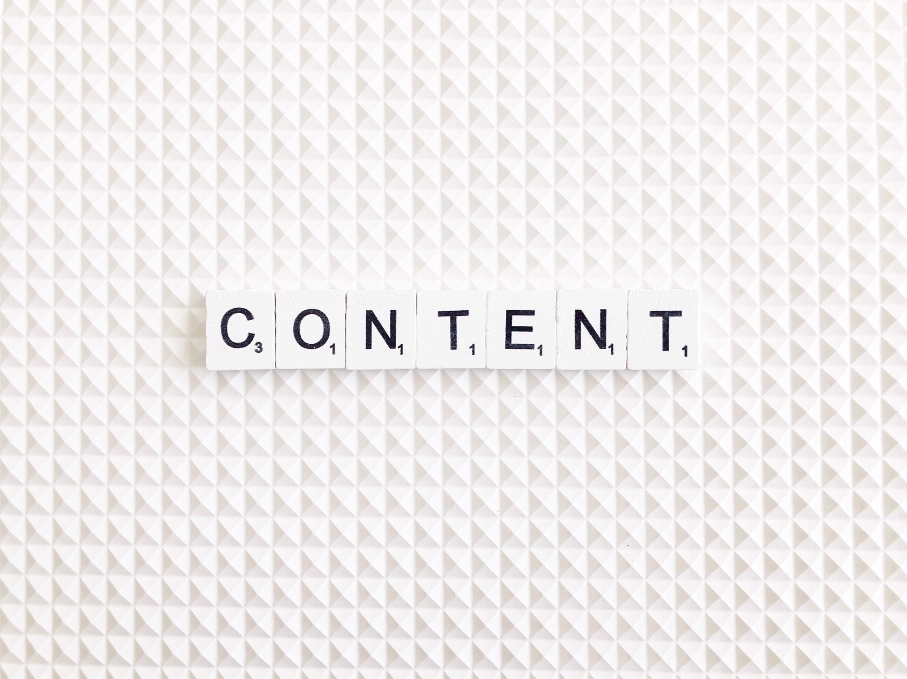

# What is Content

## Worldwide internet usage saw a considerable increase in the past decades, and it continues to grow day by day. With it came the popularization of the concept of content as used in terms of publishing and communication.

#### Definition

The term content is used to describe any kind of material or information published in different forms — commonly as text, image, audio, or video — and directed toward end-users that usually belong to a particular audience.

The term itself can be used almost synonymously with web content in many contemporary contexts — texts, videos, music, and images shared online are what’s most often referred to as content. However, content can be created and shared through several channels other than the internet, including books, magazines, radio, cinema, television, computers, smart devices, storage devices, live events (seminars, speeches, performances), and many more.

#### Content Creation

Creating content can be a very tedious process, even more so when it’s intended for internet dissemination. Content creators have to figure out what topic they will create content for, the form they’ll present it in, and devise a content creation strategy before they even begin with the production process.

The entire content creation and conception process is usually influenced by the content’s end-users — the audience that content creators are trying to reach out to. This is especially the case with [professional content creators](https://www.stateofdigitalpublishing.com/content-strategy/what-is-a-content-creator/).

Content comes in different forms, especially when it’s on the web. Therefore, the specific approaches for making different types of content (from written textual posts to eBooks to [YouTube](https://www.youtube.com/) videos, and so on) can differ, but they’re all subject to similar processes, such as finding ideas, devising implementation strategies, and actual content creation.

### Finding Content Ideas

To get an idea of what kind of content they should create and how to present it, content creators can use several sources as inspiration. Some of these include:

* **Doing keyword research** — Researching keywords that target audiences are most likely to search for in search engines such as Google is a fast, simple, and effective way to get insights into what kind of content they would consider relevant.
* **Asking the target audience for feedback** — For content creators that have already established a connection to their audience or customers, contacting them directly is an excellent way to generate new content ideas. A content creator’s audience is made up of the end-users that have a direct relationship and experience with the content. They can provide a significant user perspective that content creators themselves are not always aware of, which can, in turn, help them improve both their existing content as well as and generate fresh content ideas.
* **Discussing ideas with associates and other stakeholders** — Often times, content creators don’t work on their own. Even when they do, they usually have peers with enough knowledge and experience that they can consult that would help them generate new content ideas. On the other hand, large companies that deal in content creation for profit will often consult their various employees and sectors for content ideas, from the sales team to customer care agents and more.
* **Get inspired from other content creators** — When creating content for specific audiences, content creators can count on the fact that there are already others who provide content to these audiences. Doing research on content that’s already available within the space (or marketplace in case of for-profit content creation) can help content creators understand what works best, what doesn’t, and how to build a name for themselves that their target audiences will appreciate.
* And more.

### Devising a Content Strategy

Once content creators have enough ideas about the kind of content they want to produce, they need to create a strategy on how to deliver it to their audience most effectively. For this, they first need to decide on the form their content will take.

As there are many different kinds of content, some content ideas can be best displayed as a video, others as an image, audio file, infographic, or plain text. It’s up to content creators to figure out what form would suit their content material best and use one of the many ways of sharing content at their disposal, such as blog posts, tweets, articles, eBooks, various video and audio sharing platforms, and much more.

Another thing content creators should think about during this stage is the scope of the project they create content for. Depending on how complex each particular content idea is, content creators can either sum it up in a single go, go back to it several times, or create a more complex structure for delivering content on a regular basis around the same idea.

The content strategy should also define some other aspects such as the kind of audience or customers the content is targeting, how many resources (time, money, skills) it will require, how long it is meant to remain relevant, whose help content creators can use when producing it, and more.

### Content Production

When content creators are done brainstorming and developing a content strategy, they can move on to producing the actual content they want to deliver to their target audiences. As content creators are usually good at what they’re doing, this part is often less complicated than the ones before.

Still, content can often change as it’s being produced. Whether certain conditions change, new ideas arise, or the predetermined content format simply stops working for a content creator while working on their production, they can always decide to halt the process and come up with another way of producing content. Coming up with the most suitable content can take some time, which is something content creators should always be prepared for.

#### Summary

In art, publishing, and communication terminology, the term content designates any kind of material, presented in various forms, that aims to reach a particular target audience of end-users. The term is commonly used to refer to web content, although there are many other channels for content dissemination, such as books, radio, television, computers, live events, and more.

The content creation process is something content creators should be well prepared for, as it can take up a significant amount of their time and resources. Creating content revolves around the targeted end-users of said content, especially for professional content creators.

To create quality content in any form, content creators must go through the processes of generating content ideas, devising a content strategy, and finally, producing the content and distributing it to their audience.