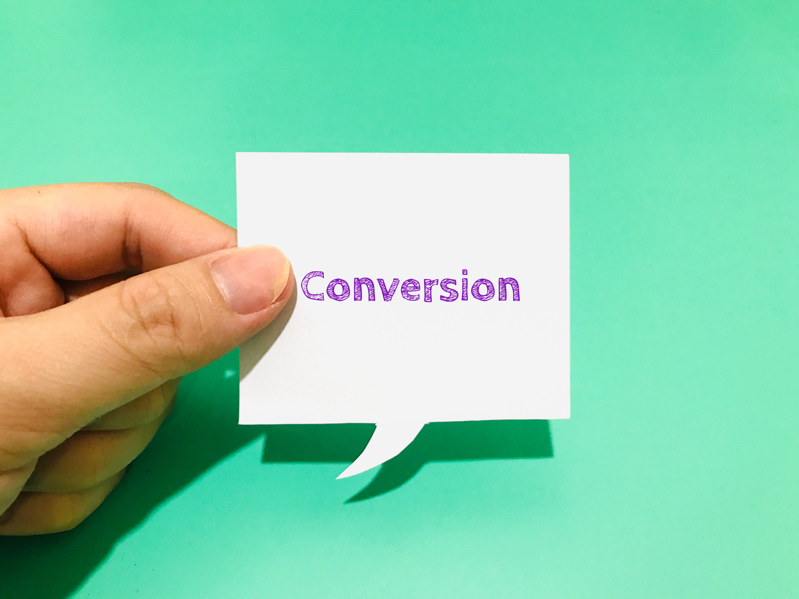

# What is Conversion

## For a business to be profitable and to grow, it needs to have buyers who will pay for its products or services — especially if it can retain these buyers as long-term clients. 

One of the concepts used when measuring a company’s success in attracting buyers and clients is known as conversion.

#### Definition

In business terminology, conversion is a term that can have two different yet similar definitions. According to one of these definitions, conversion refers to the process through which businesses turn their leads and prospects into paying buyers and customers.

According to the other definition, the term conversion is more broadly used to refer to the point at which a user engages in any kind of activity — not necessarily implying any monetary income — that a company considers favorable to their business. At that point, the company considers they have converted this user. This second, broader definition, is notably used by marketers. It’s also generally more widespread in usage since the actions described by it also include those described by the first one.

#### What Actions Can Be Classified as Conversions

A variety of different user interactions can be considered as conversions in the marketing sense. These are also sometimes known as goal completions, as users are required to complete certain actions or goals in order for their interaction to be classified as a conversion.

Some of the user interactions that companies can consider valuable enough to be classified as conversions include:

* **Website visits** — As most modern companies have websites nowadays, a lot of what they consider conversions is often related to users interacting with their sites. For simple, passive site visitors to be considered as ‘converted’ into active visitors or leads, they can perform several different interactions on a company’s website. Some of these, depending on the criteria of each company, may include actions such as having visited certain key site pages, having spent a certain amount of time browsing the site, returning to visit the site several times, and more.
* **Social media page interactions** — Having profiles on social media such as [LinkedIn](https://www.linkedin.com/), Facebook, Twitter, and Instagram is also common practice for companies that compete for customers on today’s marketplace. Any kind of user interaction on their social media pages can be considered prospect conversion.
* **Submitting information** — Users sharing any kind of personal or non-personal data on a company’s website can also be considered as converted leads. This category can include anything from the users’ contact info (phone number, email, social media pages, etc.) to their personal preferences when it comes to the features of products or services they buy, and more.
* **Signing up for email correspondence** — Some companies allow their site visitors to leave their email addresses with their permission to be contacted on these to receive notifications. A common way of doing this is sending these users the company’s newsletter, notifying them whenever an event takes place, informing them of sales and discounts, and so on.
* **Registering an account** — Some business websites let visitors create an account on them. This is a very strong kind of lead conversion, as the prospects who sign up on a company’s website show great interest in it, are likely to be willing to engage in commercial interactions with it in the near future.
* **Form completions** — From product and service-related questionnaires to public opinion feedback on a number of issues, sometimes companies give out forms to their target audience, usually through their websites (and sometimes even on paper). Any individual or group that takes their time to fill out one of these forms can be considered to have converted into a company prospect.
* **Resource download** — Some companies’ websites offer several free resources related to their industries, sectors, or markets they operate in. Site visitors that download this kind of data are commonly considered as converted prospects.
* **Buying a product or service** — Whether it’s through a company’s website or not, users that make a purchase from a company are considered to have converted into customers. This kind of commercial interaction is considered a conversion in both the broad and the narrow sense of the word. Purchases are the most sought-after kind of conversion.
* **Paid subscriptions** — Similarly to making purchases, paying for subscriptions is another kind of user conversion of the highest importance for companies. A paid subscription conversion is usually when a client has signed up for periodical (commonly monthly or yearly) payments for services rendered by the company. In some cases, this kind of conversion can also include subscriptions for the periodical delivery of several products or other kinds of materials produced by a company.
* **Calling the company’s phone number** — When a company makes its phone number available, whether it’s on their website or elsewhere, calls by any parties interested in the company’s business for whatever reason can also be considered conversions.
* **Other types of direct contact** — Individuals and organizations can also contact companies through other means, such as emailing them, writing them messages through any available channel, or even personally approaching them with questions, remarks, feedback, and suggestions. All of these direct interactions can be considered conversions, too.
* And more.

It’s important to note that not all of the above-mentioned interactions always count as conversions. The nature of each particular business and their priorities in terms of measuring user interactions is what defines their criteria when deciding what particular user action they consider to be a conversion.

#### Conversion Rate and How to Measure It

Businesses measure how successful they are in converting users through a metric known as a conversion rate. This rate shows how many users complete conversion goals, most commonly as a percentage of those users that interact with the business in any way.

Some common formulas for calculating conversion rates, depending on what each company considers to qualify as a conversion, are as follows:

**Conversion rate = (Total number of purchases / Total number of product page visits) x 100**

**Conversion rate = (Total number of accounts created / Total number of page visitors) x 100**

**Conversion rate = (Total number of forms filled / Total number of forms distributed) x 100**

Here’s an example; if a company’s website was visited by 10,000 individual visitors a month, and 1,000 of them have created accounts on it, its conversion rate for accounts created is 10%.

#### Summary

The term conversion is mostly used in two ways — to describe the point at which a company turns a prospect into a paying customer, or, in the broader sense, to describe the point at which any user performs any kind of action that the company deems favorable. The second definition is generally more widespread, particularly in marketing terminology.

There can be various actions undertaken by users that companies may consider as conversions. Some of these include website visits, social media interactions, submitting information, signing up for email correspondence, registering an account, form completion, downloading a resource, purchasing products or services, paying for subscriptions, phone calls, other means of direct contact, and more.

Businesses use a metric called conversion rate to measure how well they do in converting users. The conversion rate is commonly displayed as a percentage of users that have converted from the total number of those that have interacted with the business in any way.