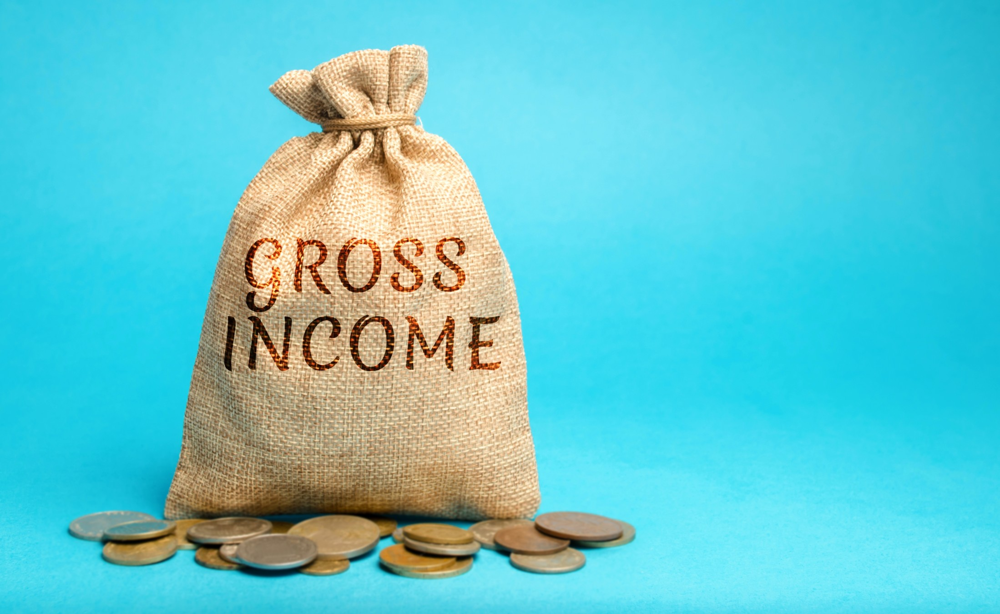

# What is Cost of Goods Sold (COGS)

## Selling goods in the form of products and/or services to buyers is the principal economic activity businesses engage in with the aim of generating profit.

However, there’s always a cost associated with producing these goods to be sold — adding to all the other costs that come with running a business — and this cost is generally measured through a metric called cost of goods sold, or COGS.

#### Definition

The cost of goods sold (COGS), also known as cost of sales, is a metric that determines how much it costs a business to produce the goods (commonly products or services) that it sells for a profit.

#### What Is the COGS Metric Used For?

The COGS measurement is applied only to expenses related to material and labor costs that a company or business incurs to produce the goods it sells. This includes the direct costs related to goods production, such as:

* Costs of raw materials necessary for production;
* Purchase of particular parts of the end product;
* Costs of products or services intended for resale (such as the purchase costs of goods to be resold, [customs duties](https://economictimes.indiatimes.com/definition/customs-duty), taxes on materials purchased, etc.);
* Facility rent (wherever applicable);
* Utilities (such as electricity, heating, water supply, etc.);
* Paying salaries to the workforce;
* Storage costs for the products to be sold;
* And other direct expenses.

On the other hand, indirect costs, such as advertisement expenses, transportation costs, and sales force costs are not included in the figure that COGS measures.

To demonstrate this with an example, let’s say that a smartphone manufacturing company is measuring its COGS for a particular time period. To do so, the company will consider things such as the costs of materials required to produce each phone (metals, plastics, etc.), the costs of particular phone parts they may be purchasing from other companies (such as electronics, screens, and so on), the labor costs for the workers that manufacture and/or assemble the smartphones in a factory, the utilities for this factory’s premises, and the rent they pay for it. On the other hand, when calculating COGS, it will not count indirect expenses, such as transporting the phones to individual retailers and the costs for paying its own salespeople who sell the smartphones to end-users.

#### How to Calculate the COGS

A general formula for measuring COGS for a specific period (usually one year) is the following:

**(Beginning Inventory + Purchase costs during the period) − Ending Inventory = COGS**

To understand each of the terms in this equation, it’s necessary to look at a business’ [inventory](https://www.thebalancesmb.com/sorting-out-inventory-why-its-important-for-your-business-4041326) in its balance sheet. For example, when the time period for which COGS is measured is a year (which is typically the case), the inventory a business managed to sell during the previous year can be found in the income statement under the COGS account. From it, the business can calculate the leftover inventory not sold during the previous year, which also represents the **beginning inventory** at its disposal during the year for which it wants to measure COGS.

Throughout the year for which it measures COGS, the business will commonly have additional **purchase costs** for the goods it sells, including costs for materials, labor, utilities, and other expenses as described above. At the end of the year, these additional costs are added to the beginning inventory.

Finally, after the year for which COGS is being measured ends, businesses will have more leftover inventory they didn’t manage to sell. The value of the remaining goods represents the business’ **ending inventory** for that year.

So, to calculate COGS for that particular year, the business subtracts the ending inventory for the year from the sum of the beginning inventory and the purchase costs for the same year, as demonstrated by the above formula.

In this case, it should be noted that a business’ beginning inventory for a particular period (usually a year) is also its ending inventory for the previous period (the previous year) in its accounting calculations. A business’ balance sheet shows its financial situation only at the end of each accounting period. Therefore, the inventory value of the business’s current assets at the end of a particular accounting period represents its ending inventory for that period as well as the beginning inventory for the period that comes right after it.

#### Why Is the COGS Metric Important?

One thing that businesses use the COGS metric for is to calculate their [gross profit](https://www.accountingcoach.com/blog/what-is-gross-profit), which is a metric that helps them evaluate how well they’ve been managing their labor and supplies. The gross profit of a particular business is calculated by subtracting its COGS for a particular period from its net sales for the same period.

Companies record their COGS as an expense for a reporting period in their [income statement](https://bench.co/blog/accounting/income-statement/), as COGS is a cost they pay for maintaining their business afloat. Therefore, analysts and investors can use the metric to determine a company’s net income, which tends to decrease proportionally with the increase of its COGS, and vice versa.

Determining and reporting higher COGS expenses can be useful for a company’s tax statement, as high COGS means less income, which in turn means less income tax to be paid. On the other hand, high COGS and less income also means less profit for a company’s shareholders, which is something they want to avoid in order for their business to remain profitable in the long run.

#### Summary

The term cost of goods sold, or COGS, refers to a metric through which businesses measure the cost of producing the goods (products and/or services) that they intend to sell for a profit.

When measuring COGS, businesses take into account only direct goods production expenses. These can include the purchase costs of raw material, particular product parts, items to be resold, rent, utilities, workers’ salaries, storage costs, and other direct expenses. Indirect expenses, such as advertisement, transportation, and sales force costs are not considered when businesses measure COGS.

To measure its COGS for a particular period which is usually one year, a business has to calculate the sum of its beginning inventory and the purchase costs for that year, and then subtract the ending inventory for the same year from this sum.

COGS is important for businesses when they measure their gross profit, which is calculated as a business’s net sales minus their COGS for a particular period. Analysts and investors can also evaluate a company’s COGS from its income statement to measure its net income, which is disproportional to the increase of its COGS. While a higher COGS will help companies pay less in income tax, it also means they turn in fewer profits.