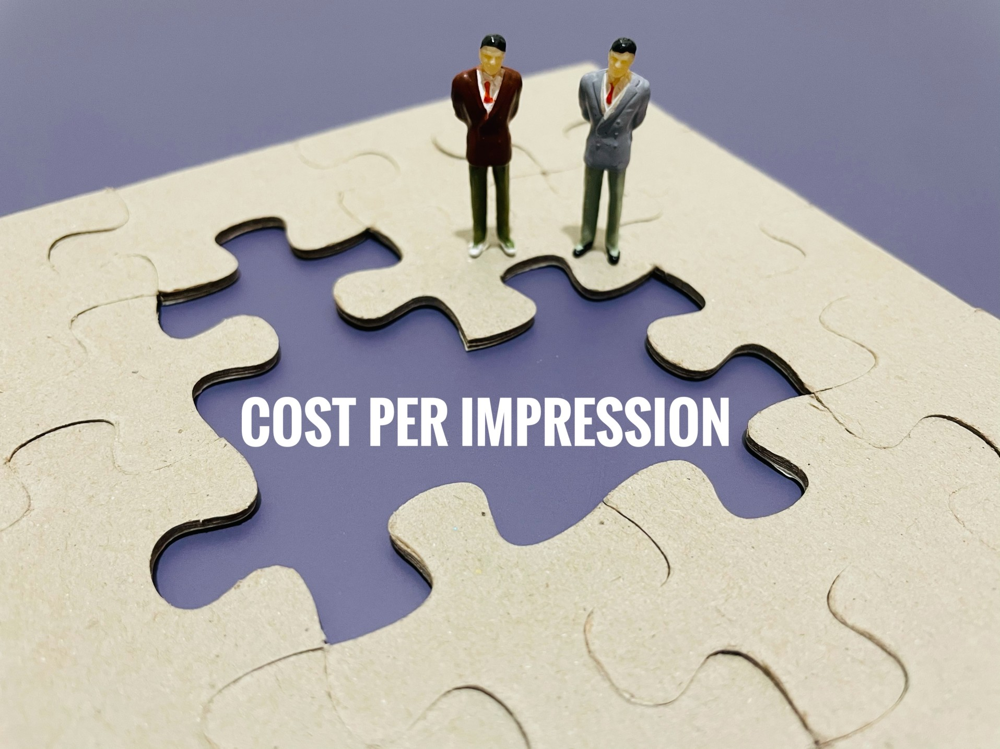

# What is Cost Per Impression (CPI)

## It should come as no surprise that many aspects of business life have been and continue to be transferred into the online sphere.

This is especially true for advertising, which found its way online long ago, as the internet provides businesses with more diverse opportunities to display ads than more traditional outlets that came before it. One well-known online advertising method is known as pay-per-impression, or PPI, and the metric associated with it is known as cost per impression, or CPI.

#### Definition

Cost per impression (CPI) is a metric used in [online advertising](https://www.tidalmarketing.co.uk/our-services/online-advertising), which refers to the amount of money that a particular advertiser pays an online publisher for each time their ad is displayed on the publisher’s platform.

#### CPI and PPI

Pay-per-impression (PPI) is a model in which advertisers pay publishers for each ad impression — that is, for each time their ad appears to any single end-user browsing the publisher’s web platform. These platforms can include websites, portals, search engines, social media, and other online outlets where ads are enabled. The price advertisers pay for each impression is the CPI, although in many cases publishers charge this price based on multiple impressions instead of a single one.

Here, it should be noted that through PPI, advertisers pay every time an end-user is able to see their ad because it has appeared on the internet page they were viewing, regardless of whether the end-user clicks on the ad, which would then take them to the advertiser’s own page. Simply put, each appearance of the advertiser’s ad in front of an end-user counts as one impression, and the CPI is the cost advertisers pay for each impression.

With this in mind, another well-known online advertising method commonly used as an alternative to PPI is known as pay-per-click, or PPC. Unlike PPI, with PPC, advertisers actually pay for each click their ad gets from end-users on the publisher’s platform. The metric associated with PPC is known as cost per click, or CPC.

While the PPC method is strictly related to the internet (as the only place people can click on ads), PPI closely resembles more traditional advertising practices — such as TV, radio, newspaper, and billboard ads — in which publishers also use impressions as a basis for payment. In fact, in some contexts, the terms PPI and CPI can also apply to these non-internet-related ways of advertising.

#### Understanding CPI

The CPI metric, much like other similar online advertising metrics, can help advertisers get a better grasp of the [ROI](https://www.owox.com/blog/articles/how-to-calculate-roi/) of their online advertising campaigns, and the profitability of their overall marketing strategies.

Because of how it closely resembles the metrics used for more traditional advertising techniques that also rely on impressions, online PPI advertisers can use the CPIs they pay to compare their own ROI to that of other advertisers using traditional advertising platforms, especially printed media, TV, and radio.

### The Difference Between Impressions and Page Views

It’s important to note that when charging a CPI, publishers differentiate between impressions (to which CPI applies) and page views. Technically speaking, the number of end-user visits to the page of the publisher displaying ads does not equal the number of impressions an ad gets on the same page, simply because publishers can (and usually do) display multiple ads per page rather than a single one.

For example, if there are three different ads displayed on a page at a time, a single end-user page view will result in 3 impressions, each for every separate ad. It’s even possible to display the same ad from the same advertiser in this way. For instance, two identical-looking ad banners, representing the same ad, can be shown on a single webpage hosted by the publisher — when this webpage gets one end-user view, the ad gets two impressions because the end-user could see it twice on the same page.

In such cases, some ad servers may decide not to consider particular end-user actions, such as page refreshes, towards the impressions count. This is done to represent a clearer and more realistic image of the number of impressions each ad gets on a webpage.

#### How Is CPI Used

Advertisers commonly distribute their advertising campaigns across many different web platforms, which means that individual publishers will usually charge them for the whole campaign. Here, advertisers calculate their CPI through the following formula:

**Overall cost of the advertising campaign / Number of times an ad is shown on a platform = CPI**

To demonstrate this with an example, if an advertiser pays a publisher $1000 for a campaign, obliging the publisher to show their ad 10.000 times, the CPI for this campaign will be calculated as follows:

**\$1000 / 10.000 = $0,1**

As average CPI prices for individual impressions are commonly low, publishers often use a cost per mille (CPM) charging method instead. Here, ‘mille’ is the Latin word for 1000, and CPM stands for the cost of 1000 impressions instead of a single one.

The CPM method of displaying CPI is used more often than not. This is because an average advertising campaign can easily get thousands, even millions of views across every web platform it’s displayed on.

#### Summary

Cost per impression, or CPI, is a metric that designates a fee that an advertiser pays to a publisher for each time the publisher displays their ad on a web platform. The CPI metric is specifically related to the online advertising model of pay-per-impression, or PPI.

Through the PPI model, advertisers pay the CPI cost for each time their ad reaches an end-user, whether this end-user actually clicks on the ad or not. In this sense, the PPI model is an alternative to the similar but different pay-per-click (PPC) model, in which an advertiser pays a publisher for each click their ad gets on the publisher’s platform.

Unlike the PPC model which is unique to internet usage, PPI resembles pre-internet advertising techniques, such as TV, radio, newspaper, and billboard advertising methods, that also use impressions as a basis for charging an ad fee.

CPI can help advertisers measure the ROI of their online advertising campaigns. What’s more, because it’s similar to traditional advertising payment methods, advertisers can also use it to compare their ROI to that of TV, radio, and printed media advertisers.

It’s important to note that the page views that a publisher’s page gets are not equal to ad impressions. In fact, a single web page can contain multiple ads, so a single page view to such a page can result in one impression for each ad displayed on it.

Publishers commonly charge advertisers for entire ad campaigns. In such cases, the CPI of a campaign is calculated as the cost of the campaign divided by the number of times a campaign ad is shown on a publisher’s platform. Since campaigns are commonly displayed across multiple publishers and can easily reach millions of views, publishers usually use a cost per mille (CPM) payment method, where ‘mille’ stands for 1000. Through CPM, publishers charge per 1000 impressions instead of a single one.