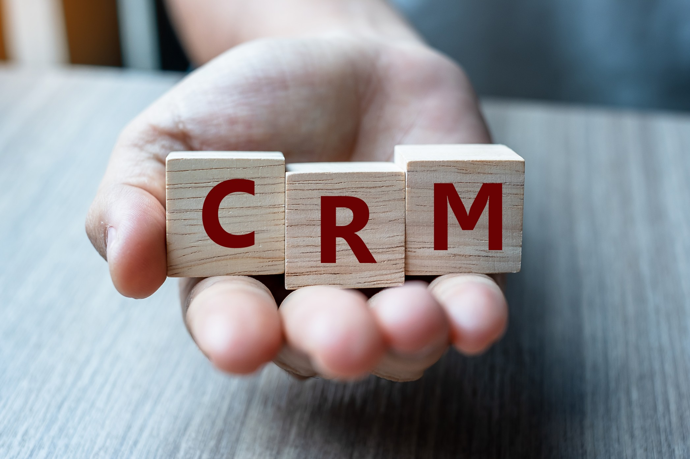

# What is Customer Relationship Management (CRM)

## A business’s customers are at the core of its success. 

Maintaining a strong and healthy customer base makes it easier for businesses to engage in their primary financial activity — selling their products and/or services — thereby ensuring their own profitability. To achieve this, businesses have to work on developing their customer relationships, and largely rely on a concept known as customer relationship management, or CRM.

#### Definition

The term customer relationship management (CRM) is used to describe several strategies, practices, and technologies that businesses employ for recording, managing, and analyzing information related to their paying and potential customers. The aim of CRM is to improve the customers’ experience, engage them more effectively and ultimately increase the revenue they generate for businesses.

#### CRM Systems

Nowadays, in practice, businesses usually manage their customer relationship through specialized CRM software solutions, also known as CRM systems. A CRM system works by gathering information related to the customers of the business that uses it. This customer information (or customer data) is obtained from many different contact channels between the business and its customers, such as:

* The business’s official website;
* Telephone communication;
* E-mails;
* Live chat;
* The business’s social network pages ([LinkedIn](https://www.linkedin.com/), [Facebook](https://www.facebook.com/), [Instagram](https://instagram.com/), etc.);
* Marketing materials used to reach out to customers;
* And more.

CRM systems as software solutions have a long history of existence, dating back to 1993 when the first CRM product, [Siebel Systems](https://www.oracle.com/applications/siebel/) — now owned by [Oracle](https://www.oracle.com/) as a CRM vendor — was designed. Other well-known CRM system providers include [SalesForce](https://www.salesforce.com/) (which is also the most used CRM system to date), [Microsoft](https://dynamics.microsoft.com/en-us/), and [SAP](https://www.sap.com/index.html) — though there are many others as well, mostly used by smaller and medium-sized businesses.

#### Why Are CRM Systems Important

An important advantage of using a CRM system is that it shares the customer data it gathers with all relevant teams within a company, such as recruiting, sales, marketing, customer support, business development, recruiting, marketing, or any other department that can make use of customer-related information. This information includes each customer’s buying history, preferences, concerns, and personal information.

By making all this customer data easily accessible, CRM systems help companies facilitate many of their daily customer-related tasks. For instance, the quick access to a customer’s interaction history with the company, which the CRM software provides, helps the company’s customer support agents in their work, making it easier for them to deliver services to the customers. As all previous customer interaction history with the company — purchases, subscriptions, complaints, e-mails, live chat history, service and payment cancellations, and more — is readily available within the company’s CRM software, customer service agents can treat all customer requests faster and more effectively.

What’s more, through collecting customer information, CRM systems provide businesses with a general idea of many important features of each individual customer, such as what products, services, or features they like or dislike, how likely they are to be [upsold](https://www.oberlo.com/ecommerce-wiki/upselling) or [cross-sold](https://www.shopify.com/encyclopedia/cross-selling) other items and what these items are, and more. CRM systems present this information to the company’s teams through intuitive (often visualized) reports, helping them engage customers more easily, and thereby drive sales.

In high workload environments, CRM systems are praised for the ability to automate daily tasks. Some aspects of a business’s work that can be automated through CRM software include:

* **Marketing** — There are CRM tools that automate common marketing tasks that marketers would otherwise have to repeat manually. Such tasks include sending automated marketing emails, posting marketing content on web pages and social media, and so on.
* **Salesforce** — CRM software can also automate some salesforce tasks that the sales team would otherwise have to take on manually. Such tasks include tracking a customer’s account history for sales, sales promotion analysis, and so on.
* **Contact center** — Customer support and other direct customer contact agents can also benefit greatly from CRM automation. For instance, CRM systems can automate phone call responses, chat responses via chatbots that can even accurately answer [FAQ](https://dictionary.cambridge.org/dictionary/english/faq), and so on.
* **Workflow** — Several other repetitive workloads can also be automated through CRM software, including setting up payment reminders, updating client info (addresses, payment methods, subscription expiration dates), tracking lead statuses, and more.

CRM automation relieves many burdens from the company’s departments such as marketing, sales, customer support, account management, and many more. With the majority of the most mundane tasks automated by CRM software, representatives can focus on more creative and high-end tasks that require much more human involvement than those CRM systems can easily automate.

#### CRM Types

Generally, CRM software solutions can be divided into 3 main categories:

* **Cloud CRM** — This CRM type stores customer data on a cloud server, which is a remote network of external computer hosts that store the business’s data for them on demand. Businesses can access their cloud CRM from any point on the planet, as long as they have an internet connection there. Providers such as [Salesforce](https://www.salesforce.com/), [HubSpot](https://www.hubspot.com/), and [Zendesk](https://www.zendesk.com/) offer cloud CRM solutions, usually for a periodic subscription fee.
* **On-premise CRM** — As opposed to cloud CRM, on-premise CRM software is installed on the businesses’ very own computers instead of being on a remote cloud. This is a preferred option for many businesses who work on stationary premises, or those that are concerned about the safety risks remote internet connections to their CRM may carry. Unlike cloud CRM solutions, on-premise CRM software is commonly bought as a license for a certain time period. A big part of the companies that offer cloud CRM can also provide an on-premise CRM option.
* **Open-source CRM** — [Open-source](https://opensource.com/resources/what-open-source) CRM distributors make the source code for their CRM solutions widely accessible to everyone at no cost. Examples of open-source CRM include [OroCRM](https://oroinc.com/orocrm/), [SuiteCRM](https://suitecrm.com/), [SugarCRM](https://www.sugarcrm.com/), and more.

#### Summary

Customer relationship management, or CRM, is the sum of practices and technologies businesses use to manage customer-related information. The aim of these practices is to improve the relationship between a business and its customers, ultimately driving sales and increasing profitability.

Many businesses use CRM software, also known as CRM systems, to manage their customer relationships. CRM systems gather customer data, obtained from all contact channels between the business and their customers, to help businesses make the best out of their customer relationships. Popular CRM solution providers include SalesForce, Oracle, Microsoft, and SAP, as well as many others used mostly by small and medium-sized businesses.

Businesses value CRM solutions because they provide customer data easily and effectively to all sectors, give them insights into their customer’s buying preferences, and help all employees automate the most mundane customer-related tasks.

CRM solutions can generally be divided into three categories: cloud CRM, on-premise CRM, and open-source CRM.