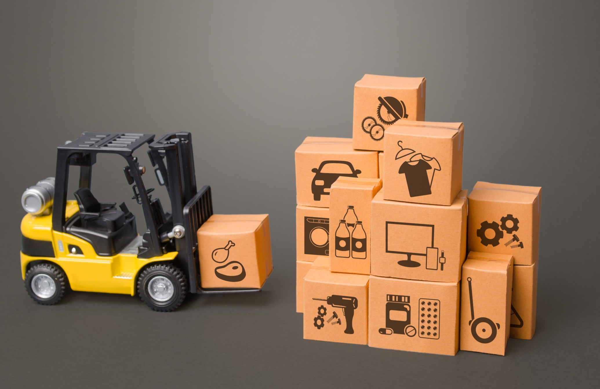

# What is E-Commerce?

## Nowadays, as more and more people spend increased amounts of their time online, the internet has had a profound impact on many aspects of daily life — especially shopping.

Every year, billions of internet users worldwide buy different kinds of items online. As online purchases have begun to account for a [significant part](https://www.webhostingsecretrevealed.net/blog/ecommerce/online-shopping-ecommerce-and-internet-statistics-2020-you-should-know/) of all retail revenue, the concept of electronic commerce (or e-commerce for short) has become an important factor for modern businesses that aim to grow and thrive on the market.

#### Definition

The term e-commerce (sometimes called e-business) is used to describe the process of organizations and individuals purchasing and selling items online. The items that are being traded through e-commerce commonly include products or services, and the term can sometimes even apply to transmitting funds or data through the internet.

#### How E-Commerce Works

The rapid growth of the use of the internet is behind the popularization of e-commerce transactions. E-commerce can be done through most devices connected to the internet, such as desktop computers, laptops, smartphones, tablets, and more.

Almost anything in terms of products and services can be sold online, from food to concert tickets to subscription-based services, and much more.

When shopping online, a [buyer](https://rev.team/kb/what-is-buyer) places an order through an online payment method (credit card, debit card, bank transfer, and so on) which is then communicated to the server that hosts the online store of the seller. Order data is then relayed to an [order manager](https://www.brightpearl.com/order-management-system) computer which validates whether the buyer can supply enough funds through their online payment method and whether the online store has enough inventory for the purchase to go through. If both conditions are met, the order manager validates the order for the online store’s server which then notifies the buyer that it has processed the order. The order manager then informs the seller that they need to distribute the product or service to the buyer — in the case of physical products being sold, the sellers usually need to physically deliver these to their buyers, too.

E-commerce transactions are commonly done through a seller’s website, though they can also be mediated through third-party retailers such as [Amazon](https://www.amazon.com/), the seller’s social media profiles, and so on.

The practice of e-commerce, though considered a novelty that changed the way commercial transactions are carried out for good, has already existed for several decades. This means that many modern businesses are present in the e-commerce market, whether they rely solely on online transactions to turn in income or use e-commerce as an addition to their physical stores.

Because of the competition present in e-commerce, businesses that deal in e-commerce have to constantly reinvent their online sales and marketing strategies to come up with innovative ways to attract more customers and [clients](https://rev.team/kb/what-is-a-client). Some good practices for increasing e-commerce sales include online marketing (especially through social media), targeting particular audiences, personalizing ads, and more.

#### E-Commerce Types

Depending on the nature of the parties engaging in e-commerce transactions, the practice can be generally divided into:

* **Business-to-business ([B2B](https://rev.team/kb/what-is-b2b))**, which is when businesses engage in e-commerce transactions with other businesses;
* **Business-to-consumer ([B2C](https://rev.team/kb/what-is-b2c))**, when businesses do online sales with their consumers, commonly by using online retail platforms;
* **Direct-to-consumer (D2C)**, when businesses sell directly to their consumers without the aid of retailers or wholesalers, usually directly through their websites;
* **Consumer-to-consumer (C2C)**, when consumers sell to other consumers online, denoting transactions between individuals that aren’t (necessarily) included in any formal business body but rather exchange products, services, and information directly with each other (typically through online platforms);
* **Consumer-to-business (C2B)**, when consumers sell their self-made products or services to businesses that then use them for their daily activities or resell them for a profit;
* **Business-to-government (B2G)**, when businesses sell their products or services to government bodies or public administration;
* **Consumer-to-government (C2G)**, usually referring to interactions such as tax payments, online education, health services appointments/payments, and so on, as actual purchases of consumer-made products or services by government bodies are rare.

#### Advantages and Disadvantages

One of the most notable advantages of e-commerce is that it has provided sellers with a much larger market to sell to. The channel and process through which online selling is done are very cheap for the seller — the buyer just needs to access the internet to do a purchase — unlike physical retail locations for which businesses commonly incur utilities and workforce (including salesforce) expenses. Furthermore, online stores are commonly open 24/7, which is a huge advantage over physical stores, most of which are usually closed during particular periods. Online stores also serve as an improved catalog of products and services that customers may not be able to find as easily in physical stores.

Apart from its many advantages, e-commerce also has some shortcomings. Namely, buyers don’t usually communicate with a salesperson when buying online, which can complicate their purchase process in case they need additional information about what they’re buying. This can be especially difficult when buyers are trying to purchase physical products, as online images of these products aren’t always conveying a detailed idea of what they’re really like. What’s more, online orders of physical products usually come with a delivery, which means buyers will commonly have to wait before they can use the items they purchased (which isn’t the case when buying from a physical store).

#### Summary

The term e-commerce refers to the practice of organizations or individuals buying products or services online. In some cases, it also refers to online transfers of data and funds.

The ever-expanding role of the internet in everyday life is what drives the popularity of e-commerce. Buyers can use an internet connection through computers, smartphones, tablets, and other devices to buy almost every kind of product or service online.

During e-commerce transactions, buyers place orders through their online payment method which are directed to the online store’s server. This server uses an order manager computer to verify that the purchase can be made, and then informs the buyer the order has been processed. Finally, the order manager informs the seller that they need to deliver the product or service to its buyer.

Usually, a buyer can access a seller’s products online through their website, social media profiles, online retail platforms, other third parties, and so on. As there’s a lot of competition among businesses dealing in e-commerce, they constantly have to come up with creative ways of attracting new buyers, commonly through different forms of online marketing.

Depending on the participants in the transactions, e-commerce can generally be divided into business-to-business (B2B), business-to-consumer (B2C), direct-to-consumer (D2C), consumer-to-consumer (C2C), consumer-to-business (C2B), business-to-government (B2G), and consumer-to-government (C2G) transactions.

E-commerce has many advantages, such as providing wider markets, reducing selling costs, 24/7 availability, better cataloging possibilities, and more. However, it also has some shortcomings, such as not providing salesperson contact during purchase, only showing a simplified image of the items for sale, and delays in delivery.