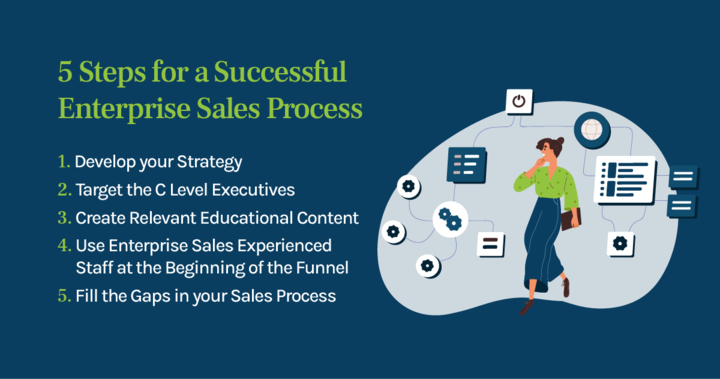

# What is Enterprise?

## The term enterprise is often used to describe businesses of a larger size.

### Definition

In business terminology, the term enterprise is commonly used to refer to any larger company, having hundreds or even thousands of employees. In essence, the term is officially used to designate any kind of business — or a business that’s related to the practice of [entrepreneurship](https://www.oberlo.com/blog/what-is-entrepreneurship) in particular — but in practice, it’s often only applied to large-scale corporations.

#### Background

In wider usage, the term enterprise can have several meanings — from being used with its general meaning as a type of project or undertaking, to simply referring to any kind of business. In the internal context of business terminology, however, the term enterprise is usually used when differentiating larger corporations from small and medium-scale businesses.

The exact difference between a small, medium and a large-scale company (or enterprise) can vary. As a common reference, the intergovernmental Organisation for Economic Co-operation and Development [(OECD)](https://www.oecd.org/) considers any company with over [250 employees](https://data.oecd.org/entrepreneur/enterprises-by-business-size.htm) as a larger enterprise, while also referring to those that employ less than that number as small and medium-sized enterprises, or SMEs for short. However, different international and governmental bodies can have different definitions when it comes to the size at which a company is considered large.

### Complexity is the Key to Success in Enterprise Sales

It is easy to buy a personal subscription. Simply select your plan and enter your details. You will then have instant access.

Enterprise software is more complex than software that is targeted at small to medium-sized companies (SMB). This is usually because enterprise software must be tailored to meet a company's specific needs.

Prospects at the enterprise level often need additional support and persuasion to close the deal. Software sales are often managed and managed by sales executives (sometimes called account executives), who have a deep understanding of the product (especially technical products).

Software sales are usually done in one of three ways: Transactional, self-service, or enterprise.

**The Transactional Model**

Transactional sales are when a prospect selects a tool, but still needs assistance from sales or customer service with implementation and onboarding. This type of sale is usually when products are more expensive or cannot be used right out of the box.

**The Self-Service Model**

The self-service model is when a customer completes the sale themselves. They choose the plan or product that suits them best, pay using the payment platform, then onboard themselves with knowledge bases, tutorials, and product documentation.

**The Enterprise Model**

For enterprise sales to succeed, it is necessary to have a more hands-on approach to the sale and for organization-wide adoption. The company that purchases the product will need to be trained and assisted in integrating it into their existing tech stack.

Enterprise sales involve many steps such as live demos, ROI calculations, and vendor onboarding before a contract can be signed.

This complexity not only sets enterprise sales deals apart but is also what makes them the most lucrative.

#### How enterprise can be used to close more OEM sales

Software isn’t always sold directly to the end-user. Other software companies may also be potential customers. OEM, or original equipment maker software, is when a company licenses its product so that it can embed it in its software.

Software companies might want to add functionality to their CRM platform that is not possible to build from scratch. This could include document creation and one-touch video calling integration. The CRM software company might consider licensing the technology if the technology is already available on the market.

End-users can then enjoy the benefits of having all their needs met in a single tool, even if a portion of them is being met by another technology company.

OEM deals can be just as complex and difficult as standard B2B enterprise deals, so closing is just as risky.

### The Difference Between Enterprises and Other Businesses

The sheer size of the companies that are commonly referred to as enterprises is the primary feature that makes them stand out among other businesses. The fact that they’re larger in scope also has several other implications.

For one thing, larger companies are much more likely to have already established a name for themselves than their small and medium counterparts. In many cases, their size also means they have years of working experience behind them. Because of this, the [client](https://rev.team/kb/what-is-a-client) base of enterprises is usually well established, and they rarely ever have to struggle to attract [buyers](https://rev.team/kb/what-is-buyer), unlike smaller, less developed businesses.

Large enterprises work by established production routines and are far less likely to make complete overhauls of the products or services they offer or even experiment with new ones (although it sometimes happens). Enterprise-sized organizations usually have a large clientele that likes to buy what they’re used to, and they’re much more likely to gain new clients because of their current way of doing things rather than through experiments. Smaller businesses have more room to test novel ideas that might earn them more clients.

When it comes to [B2B](https://rev.team/kb/what-is-b2b) selling businesses of different sizes are likely to stay in their own lanes. Large enterprises are much more likely to sell to other larger corporations because their production and payment abilities are similar. Small and medium businesses, however, usually start by selling to other smaller-scale businesses until they’re able to make a name for themselves and start selling bigger.

The structure in large enterprises is more organized, as their hierarchy has to match their size. Smaller businesses and startups usually don’t have the same level of logistics and infrastructure as enterprises.

#### Enterprise Level Business Software

A notable case of using the term enterprise to denote larger companies only is in reference to business software. Many different types of business management software solutions, such as [customer relationship management (CRM)](https://rev.team/kb/what-is-customer-relationship-management-crm) software, for example, have special enterprise-level software options which they usually sell in addition to their regular ones.

Whenever a business software provider offers an enterprise-level solution, it will have most or all of the following characteristics:

* **Higher prices** — Enterprise-level software is always more expensive than regular solutions. This is because it’s meant for enterprises, or larger companies, that should be able to afford to pay more for it.
* **An abundance of features** — The higher price of enterprise software means it has more to offer. As enterprises are larger companies employing more people than small businesses, their needs and expectations in terms of what their software can achieve are also greater, and the increased number of functionalities that enterprise-level software solutions provide reflects this.
* **Obtained by contacting a salesperson** — In most cases, an enterprise-level software solution isn’t as easy to get as a regular one. Businesses usually have to talk to a member of the software provider’s sales team in order to be able to gain access to an enterprise version of their software.
* **Long-term (annual) payments** — For larger companies, annual payments are much more convenient since they require less paperwork than monthly or weekly payments. For this reason, software providers selling enterprise-level solutions are likely to bill their clients annually or on longer terms in general.

It’s important to note that it may be possible for smaller businesses to get access to enterprise-level software, too. Most providers of enterprise-level software solutions don’t actually check the size of businesses ready to pay for their products. However, as they’ve usually got sales professionals working on [commissions](https://rev.team/kb/what-is-commission) that sell enterprise-level software, they’ll mostly be focusing on attracting larger corporations as clients. This means that, while they may allow smaller businesses to buy their enterprise software, they’ll probably pay less attention to them as clients.

This is especially the case if the commission of these salespeople is related to the number of actual business employees using their software, which means smaller businesses will be bringing them much less pay and they’ll therefore focus much less on them.

### Enterprise Sales Process: How Big Deals Come Together

When it comes to the enterprise sales process, businesses come in many shapes, sizes, and structures. The angles and processes used for selling to different companies reflect this variability.

We'll be taking a closer look at key elements of an enterprise sales process, reviewing the basic steps, and getting a refresher on how the close rate is calculated for longer sales cycles.

**The Typical Enterprise Sales Cycle**

**Relationship-Building**

Establishing rapport and relationship-building are particularly important when it comes to your typical enterprise sales cycle.

Enterprise sales allow you to lock in on one business and interact with multiple stakeholders within it, having conversations that are significant as the deal progresses. You are in this for the long term, so you must make sure you get in front of the right people.

Positioning yourself as a resource for prospects is the best way to get there. Building relationships through education, communication, and collaboration might be *the* key to a successful enterprise sales process.

**More stakeholders**

Your average enterprise is significantly larger than a small or medium-sized business. This means that they have more to consider and more to decide on.

Gartner states that the typical buying group for complex B2B solutions includes six to ten decision-makers. When you conduct an enterprise sales process, you have a good chance of making contact with most, if not all of them.

**Long Sales Cycle**

The typical SMB sales cycle is shorter than the average enterprise sales cycle. Because it involves more stakeholders and red tape, the average sales cycle for enterprise deals is ***6+ months***.

**Large Contract Value**

It's not innovative or insightful to point out the fact that enterprises are larger than small- to medium-sized businesses. This means that enterprises will be able to leverage your solution on a larger scale than smaller businesses, resulting in more valuable contracts that often exceed six figures and seven figures.

**Higher-Risk**

An enterprise deal is difficult to find and even more difficult to land. This, combined with all the other factors, makes the enterprise sales cycle more difficult than others.

### How Enterprise Software is Changing How We Sell

To help them sell, enterprise sales reps have access to technology such as AI. This technology can be used to determine if a prospect is interested in a product, assess emotions and changes in speech patterns, and determine if a sales pitch is reaching the right decision-makers.

Forbes reports that Asheem Chandna, a venture capitalist, has explained that this type of sales technology could soon allow sales reps to evaluate whether a selling strategy is persuasive enough.

He says that predictive algorithms allow sales teams to access real-time insights, allowing them to adjust their arguments quickly or recognize when a sale isn't closing.

> *"Technology could also be used to identify the champion in the virtual room alongside the skeptic. This would allow the salesperson to focus their argument on the right person during a multi-person conference call."*

Software companies are offering enterprise trials for free to potential customers so they can test it out before buying. These companies aren't doing it out of kindness. They offer free trials to prospects so they can see what tools they prefer and how easy the software is for them to use.

This shifts the burden away from what was previously required of sales reps in past.

In the past, sales representatives would demonstrate the benefits of enterprise software to prospects in live demos. However, they couldn't test it out until they signed a large contract. Potential customers can now try the software.

Sales reps can also jump in and communicate with them during the trial period to resolve any issues and increase their chances of purchasing the software.

Enterprise sellers can now replace in-person demos and visits with free software trials. This allows them to show prospects how great their product is while simultaneously collecting valuable data.

### Evolution of the Sales Strategy

Enterprise sales reps have to take a different approach because of the added complexity. Over time, enterprise best practices and sales methodology have changed.

#### Increase your pipeline of ideal prospects

It's not enough to get a prospect to sign up for a deal. As a sales representative, there are many other things you should do. It's not enough to make one sale.

You need to be able to replicate and build upon your successes. Sales teams must follow up with clients. This builds client loyalty and ensures continued business between you.

Keep up-to-date with market news and trends. This will enable you to identify your blind spots and areas that need improvement.

#### Calculating the Enterprise Sales Close Rate for a Long-Term Sales Cycle

The process of calculating the enterprise sales close rate for a long cycle is the same as for any other sales cycle. Divide the number of closed enterprise sales by attempted enterprise sales.

They are lengthy processes that require patience, finesse, people skills, and persistence. If you are willing and able, you can conduct one yourself.

### Summary

Enterprise software sales are different from other types of sales. It's riskier, requires sales reps to work harder, and your team must be committed to the long-term success of enterprise software sales.

The rewards can be enormous. Enterprise software sales can be extremely lucrative for any software company if you tailor your sales skills or tactics to solve the problems of each prospect and build meaningful relationships with them.